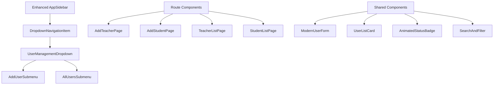

# Design Document

## Overview

The Modern Sidebar User Management system enhances the existing university attendance system with sophisticated dropdown navigation, dedicated user management routes, and beautiful form interfaces. The design leverages the existing Shadcn/ui component library, Framer Motion animations, and modern design patterns to create an intuitive, responsive user management experience that seamlessly integrates with the current dashboard aesthetic.

### Design Principles
- **Seamless Integration**: Builds upon existing sidebar architecture and design system
- **Progressive Enhancement**: Transforms static menu items into interactive dropdowns
- **Modern Interactions**: Smooth animations with spring physics and 3D effects
- **Responsive Excellence**: Touch-optimized for all devices with proper spacing
- **Visual Consistency**: Maintains existing color palette and typography system
- **Accessibility First**: WCAG 2.1 AA compliance with keyboard navigation

## Architecture

### Component Architecture Pattern
The system follows a **hierarchical component architecture** with clear separation between navigation, routing, and content:



### Navigation State Management
```typescript
interface NavigationState {
  expandedDropdowns: string[];
  activeRoute: string;
  userManagementState: {
    selectedUserType: 'teacher' | 'student' | null;
    searchQuery: string;
    filters: UserFilter[];
  };
}
```

### Animation System Architecture
```typescript
interface AnimationConfig {
  dropdown: {
    expand: { duration: 300, easing: 'easeOut' };
    collapse: { duration: 200, easing: 'easeIn' };
  };
  cards: {
    hover: { scale: 1.02, duration: 200 };
    tap: { scale: 0.98, duration: 100 };
  };
  forms: {
    fieldFocus: { scale: 1.01, duration: 150 };
    validation: { shake: { x: [-10, 10, -5, 5, 0], duration: 400 } };
    success: { confetti: true, duration: 2000 };
  };
}
```

## Components and Interfaces

### Enhanced Sidebar Navigation Structure

```typescript
// Enhanced navigation structure for user management
interface EnhancedNavigationItem extends NavigationItem {
  isDropdown?: boolean;
  dropdownItems?: DropdownItem[];
  animationConfig?: AnimationConfig;
  hoverEffects?: HoverEffects;
}

interface DropdownItem {
  label: string;
  href: string;
  icon: React.ComponentType<{ className?: string }>;
  description?: string;
  badge?: string | number;
  animationDelay?: number;
}

interface HoverEffects {
  scale?: number;
  glow?: boolean;
  shadowElevation?: number;
  iconRotation?: number;
}
```

### Modern Sidebar Component Architecture

```
components/
├── navigation/
│   ├── EnhancedAppSidebar.tsx        # Main sidebar with dropdown functionality
│   ├── DropdownNavigationItem.tsx    # Reusable dropdown menu item with animations
│   ├── UserManagementDropdown.tsx    # Specialized user management dropdown
│   ├── NavigationIcon.tsx            # 3D icons with hover effects and animations
│   ├── DropdownMenu.tsx              # Animated dropdown container with spring physics
│   ├── NavigationBadge.tsx           # Animated badges with pulse effects
│   └── SidebarTransition.tsx         # Page transition wrapper for smooth navigation
├── user-management/
│   ├── forms/
│   │   ├── AddTeacherForm.tsx        # Shadcn form with real-time validation
│   │   ├── AddStudentForm.tsx        # Shadcn form with animated field states
│   │   ├── FormField.tsx             # Enhanced form field with animations
│   │   ├── FormValidation.tsx        # Real-time validation with smooth feedback
│   │   ├── SuccessAnimation.tsx      # Confetti and success state animations
│   │   └── FormProgress.tsx          # Multi-step form progress indicator
│   ├── lists/
│   │   ├── TeacherList.tsx           # Teacher listing with animated cards
│   │   ├── StudentList.tsx           # Student listing with search and filters
│   │   ├── UserCard.tsx              # 3D user cards with hover effects
│   │   ├── UserAvatar.tsx            # Animated avatars with status indicators
│   │   ├── SearchBar.tsx             # Real-time search with animated results
│   │   ├── FilterPanel.tsx           # Advanced filters with smooth animations
│   │   └── PaginationControls.tsx    # Animated pagination with smooth transitions
│   ├── shared/
│   │   ├── UserStatusBadge.tsx       # Animated status badges with icons
│   │   ├── LoadingStates.tsx         # Skeleton screens with shimmer effects
│   │   ├── EmptyStates.tsx           # Beautiful empty states with illustrations
│   │   ├── ActionButtons.tsx         # 3D action buttons with ripple effects
│   │   └── ConfirmationModal.tsx     # Glass morphism modals with animations
├── ui/
│   ├── enhanced/
│   │   ├── AnimatedButton.tsx        # Enhanced buttons with 3D effects
│   │   ├── GlassCard.tsx             # Glass morphism cards with backdrop blur
│   │   ├── FloatingPanel.tsx         # Floating panels with smooth reveal
│   │   ├── RippleEffect.tsx          # Material Design ripple animations
│   │   ├── SpringModal.tsx           # Modals with spring physics animations
│   │   ├── CountUpNumber.tsx         # Number animations for metrics
│   │   ├── ProgressRing.tsx          # Animated progress rings with gradients
│   │   └── ParticleEffect.tsx        # Particle effects for celebrations
└── layouts/
    ├── UserManagementLayout.tsx      # Layout wrapper for user management pages
    ├── FormLayout.tsx                # Specialized layout for forms with progress
    ├── ListLayout.tsx                # Layout for user listing pages
    └── ResponsiveContainer.tsx       # Responsive container with breakpoint handling
```

### Enhanced Sidebar Navigation Implementation

```tsx
// Enhanced sidebar with dropdown functionality
const EnhancedAppSidebar = ({ user, onLogout, onNavigate }: AppSidebarProps) => {
  const [expandedDropdowns, setExpandedDropdowns] = useState<string[]>([]);
  const [hoveredItem, setHoveredItem] = useState<string | null>(null);

  const userManagementNavigation: EnhancedNavigationItem = {
    label: "User Management",
    href: "/user-management",
    icon: Users,
    isDropdown: true,
    dropdownItems: [
      {
        label: "Add User",
        href: "#",
        icon: UserPlus,
        description: "Create new accounts",
        animationDelay: 0,
        children: [
          {
            label: "Add Teacher",
            href: "/dashboard/users/add-teacher",
            icon: GraduationCap,
            description: "Create teacher account",
            animationDelay: 100,
          },
          {
            label: "Add Student", 
            href: "/dashboard/users/add-student",
            icon: User,
            description: "Create student account",
            animationDelay: 150,
          }
        ]
      },
      {
        label: "All Users",
        href: "#",
        icon: Users,
        description: "View and manage users",
        animationDelay: 50,
        children: [
          {
            label: "Teacher List",
            href: "/dashboard/users/teachers",
            icon: GraduationCap,
            description: "View all teachers",
            animationDelay: 200,
          },
          {
            label: "Student List",
            href: "/dashboard/users/students", 
            icon: User,
            description: "View all students",
            animationDelay: 250,
          }
        ]
      }
    ],
    hoverEffects: {
      scale: 1.02,
      glow: true,
      shadowElevation: 8,
      iconRotation: 5
    }
  };

  return (
    <Sidebar variant="inset" className="bg-gradient-to-b from-slate-50 to-white">
      <SidebarContent>
        <SidebarMenu>
          <DropdownNavigationItem
            item={userManagementNavigation}
            isExpanded={expandedDropdowns.includes("user-management")}
            isHovered={hoveredItem === "user-management"}
            onToggle={() => toggleDropdown("user-management")}
            onHover={(isHovered) => setHoveredItem(isHovered ? "user-management" : null)}
            onNavigate={onNavigate}
          />
        </SidebarMenu>
      </SidebarContent>
    </Sidebar>
  );
};
```

### Dropdown Navigation Component

```tsx
// Animated dropdown navigation item
const DropdownNavigationItem = ({ 
  item, 
  isExpanded, 
  isHovered, 
  onToggle, 
  onHover, 
  onNavigate 
}: DropdownNavigationItemProps) => {
  const Icon = item.icon;

  return (
    <motion.div
      initial={{ opacity: 0, y: -10 }}
      animate={{ opacity: 1, y: 0 }}
      transition={{ duration: 0.3, ease: "easeOut" }}
    >
      <SidebarMenuItem>
        <motion.div
          whileHover={{ scale: item.hoverEffects?.scale || 1.02 }}
          whileTap={{ scale: 0.98 }}
          onHoverStart={() => onHover(true)}
          onHoverEnd={() => onHover(false)}
        >
          <SidebarMenuButton
            onClick={onToggle}
            className={cn(
              "group relative overflow-hidden transition-all duration-300",
              isHovered && "bg-gradient-to-r from-blue-50 to-purple-50",
              isExpanded && "bg-gradient-to-r from-blue-100 to-purple-100"
            )}
          >
            <motion.div
              animate={{ 
                rotate: isHovered ? item.hoverEffects?.iconRotation || 0 : 0,
                scale: isHovered ? 1.1 : 1
              }}
              transition={{ duration: 0.2, ease: "easeOut" }}
            >
              <Icon className={cn(
                "transition-colors duration-300",
                isHovered && "text-blue-600"
              )} />
            </motion.div>
            
            <span className="font-medium">{item.label}</span>
            
            <motion.div
              animate={{ rotate: isExpanded ? 90 : 0 }}
              transition={{ duration: 0.3, ease: "easeOut" }}
              className="ml-auto"
            >
              <ChevronRight className="h-4 w-4" />
            </motion.div>

            {/* Hover glow effect */}
            {isHovered && item.hoverEffects?.glow && (
              <motion.div
                initial={{ opacity: 0 }}
                animate={{ opacity: 1 }}
                exit={{ opacity: 0 }}
                className="absolute inset-0 bg-gradient-to-r from-blue-500/10 to-purple-500/10 rounded-lg"
              />
            )}
          </SidebarMenuButton>
        </motion.div>

        <AnimatePresence>
          {isExpanded && (
            <motion.div
              initial={{ height: 0, opacity: 0 }}
              animate={{ height: "auto", opacity: 1 }}
              exit={{ height: 0, opacity: 0 }}
              transition={{ duration: 0.3, ease: "easeOut" }}
              className="overflow-hidden"
            >
              <SidebarMenuSub className="ml-4 mt-2 space-y-1">
                {item.dropdownItems?.map((dropdownItem, index) => (
                  <DropdownSubItem
                    key={dropdownItem.href}
                    item={dropdownItem}
                    index={index}
                    onNavigate={onNavigate}
                  />
                ))}
              </SidebarMenuSub>
            </motion.div>
          )}
        </AnimatePresence>
      </SidebarMenuItem>
    </motion.div>
  );
};
```

### Dropdown Sub-Item Component

```tsx
// Animated dropdown sub-item with nested support
const DropdownSubItem = ({ item, index, onNavigate }: DropdownSubItemProps) => {
  const [isExpanded, setIsExpanded] = useState(false);
  const [isHovered, setIsHovered] = useState(false);
  const Icon = item.icon;
  const hasChildren = item.children && item.children.length > 0;

  return (
    <motion.div
      initial={{ opacity: 0, x: -20 }}
      animate={{ opacity: 1, x: 0 }}
      transition={{ 
        duration: 0.3, 
        delay: item.animationDelay ? item.animationDelay / 1000 : 0,
        ease: "easeOut" 
      }}
    >
      <SidebarMenuSubItem>
        <motion.div
          whileHover={{ scale: 1.02, x: 4 }}
          whileTap={{ scale: 0.98 }}
          onHoverStart={() => setIsHovered(true)}
          onHoverEnd={() => setIsHovered(false)}
        >
          <SidebarMenuSubButton
            onClick={() => {
              if (hasChildren) {
                setIsExpanded(!isExpanded);
              } else {
                onNavigate(item.href);
              }
            }}
            className={cn(
              "group relative transition-all duration-200",
              isHovered && "bg-gradient-to-r from-blue-50 to-purple-50 shadow-sm"
            )}
          >
            <motion.div
              animate={{ 
                scale: isHovered ? 1.1 : 1,
                rotate: isHovered ? 5 : 0
              }}
              transition={{ duration: 0.2 }}
            >
              <Icon className={cn(
                "h-4 w-4 transition-colors duration-200",
                isHovered ? "text-blue-600" : "text-slate-600"
              )} />
            </motion.div>
            
            <div className="flex-1">
              <div className="font-medium text-sm">{item.label}</div>
              {item.description && (
                <div className="text-xs text-slate-500">{item.description}</div>
              )}
            </div>

            {item.badge && (
              <motion.div
                initial={{ scale: 0 }}
                animate={{ scale: 1 }}
                className="bg-blue-100 text-blue-700 text-xs px-2 py-1 rounded-full"
              >
                {item.badge}
              </motion.div>
            )}

            {hasChildren && (
              <motion.div
                animate={{ rotate: isExpanded ? 90 : 0 }}
                transition={{ duration: 0.2 }}
              >
                <ChevronRight className="h-3 w-3" />
              </motion.div>
            )}

            {/* Hover indicator */}
            <motion.div
              initial={{ scaleX: 0 }}
              animate={{ scaleX: isHovered ? 1 : 0 }}
              transition={{ duration: 0.2 }}
              className="absolute left-0 top-0 bottom-0 w-1 bg-gradient-to-b from-blue-500 to-purple-500 rounded-r"
            />
          </SidebarMenuSubButton>
        </motion.div>

        {/* Nested children */}
        <AnimatePresence>
          {hasChildren && isExpanded && (
            <motion.div
              initial={{ height: 0, opacity: 0 }}
              animate={{ height: "auto", opacity: 1 }}
              exit={{ height: 0, opacity: 0 }}
              transition={{ duration: 0.3 }}
              className="ml-6 mt-1 space-y-1"
            >
              {item.children?.map((child, childIndex) => (
                <motion.div
                  key={child.href}
                  initial={{ opacity: 0, x: -10 }}
                  animate={{ opacity: 1, x: 0 }}
                  transition={{ delay: childIndex * 0.05 }}
                >
                  <SidebarMenuSubButton
                    onClick={() => onNavigate(child.href)}
                    className="text-sm py-2 hover:bg-slate-100 transition-colors"
                  >
                    <child.icon className="h-3 w-3" />
                    <span>{child.label}</span>
                  </SidebarMenuSubButton>
                </motion.div>
              ))}
            </motion.div>
          )}
        </AnimatePresence>
      </SidebarMenuSubItem>
    </motion.div>
  );
};
```

## Data Models

### User Management Data Structures

```typescript
// Enhanced user models for the management system
interface User {
  id: string;
  email: string;
  name: string;
  role: 'OFFICE' | 'TEACHER' | 'STUDENT';
  avatar?: string;
  status: 'ACTIVE' | 'INACTIVE' | 'PENDING';
  createdAt: Date;
  updatedAt: Date;
  lastLogin?: Date;
}

interface Teacher extends User {
  role: 'TEACHER';
  employeeId: string;
  department: string;
  subjects: string[];
  classes: Class[];
  phoneNumber?: string;
  address?: string;
  qualifications: string[];
  joiningDate: Date;
}

interface Student extends User {
  role: 'STUDENT';
  studentId: string;
  class: Class;
  enrollmentDate: Date;
  parentContact?: {
    name: string;
    phone: string;
    email?: string;
  };
  address?: string;
  dateOfBirth?: Date;
  bloodGroup?: string;
  emergencyContact?: {
    name: string;
    phone: string;
    relationship: string;
  };
}

interface Class {
  id: string;
  name: string;
  grade: string;
  section: string;
  teacher: Teacher;
  students: Student[];
  schedule: ClassSchedule[];
  maxCapacity: number;
  currentEnrollment: number;
}

// Form data structures
interface AddTeacherFormData {
  name: string;
  email: string;
  employeeId: string;
  department: string;
  subjects: string[];
  phoneNumber?: string;
  address?: string;
  qualifications: string[];
  joiningDate: Date;
}

interface AddStudentFormData {
  name: string;
  email: string;
  studentId: string;
  classId: string;
  enrollmentDate: Date;
  parentContact?: {
    name: string;
    phone: string;
    email?: string;
  };
  address?: string;
  dateOfBirth?: Date;
  bloodGroup?: string;
  emergencyContact?: {
    name: string;
    phone: string;
    relationship: string;
  };
}

// List filtering and search
interface UserFilter {
  field: keyof User;
  operator: 'equals' | 'contains' | 'startsWith' | 'endsWith';
  value: string | number | boolean;
}

interface UserListState {
  users: User[];
  filteredUsers: User[];
  searchQuery: string;
  filters: UserFilter[];
  sortBy: keyof User;
  sortOrder: 'asc' | 'desc';
  currentPage: number;
  itemsPerPage: number;
  totalItems: number;
  loading: boolean;
  error?: string;
}
```

## Modern Form Design

### Shadcn Form Implementation with Animations

```tsx
// Enhanced form component with real-time validation
const AddTeacherForm = () => {
  const [isSubmitting, setIsSubmitting] = useState(false);
  const [showSuccess, setShowSuccess] = useState(false);
  
  const form = useForm<AddTeacherFormData>({
    resolver: zodResolver(addTeacherSchema),
    mode: 'onChange',
    defaultValues: {
      name: '',
      email: '',
      employeeId: '',
      department: '',
      subjects: [],
      joiningDate: new Date(),
    }
  });

  const onSubmit = async (data: AddTeacherFormData) => {
    setIsSubmitting(true);
    try {
      await createTeacher(data);
      setShowSuccess(true);
      // Trigger confetti animation
      triggerConfetti();
    } catch (error) {
      // Handle error with animated feedback
    } finally {
      setIsSubmitting(false);
    }
  };

  return (
    <motion.div
      initial={{ opacity: 0, y: 20 }}
      animate={{ opacity: 1, y: 0 }}
      transition={{ duration: 0.4, ease: "easeOut" }}
      className="max-w-2xl mx-auto p-6"
    >
      <div className="bg-white/80 backdrop-blur-sm rounded-2xl shadow-xl border border-white/20 p-8">
        <motion.div
          initial={{ opacity: 0, y: -10 }}
          animate={{ opacity: 1, y: 0 }}
          transition={{ delay: 0.1 }}
          className="mb-8"
        >
          <h1 className="text-3xl font-bold bg-gradient-to-r from-blue-600 to-purple-600 bg-clip-text text-transparent">
            Add New Teacher
          </h1>
          <p className="text-slate-600 mt-2">Create a new teacher account with all necessary details</p>
        </motion.div>

        <Form {...form}>
          <form onSubmit={form.handleSubmit(onSubmit)} className="space-y-6">
            {/* Personal Information Section */}
            <motion.div
              initial={{ opacity: 0, x: -20 }}
              animate={{ opacity: 1, x: 0 }}
              transition={{ delay: 0.2 }}
              className="space-y-4"
            >
              <h3 className="text-lg font-semibold text-slate-800 flex items-center">
                <User className="mr-2 h-5 w-5 text-blue-600" />
                Personal Information
              </h3>
              
              <div className="grid grid-cols-1 md:grid-cols-2 gap-4">
                <AnimatedFormField
                  control={form.control}
                  name="name"
                  label="Full Name"
                  placeholder="Enter teacher's full name"
                  icon={User}
                />
                
                <AnimatedFormField
                  control={form.control}
                  name="email"
                  label="Email Address"
                  type="email"
                  placeholder="teacher@university.edu"
                  icon={Mail}
                />
              </div>
            </motion.div>

            {/* Professional Information Section */}
            <motion.div
              initial={{ opacity: 0, x: -20 }}
              animate={{ opacity: 1, x: 0 }}
              transition={{ delay: 0.3 }}
              className="space-y-4"
            >
              <h3 className="text-lg font-semibold text-slate-800 flex items-center">
                <GraduationCap className="mr-2 h-5 w-5 text-purple-600" />
                Professional Information
              </h3>
              
              <div className="grid grid-cols-1 md:grid-cols-2 gap-4">
                <AnimatedFormField
                  control={form.control}
                  name="employeeId"
                  label="Employee ID"
                  placeholder="EMP001"
                  icon={IdCard}
                />
                
                <AnimatedFormField
                  control={form.control}
                  name="department"
                  label="Department"
                  placeholder="Computer Science"
                  icon={Building}
                />
              </div>
            </motion.div>

            {/* Submit Button */}
            <motion.div
              initial={{ opacity: 0, y: 20 }}
              animate={{ opacity: 1, y: 0 }}
              transition={{ delay: 0.4 }}
              className="pt-6"
            >
              <AnimatedButton
                type="submit"
                disabled={isSubmitting}
                loading={isSubmitting}
                className="w-full bg-gradient-to-r from-blue-600 to-purple-600 hover:from-blue-700 hover:to-purple-700"
              >
                {isSubmitting ? 'Creating Teacher Account...' : 'Create Teacher Account'}
              </AnimatedButton>
            </motion.div>
          </form>
        </Form>

        {/* Success Animation */}
        <AnimatePresence>
          {showSuccess && (
            <SuccessOverlay
              title="Teacher Created Successfully!"
              message="The teacher account has been created and credentials have been sent."
              onClose={() => setShowSuccess(false)}
            />
          )}
        </AnimatePresence>
      </div>
    </motion.div>
  );
};
```

### Animated Form Field Component

```tsx
// Enhanced form field with animations and validation feedback
const AnimatedFormField = ({ 
  control, 
  name, 
  label, 
  placeholder, 
  type = "text", 
  icon: Icon,
  ...props 
}: AnimatedFormFieldProps) => {
  const [isFocused, setIsFocused] = useState(false);
  const [hasError, setHasError] = useState(false);

  return (
    <FormField
      control={control}
      name={name}
      render={({ field, fieldState }) => {
        const error = fieldState.error;
        setHasError(!!error);

        return (
          <FormItem>
            <FormLabel className="text-sm font-medium text-slate-700">
              {label}
            </FormLabel>
            <FormControl>
              <motion.div
                animate={{
                  scale: isFocused ? 1.01 : 1,
                  borderColor: error ? '#ef4444' : isFocused ? '#3b82f6' : '#e2e8f0'
                }}
                transition={{ duration: 0.2 }}
                className="relative"
              >
                <div className="relative">
                  {Icon && (
                    <motion.div
                      animate={{
                        color: error ? '#ef4444' : isFocused ? '#3b82f6' : '#64748b',
                        scale: isFocused ? 1.1 : 1
                      }}
                      transition={{ duration: 0.2 }}
                      className="absolute left-3 top-1/2 transform -translate-y-1/2 z-10"
                    >
                      <Icon className="h-4 w-4" />
                    </motion.div>
                  )}
                  
                  <Input
                    {...field}
                    type={type}
                    placeholder={placeholder}
                    onFocus={() => setIsFocused(true)}
                    onBlur={() => setIsFocused(false)}
                    className={cn(
                      "transition-all duration-200 bg-white/50 backdrop-blur-sm",
                      Icon && "pl-10",
                      error && "border-red-500 focus:border-red-500",
                      !error && isFocused && "border-blue-500 shadow-lg shadow-blue-500/20",
                      "hover:bg-white/70"
                    )}
                    {...props}
                  />
                  
                  {/* Focus glow effect */}
                  {isFocused && !error && (
                    <motion.div
                      initial={{ opacity: 0 }}
                      animate={{ opacity: 1 }}
                      exit={{ opacity: 0 }}
                      className="absolute inset-0 rounded-md bg-blue-500/10 pointer-events-none"
                    />
                  )}
                </div>
              </motion.div>
            </FormControl>
            
            <AnimatePresence>
              {error && (
                <motion.div
                  initial={{ opacity: 0, y: -10, scale: 0.9 }}
                  animate={{ 
                    opacity: 1, 
                    y: 0, 
                    scale: 1,
                    x: [0, -5, 5, -3, 3, 0] // Shake animation
                  }}
                  exit={{ opacity: 0, y: -10, scale: 0.9 }}
                  transition={{ duration: 0.3 }}
                >
                  <FormMessage className="text-red-500 text-sm flex items-center mt-1">
                    <AlertCircle className="h-3 w-3 mr-1" />
                    {error.message}
                  </FormMessage>
                </motion.div>
              )}
            </AnimatePresence>
          </FormItem>
        );
      }}
    />
  );
};
```

## User List Design

### Modern User Cards with 3D Effects

```tsx
// Beautiful user cards with hover animations
const UserCard = ({ user, onEdit, onDelete, onView }: UserCardProps) => {
  const [isHovered, setIsHovered] = useState(false);
  
  return (
    <motion.div
      initial={{ opacity: 0, y: 20 }}
      animate={{ opacity: 1, y: 0 }}
      whileHover={{ 
        scale: 1.02,
        rotateX: -2,
        rotateY: 2,
        z: 10
      }}
      transition={{ 
        type: "spring", 
        stiffness: 300, 
        damping: 20 
      }}
      onHoverStart={() => setIsHovered(true)}
      onHoverEnd={() => setIsHovered(false)}
      className="relative perspective-1000"
    >
      <div className={cn(
        "bg-white/80 backdrop-blur-sm rounded-2xl p-6 border border-white/20 shadow-lg",
        "transition-all duration-300 transform-gpu",
        isHovered && "shadow-2xl shadow-blue-500/20 border-blue-200/50"
      )}>
        {/* User Avatar and Basic Info */}
        <div className="flex items-start space-x-4 mb-4">
          <motion.div
            animate={{ 
              scale: isHovered ? 1.1 : 1,
              rotate: isHovered ? 5 : 0
            }}
            transition={{ duration: 0.2 }}
            className="relative"
          >
            <UserAvatar 
              user={user} 
              size="lg"
              showStatus={true}
              className="ring-2 ring-white shadow-lg"
            />
            
            {/* Online status indicator */}
            <motion.div
              animate={{ 
                scale: [1, 1.2, 1],
                opacity: [1, 0.7, 1]
              }}
              transition={{ 
                duration: 2, 
                repeat: Infinity,
                ease: "easeInOut"
              }}
              className="absolute -bottom-1 -right-1 w-4 h-4 bg-green-500 rounded-full border-2 border-white"
            />
          </motion.div>
          
          <div className="flex-1 min-w-0">
            <h3 className="text-lg font-semibold text-slate-900 truncate">
              {user.name}
            </h3>
            <p className="text-sm text-slate-600 truncate">{user.email}</p>
            
            <div className="flex items-center space-x-2 mt-2">
              <AnimatedStatusBadge 
                status={user.status}
                role={user.role}
                size="sm"
              />
              
              {user.role === 'TEACHER' && (
                <motion.div
                  initial={{ scale: 0 }}
                  animate={{ scale: 1 }}
                  transition={{ delay: 0.1 }}
                  className="bg-purple-100 text-purple-700 text-xs px-2 py-1 rounded-full"
                >
                  {(user as Teacher).department}
                </motion.div>
              )}
            </div>
          </div>
        </div>

        {/* User Details */}
        <div className="space-y-2 mb-4">
          {user.role === 'TEACHER' && (
            <div className="flex items-center text-sm text-slate-600">
              <GraduationCap className="h-4 w-4 mr-2" />
              <span>{(user as Teacher).subjects.join(', ')}</span>
            </div>
          )}
          
          {user.role === 'STUDENT' && (
            <div className="flex items-center text-sm text-slate-600">
              <BookOpen className="h-4 w-4 mr-2" />
              <span>{(user as Student).class.name}</span>
            </div>
          )}
          
          <div className="flex items-center text-sm text-slate-500">
            <Calendar className="h-4 w-4 mr-2" />
            <span>Joined {format(user.createdAt, 'MMM dd, yyyy')}</span>
          </div>
        </div>

        {/* Action Buttons */}
        <motion.div
          initial={{ opacity: 0, y: 10 }}
          animate={{ 
            opacity: isHovered ? 1 : 0.7, 
            y: isHovered ? 0 : 10 
          }}
          transition={{ duration: 0.2 }}
          className="flex space-x-2"
        >
          <ActionButton
            variant="primary"
            size="sm"
            icon={Eye}
            onClick={() => onView(user.id)}
            tooltip="View Details"
          />
          
          <ActionButton
            variant="secondary"
            size="sm"
            icon={Edit}
            onClick={() => onEdit(user.id)}
            tooltip="Edit User"
          />
          
          <ActionButton
            variant="danger"
            size="sm"
            icon={Trash2}
            onClick={() => onDelete(user.id)}
            tooltip="Delete User"
          />
        </motion.div>

        {/* Hover glow effect */}
        <AnimatePresence>
          {isHovered && (
            <motion.div
              initial={{ opacity: 0 }}
              animate={{ opacity: 1 }}
              exit={{ opacity: 0 }}
              className="absolute inset-0 bg-gradient-to-r from-blue-500/5 to-purple-500/5 rounded-2xl pointer-events-none"
            />
          )}
        </AnimatePresence>
      </div>
    </motion.div>
  );
};
```

## Responsive Design System

### Breakpoint Strategy
```typescript
const breakpoints = {
  xs: '320px',   // Mobile portrait
  sm: '640px',   // Mobile landscape  
  md: '768px',   // Tablet portrait
  lg: '1024px',  // Tablet landscape / Small desktop
  xl: '1280px',  // Desktop
  '2xl': '1536px' // Large desktop
};

// Responsive sidebar behavior
const sidebarResponsive = {
  xs: 'overlay',      // Full overlay on mobile
  sm: 'overlay',      // Full overlay on mobile landscape
  md: 'collapsible',  // Collapsible on tablet
  lg: 'fixed',        // Fixed sidebar on desktop
  xl: 'fixed',        // Fixed sidebar on large desktop
  '2xl': 'fixed'      // Fixed sidebar on extra large
};
```

### Touch Optimization
```typescript
// Touch-optimized dropdown interactions
const touchOptimizations = {
  minTouchTarget: '44px',
  tapDelay: 0,
  swipeThreshold: 50,
  longPressDelay: 500,
  hapticFeedback: true,
  gestureSupport: {
    swipeToClose: true,
    pinchToZoom: false,
    doubleTapToExpand: true
  }
};
```

## Error Handling

### Form Validation Strategy
```typescript
// Comprehensive validation with animated feedback
const validationStrategy = {
  realTime: true,
  debounceMs: 300,
  showErrorsOn: 'blur',
  animateErrors: true,
  errorAnimations: {
    shake: { x: [-10, 10, -5, 5, 0], duration: 400 },
    pulse: { scale: [1, 1.05, 1], duration: 300 },
    glow: { boxShadow: ['0 0 0 0 rgba(239, 68, 68, 0.4)', '0 0 0 4px rgba(239, 68, 68, 0.1)'] }
  }
};
```

### Loading States
```typescript
// Beautiful loading states with skeleton screens
const loadingStates = {
  skeleton: {
    shimmer: true,
    duration: 1500,
    baseColor: '#f1f5f9',
    highlightColor: '#e2e8f0'
  },
  spinner: {
    size: 'md',
    color: 'blue',
    speed: 'normal'
  },
  progressive: {
    fadeIn: true,
    staggerDelay: 100
  }
};
```

## Testing Strategy

### Component Testing
- Unit tests for all form validation logic
- Integration tests for dropdown navigation behavior
- Visual regression tests for animation consistency
- Accessibility tests for keyboard navigation and screen readers

### User Experience Testing
- Touch interaction testing on mobile devices
- Performance testing for smooth 60fps animations
- Cross-browser compatibility testing
- Responsive design testing across all breakpoints

### Animation Performance Testing
- Frame rate monitoring during complex animations
- Memory usage testing for long-running animations
- Battery impact testing on mobile devices
- Reduced motion preference compliance testing