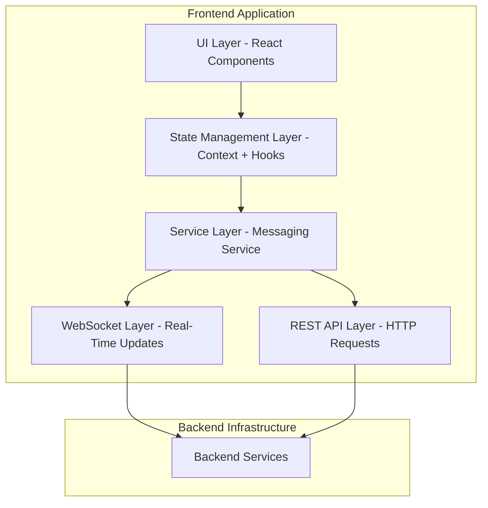
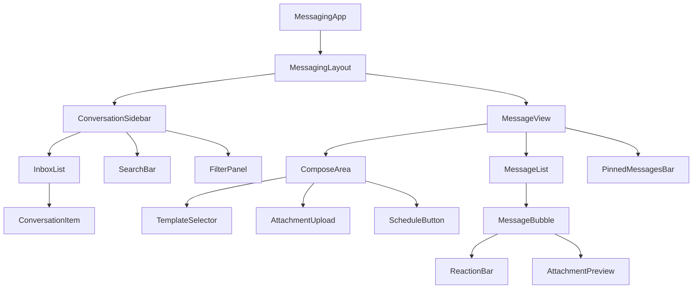
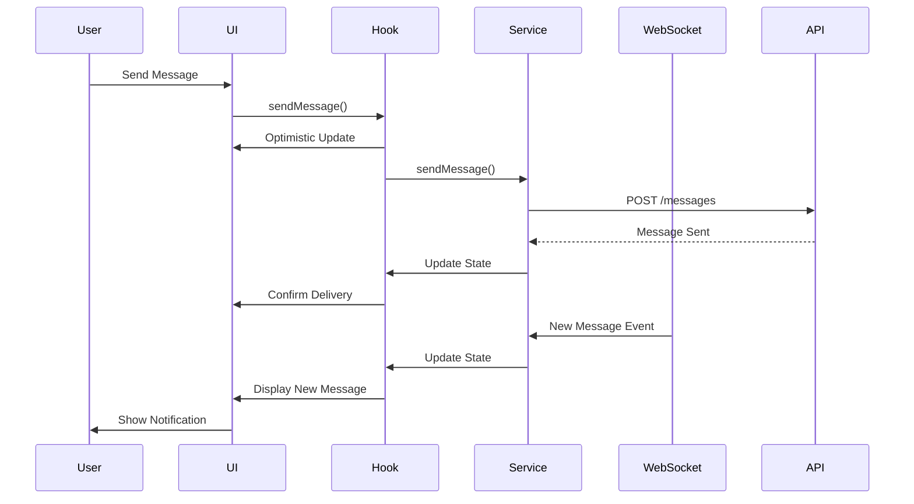

# Design Document: Office User Dashboard Messaging System

## Overview

The Office User Dashboard Messaging System is a comprehensive, real-time messaging interface designed for administrative staff in a university attendance management system. The system enables office users to communicate with students and teachers through direct messaging, broadcast messages to groups, manage conversations efficiently, and handle administrative communications with professional tools.

### Key Design Principles

1. **Professional Visual Design**: Modern glassmorphism effects, gradient-filled buttons, shadow-based separation, 3D professional icons, smooth micro-animations
2. **Real-Time Communication**: WebSocket-based real-time updates for messages, typing indicators, and status changes
3. **Multi-Language Support**: Full RTL/LTR support for Dari, Pashto, and English
4. **Accessibility First**: WCAG 2.1 AA compliance with keyboard navigation and screen reader support
5. **Performance Optimized**: Virtual scrolling, optimistic UI updates, efficient state management
6. **Responsive Design**: Mobile-first approach with adaptive layouts for all device sizes

### Technology Stack

- **Frontend Framework**: React with TypeScript
- **State Management**: React Context API with custom hooks
- **Real-Time Communication**: WebSocket (existing messaging infrastructure)
- **Styling**: Tailwind CSS with custom design system
- **Icons**: Custom 3D icon library (professional, no emojis)
- **Animations**: Framer Motion for smooth micro-animations
- **Internationalization**: i18next with RTL support
- **File Handling**: Existing file storage service integration
- **Backend Integration**: Existing Messaging_Service (lib/services/messaging-service.ts)

## Architecture

### High-Level Architecture



### Component Hierarchy



### Data Flow Architecture



## Components and Interfaces

### Core Components

#### 1. MessagingLayout Component

**Purpose**: Main layout container managing responsive behavior and RTL/LTR direction

**Props**:
```typescript
interface MessagingLayoutProps {
  language: 'en' | 'fa' | 'ps'; // English, Dari, Pashto
  direction: 'ltr' | 'rtl';
  children: React.ReactNode;
}
```

**Responsive Behavior**:
- Mobile (< 768px): Single column, toggle between inbox and conversation
- Tablet (768px - 1024px): Two columns with collapsible sidebar
- Desktop (> 1024px): Fixed two-column layout (320px sidebar + flexible main)

**Visual Design**:
- Clean white background with subtle gradient overlay
- Glassmorphism effect on sidebar with backdrop-blur
- Smooth transitions when switching between views
- Shadow-based separation (no borders)

#### 2. ConversationSidebar Component

**Purpose**: Displays conversation list with search, filters, and sorting

**Props**:
```typescript
interface ConversationSidebarProps {
  conversations: Conversation[];
  selectedId: string | null;
  onSelect: (id: string) => void;
  unreadCount: number;
}
```

**Features**:
- Search bar with real-time filtering
- Filter panel (user type, date range, category, status, priority)
- Sort dropdown (Recent, Unread first, Priority, Alphabetical)
- Bulk action toolbar (appears when items selected)
- Pinned conversations section at top
- Virtual scrolling for performance

**Visual Design**:
- Glassmorphism background with blur effect
- Gradient-filled action buttons
- 3D icons for user avatars and status
- Smooth hover animations with scale effect
- Unread badge with gradient background
- Professional blue color scheme


#### 3. ConversationItem Component

**Purpose**: Individual conversation list item with preview and actions

**Props**:
```typescript
interface ConversationItemProps {
  conversation: Conversation;
  isSelected: boolean;
  isStarred: boolean;
  isPinned: boolean;
  onClick: () => void;
  onStar: () => void;
  onPin: () => void;
  onArchive: () => void;
  onMarkUnread: () => void;
}
```

**Visual Design**:
- Gradient background when selected
- 3D avatar icon with role indicator (student/teacher)
- Message preview with truncation
- Timestamp in relative format (e.g., "2 hours ago")
- Unread count badge with gradient
- Quick action buttons on hover (star, pin, archive, mark unread)
- Typing indicator animation when active
- Priority indicator (urgent: red glow, important: amber glow)
- Category icon with tooltip

**Animations**:
- Smooth slide-in when new conversation appears
- Scale effect on hover
- Pulse animation for new messages
- Smooth color transition when selected

#### 4. MessageView Component

**Purpose**: Main message display area with conversation header and message list

**Props**:
```typescript
interface MessageViewProps {
  conversation: Conversation | null;
  messages: Message[];
  onSendMessage: (content: string, metadata: MessageMetadata) => void;
  onLoadMore: () => void;
}
```

**Layout**:
- Header: Recipient info, search, actions (pin conversation, archive, resolve)
- Pinned messages bar (collapsible, shows up to 10 pinned messages)
- Message list with virtual scrolling
- Compose area at bottom (fixed position)

**Visual Design**:
- Clean white background
- Header with glassmorphism effect
- Pinned messages bar with subtle blue gradient background
- Smooth scroll behavior with momentum
- Loading skeleton for messages
- Empty state with illustration when no conversation selected


#### 5. MessageBubble Component

**Purpose**: Individual message display with reactions, attachments, and actions

**Props**:
```typescript
interface MessageBubbleProps {
  message: Message;
  isSent: boolean; // true if sent by office user
  isPinned: boolean;
  onReact: (reactionType: ReactionType) => void;
  onPin: () => void;
  onForward: () => void;
  onReply: () => void;
}
```

**Visual Design**:
- Sent messages: Right-aligned, blue gradient background
- Received messages: Left-aligned, light gray background with subtle shadow
- Rounded corners with glassmorphism effect
- 3D avatar for received messages
- Timestamp below message (human-readable format)
- Delivery status indicator (sent, delivered, read) with 3D icons
- Category badge at top of message
- Priority indicator (urgent: red accent, important: amber accent)
- Attachment previews with download button
- Reaction bar below message (shows on hover or if reactions exist)
- Pin icon indicator if message is pinned
- Smooth entrance animation when message appears

**Reactions**:
- 5 reaction types: Acknowledge (checkmark), Important (star), Agree (thumbs up), Question (question mark), Urgent (alert)
- 3D professional icons (no emojis)
- Reaction count badge
- Hover to see list of users who reacted
- Click to add/remove reaction
- Smooth scale animation when adding reaction

**Attachments**:
- Image preview with lightbox on click
- Document icon with filename and size
- PDF preview with page count
- Download button with progress indicator
- Multiple attachments in grid layout


#### 6. ComposeArea Component

**Purpose**: Message composition with templates, attachments, scheduling, and formatting

**Props**:
```typescript
interface ComposeAreaProps {
  onSend: (message: MessageDraft) => void;
  onTyping: () => void;
  recipientType: 'student' | 'teacher';
  conversationId: string;
}
```

**Features**:
- Rich text input with auto-resize
- Template selector dropdown
- Category selector (6 categories)
- Priority selector (3 levels)
- Attachment upload button with drag-and-drop
- Schedule message button
- Send button (gradient-filled)
- Character count indicator
- Typing indicator broadcast

**Visual Design**:
- Glassmorphism background with subtle shadow
- Gradient-filled send button with hover animation
- 3D icons for all action buttons
- Smooth expand animation when focused
- Attachment preview chips with remove button
- Template preview tooltip on hover
- Schedule dialog with date/time picker

**Keyboard Shortcuts**:
- Ctrl/Cmd + Enter: Send message
- Ctrl/Cmd + K: Open template selector
- Escape: Clear input

#### 7. SearchBar Component

**Purpose**: Search conversations and messages with filters

**Props**:
```typescript
interface SearchBarProps {
  onSearch: (query: string) => void;
  onFilterChange: (filters: SearchFilters) => void;
  placeholder: string;
}
```

**Features**:
- Real-time search with debouncing (300ms)
- Filter button to open filter panel
- Clear button when text entered
- Search history dropdown
- Keyboard shortcut: Ctrl/Cmd + F

**Visual Design**:
- Rounded input with glassmorphism effect
- 3D search icon
- Gradient focus ring
- Smooth expand animation when focused
- Filter badge showing active filter count


#### 8. FilterPanel Component

**Purpose**: Advanced filtering options for conversations

**Props**:
```typescript
interface FilterPanelProps {
  filters: SearchFilters;
  onChange: (filters: SearchFilters) => void;
  onReset: () => void;
}
```

**Filter Options**:
- User Type: All, Students, Teachers
- Date Range: Today, This Week, This Month, Custom Range
- Category: All 6 message categories
- Status: All, Unread, Read, Resolved, Archived
- Priority: All, Normal, Important, Urgent
- Starred: All, Starred Only

**Visual Design**:
- Slide-in panel from right (LTR) or left (RTL)
- Glassmorphism background with backdrop blur
- Gradient-filled apply button
- Checkbox groups with 3D icons
- Date range picker with calendar
- Reset button to clear all filters
- Active filter count badge

#### 9. BroadcastDialog Component

**Purpose**: Send broadcast messages to groups

**Props**:
```typescript
interface BroadcastDialogProps {
  isOpen: boolean;
  onClose: () => void;
  onSend: (broadcast: BroadcastMessage) => void;
}
```

**Features**:
- Recipient selection (all students, specific class, all teachers, specific department)
- Class/session selector (for students)
- Department/subject selector (for teachers)
- Message composition area
- Category and priority selectors
- Attachment upload
- Recipient count preview
- Confirmation dialog before sending

**Visual Design**:
- Modal dialog with glassmorphism background
- Backdrop blur effect
- Multi-step wizard interface
- Progress indicator at top
- Gradient-filled send button
- Recipient count badge with animation
- Preview panel showing message as it will appear


#### 10. NotificationCenter Component

**Purpose**: Manage notifications and notification settings

**Props**:
```typescript
interface NotificationCenterProps {
  notifications: Notification[];
  settings: NotificationSettings;
  onUpdateSettings: (settings: NotificationSettings) => void;
  onDismiss: (id: string) => void;
  onSnooze: (id: string, duration: number) => void;
}
```

**Features**:
- Notification list with grouping
- Quick actions (mark as read, snooze, dismiss)
- Settings panel (quiet hours, sound, preview preferences)
- Per-conversation notification settings
- Notification summary view
- Unread count badge

**Visual Design**:
- Slide-in panel from top-right (LTR) or top-left (RTL)
- Glassmorphism background
- Notification items with gradient on hover
- 3D icons for notification types
- Smooth slide-in animation for new notifications
- Quiet hours indicator with moon icon
- Muted conversation indicator

#### 11. KeyboardShortcutsDialog Component

**Purpose**: Display available keyboard shortcuts

**Props**:
```typescript
interface KeyboardShortcutsDialogProps {
  isOpen: boolean;
  onClose: () => void;
}
```

**Features**:
- Categorized shortcut list (Navigation, Actions, Composition)
- Search shortcuts
- Customization interface (future enhancement)
- Platform-specific display (Ctrl vs Cmd)

**Visual Design**:
- Modal dialog with glassmorphism
- Keyboard key visual representation (3D key caps)
- Grouped sections with headers
- Search bar at top
- Smooth fade-in animation

### Utility Components

#### TypingIndicator
- Animated dots with smooth pulse effect
- Shows user name and "is typing..."
- 3D icon animation

#### LoadingSpinner
- Gradient-colored spinner
- Smooth rotation animation
- Multiple sizes (small, medium, large)

#### EmptyState
- Illustration with 3D elements
- Helpful message
- Call-to-action button

#### ErrorBoundary
- Catches component errors
- Displays friendly error message
- Retry button


## Data Models

### Core Data Types

```typescript
// User Types
type UserRole = 'student' | 'teacher' | 'office';

interface User {
  id: string;
  name: string;
  role: UserRole;
  avatar?: string;
  department?: string; // for teachers
  class?: string; // for students
  session?: string; // for students
}

// Message Types
type MessageCategory = 
  | 'administrative' 
  | 'attendance_alert' 
  | 'schedule_change' 
  | 'announcement' 
  | 'general' 
  | 'urgent';

type PriorityLevel = 'normal' | 'important' | 'urgent';

type DeliveryStatus = 'sending' | 'sent' | 'delivered' | 'read' | 'failed';

type ReactionType = 'acknowledge' | 'important' | 'agree' | 'question' | 'urgent';

interface Reaction {
  type: ReactionType;
  userId: string;
  userName: string;
  timestamp: Date;
}

interface Attachment {
  id: string;
  name: string;
  size: number;
  type: string; // MIME type
  url: string;
  thumbnailUrl?: string;
  uploadProgress?: number;
}

interface Message {
  id: string;
  conversationId: string;
  senderId: string;
  senderName: string;
  senderRole: UserRole;
  content: string;
  category: MessageCategory;
  priority: PriorityLevel;
  status: DeliveryStatus;
  attachments: Attachment[];
  reactions: Reaction[];
  isPinned: boolean;
  isForwarded: boolean;
  forwardedFrom?: {
    senderId: string;
    senderName: string;
  };
  replyTo?: string; // message ID
  timestamp: Date;
  readAt?: Date;
  deliveredAt?: Date;
}

interface MessageDraft {
  content: string;
  category: MessageCategory;
  priority: PriorityLevel;
  attachments: File[];
  scheduledFor?: Date;
  templateId?: string;
}
```


```typescript
// Conversation Types
interface Conversation {
  id: string;
  recipientId: string;
  recipientName: string;
  recipientRole: UserRole;
  recipientAvatar?: string;
  lastMessage: Message;
  unreadCount: number;
  isPinned: boolean;
  isStarred: boolean;
  isArchived: boolean;
  isResolved: boolean;
  isMuted: boolean;
  pinnedMessages: Message[];
  createdAt: Date;
  updatedAt: Date;
}

// Broadcast Types
interface BroadcastCriteria {
  type: 'all_students' | 'specific_class' | 'all_teachers' | 'specific_department';
  className?: string;
  session?: string;
  department?: string;
  subject?: string;
}

interface BroadcastMessage {
  id: string;
  senderId: string;
  content: string;
  category: MessageCategory;
  priority: PriorityLevel;
  attachments: Attachment[];
  criteria: BroadcastCriteria;
  recipientCount: number;
  deliveredCount: number;
  readCount: number;
  failedCount: number;
  failedRecipients: string[];
  timestamp: Date;
}

// Template Types
interface MessageTemplate {
  id: string;
  name: string;
  content: string;
  category: MessageCategory;
  variables: string[]; // e.g., ['recipientName', 'date']
  usageCount: number;
}

// Search and Filter Types
interface SearchFilters {
  userType?: 'student' | 'teacher' | 'all';
  dateRange?: {
    start: Date;
    end: Date;
  };
  categories?: MessageCategory[];
  status?: 'all' | 'unread' | 'read' | 'resolved' | 'archived';
  priority?: PriorityLevel | 'all';
  starred?: boolean;
}

type SortOption = 'recent' | 'unread_first' | 'priority' | 'alphabetical';
```


```typescript
// Notification Types
interface Notification {
  id: string;
  type: 'new_message' | 'message_read' | 'broadcast_complete' | 'delivery_failed';
  conversationId?: string;
  senderId?: string;
  senderName?: string;
  message?: string;
  timestamp: Date;
  isRead: boolean;
  priority: PriorityLevel;
}

interface NotificationSettings {
  enabled: boolean;
  sound: 'default' | 'subtle' | 'silent';
  preview: 'full' | 'sender_only' | 'count_only';
  quietHours?: {
    enabled: boolean;
    start: string; // HH:mm format
    end: string;
  };
  grouping: boolean;
  browserNotifications: boolean;
}

// Typing Indicator Types
interface TypingIndicator {
  conversationId: string;
  userId: string;
  userName: string;
  timestamp: Date;
}

// Scheduled Message Types
interface ScheduledMessage {
  id: string;
  draft: MessageDraft;
  conversationId: string;
  recipientId: string;
  scheduledFor: Date;
  status: 'pending' | 'sent' | 'cancelled';
  createdAt: Date;
}

// Language and Direction Types
type Language = 'en' | 'fa' | 'ps'; // English, Dari (Farsi), Pashto
type TextDirection = 'ltr' | 'rtl';

interface LanguageSettings {
  language: Language;
  direction: TextDirection;
}

// Keyboard Shortcut Types
interface KeyboardShortcut {
  id: string;
  name: string;
  description: string;
  keys: string[]; // e.g., ['Ctrl', 'N'] or ['Cmd', 'N']
  category: 'navigation' | 'actions' | 'composition';
  action: () => void;
}
```


## State Management

### Context Structure

```typescript
// Main Messaging Context
interface MessagingContextState {
  // Conversations
  conversations: Conversation[];
  selectedConversationId: string | null;
  
  // Messages
  messages: Record<string, Message[]>; // conversationId -> messages
  
  // UI State
  isLoading: boolean;
  error: string | null;
  
  // Search and Filters
  searchQuery: string;
  filters: SearchFilters;
  sortBy: SortOption;
  
  // Real-time
  typingIndicators: Record<string, TypingIndicator>; // conversationId -> indicator
  
  // Notifications
  notifications: Notification[];
  unreadCount: number;
  notificationSettings: NotificationSettings;
  
  // Language
  languageSettings: LanguageSettings;
  
  // Actions
  sendMessage: (conversationId: string, draft: MessageDraft) => Promise<void>;
  sendBroadcast: (broadcast: BroadcastMessage) => Promise<void>;
  loadConversations: () => Promise<void>;
  loadMessages: (conversationId: string) => Promise<void>;
  selectConversation: (id: string) => void;
  searchConversations: (query: string) => void;
  applyFilters: (filters: SearchFilters) => void;
  setSortBy: (sort: SortOption) => void;
  markAsRead: (conversationId: string) => Promise<void>;
  markAsUnread: (conversationId: string) => Promise<void>;
  pinConversation: (conversationId: string) => Promise<void>;
  starConversation: (conversationId: string) => Promise<void>;
  archiveConversation: (conversationId: string) => Promise<void>;
  resolveConversation: (conversationId: string) => Promise<void>;
  pinMessage: (messageId: string) => Promise<void>;
  addReaction: (messageId: string, reaction: ReactionType) => Promise<void>;
  forwardMessage: (messageId: string, recipientId: string) => Promise<void>;
  scheduleMessage: (conversationId: string, draft: MessageDraft, scheduledFor: Date) => Promise<void>;
  updateNotificationSettings: (settings: NotificationSettings) => Promise<void>;
  setLanguage: (language: Language) => void;
}
```

### Custom Hooks

```typescript
// useMessaging - Main hook for messaging functionality
function useMessaging(): MessagingContextState;

// useConversation - Hook for single conversation
function useConversation(conversationId: string): {
  conversation: Conversation | null;
  messages: Message[];
  isLoading: boolean;
  sendMessage: (draft: MessageDraft) => Promise<void>;
  loadMore: () => Promise<void>;
  hasMore: boolean;
};

// useRealTimeUpdates - WebSocket connection management
function useRealTimeUpdates(): {
  isConnected: boolean;
  reconnect: () => void;
};
```


```typescript
// useNotifications - Notification management
function useNotifications(): {
  notifications: Notification[];
  unreadCount: number;
  settings: NotificationSettings;
  dismiss: (id: string) => void;
  snooze: (id: string, duration: number) => void;
  updateSettings: (settings: NotificationSettings) => void;
  showNotification: (notification: Notification) => void;
};

// useKeyboardShortcuts - Keyboard shortcut handling
function useKeyboardShortcuts(shortcuts: KeyboardShortcut[]): void;

// useLanguage - Language and direction management
function useLanguage(): {
  language: Language;
  direction: TextDirection;
  setLanguage: (language: Language) => void;
  t: (key: string) => string; // translation function
};

// useFileUpload - File upload with progress
function useFileUpload(): {
  upload: (file: File) => Promise<Attachment>;
  progress: number;
  isUploading: boolean;
  error: string | null;
};

// useMessageTemplates - Template management
function useMessageTemplates(): {
  templates: MessageTemplate[];
  insertTemplate: (templateId: string, variables: Record<string, string>) => string;
};

// useVirtualScroll - Virtual scrolling for performance
function useVirtualScroll<T>(items: T[], itemHeight: number): {
  visibleItems: T[];
  scrollToIndex: (index: number) => void;
  containerRef: React.RefObject<HTMLDivElement>;
};
```

## Service Layer Integration

### MessagingService Interface

```typescript
class MessagingService {
  // Conversations
  async getConversations(filters?: SearchFilters): Promise<Conversation[]>;
  async getConversation(id: string): Promise<Conversation>;
  async createConversation(recipientId: string): Promise<Conversation>;
  
  // Messages
  async getMessages(conversationId: string, offset: number, limit: number): Promise<Message[]>;
  async sendMessage(conversationId: string, draft: MessageDraft): Promise<Message>;
  async sendBroadcast(broadcast: BroadcastMessage): Promise<BroadcastMessage>;
  async scheduleMessage(message: ScheduledMessage): Promise<ScheduledMessage>;
  
  // Message Actions
  async markAsRead(conversationId: string): Promise<void>;
  async markAsUnread(conversationId: string): Promise<void>;
  async pinMessage(messageId: string): Promise<void>;
  async unpinMessage(messageId: string): Promise<void>;
  async addReaction(messageId: string, reaction: ReactionType): Promise<void>;
  async removeReaction(messageId: string, reaction: ReactionType): Promise<void>;
  async forwardMessage(messageId: string, recipientId: string): Promise<Message>;
  
  // Conversation Actions
  async pinConversation(conversationId: string): Promise<void>;
  async starConversation(conversationId: string): Promise<void>;
  async archiveConversation(conversationId: string): Promise<void>;
  async resolveConversation(conversationId: string): Promise<void>;
  async muteConversation(conversationId: string): Promise<void>;
  
  // File Handling
  async uploadAttachment(file: File): Promise<Attachment>;
  async downloadAttachment(attachmentId: string): Promise<Blob>;
  
  // Templates
  async getTemplates(): Promise<MessageTemplate[]>;
  
  // Search
  async searchMessages(query: string, filters?: SearchFilters): Promise<Message[]>;
  
  // Broadcast
  async getBroadcastHistory(): Promise<BroadcastMessage[]>;
  async getBroadcastDetails(broadcastId: string): Promise<BroadcastMessage>;
  async retryFailedBroadcast(broadcastId: string): Promise<void>;
  
  // Real-time (WebSocket)
  connect(): void;
  disconnect(): void;
  onMessage(callback: (message: Message) => void): void;
  onTyping(callback: (indicator: TypingIndicator) => void): void;
  onStatusChange(callback: (messageId: string, status: DeliveryStatus) => void): void;
  sendTypingIndicator(conversationId: string): void;
}
```


## Visual Design System

### Color Palette

```typescript
const colors = {
  // Primary Blues (Professional Theme)
  primary: {
    50: '#E3F2FD',
    100: '#BBDEFB',
    200: '#90CAF9',
    300: '#64B5F6',
    400: '#42A5F5',
    500: '#2196F3', // Main brand blue
    600: '#1E88E5',
    700: '#1976D2',
    800: '#1565C0',
    900: '#0D47A1',
  },
  
  // Gradients
  gradients: {
    primary: 'linear-gradient(135deg, #667eea 0%, #764ba2 100%)',
    blue: 'linear-gradient(135deg, #2196F3 0%, #1976D2 100%)',
    success: 'linear-gradient(135deg, #4CAF50 0%, #388E3C 100%)',
    warning: 'linear-gradient(135deg, #FF9800 0%, #F57C00 100%)',
    danger: 'linear-gradient(135deg, #F44336 0%, #D32F2F 100%)',
    glass: 'linear-gradient(135deg, rgba(255,255,255,0.1) 0%, rgba(255,255,255,0.05) 100%)',
  },
  
  // Status Colors
  status: {
    sent: '#90CAF9',
    delivered: '#64B5F6',
    read: '#2196F3',
    failed: '#F44336',
  },
  
  // Priority Colors
  priority: {
    normal: '#9E9E9E',
    important: '#FF9800',
    urgent: '#F44336',
  },
  
  // Backgrounds
  background: {
    primary: '#FFFFFF',
    secondary: '#F5F7FA',
    glass: 'rgba(255, 255, 255, 0.7)',
    glassDark: 'rgba(0, 0, 0, 0.05)',
  },
  
  // Text
  text: {
    primary: '#212121',
    secondary: '#757575',
    disabled: '#BDBDBD',
    inverse: '#FFFFFF',
  },
  
  // Shadows
  shadows: {
    sm: '0 2px 4px rgba(0,0,0,0.05)',
    md: '0 4px 6px rgba(0,0,0,0.07)',
    lg: '0 10px 15px rgba(0,0,0,0.1)',
    xl: '0 20px 25px rgba(0,0,0,0.15)',
    glow: '0 0 20px rgba(33, 150, 243, 0.3)',
  },
};
```

### Typography

```typescript
const typography = {
  fontFamily: {
    primary: "'Inter', -apple-system, BlinkMacSystemFont, 'Segoe UI', sans-serif",
    rtl: "'Vazirmatn', 'Noto Sans Arabic', sans-serif", // For Dari/Pashto
  },
  
  fontSize: {
    xs: '0.75rem',    // 12px
    sm: '0.875rem',   // 14px
    base: '1rem',     // 16px
    lg: '1.125rem',   // 18px
    xl: '1.25rem',    // 20px
    '2xl': '1.5rem',  // 24px
    '3xl': '1.875rem', // 30px
  },
  
  fontWeight: {
    normal: 400,
    medium: 500,
    semibold: 600,
    bold: 700,
  },
  
  lineHeight: {
    tight: 1.25,
    normal: 1.5,
    relaxed: 1.75,
  },
};
```


### Spacing System

```typescript
const spacing = {
  0: '0',
  1: '0.25rem',  // 4px
  2: '0.5rem',   // 8px
  3: '0.75rem',  // 12px
  4: '1rem',     // 16px
  5: '1.25rem',  // 20px
  6: '1.5rem',   // 24px
  8: '2rem',     // 32px
  10: '2.5rem',  // 40px
  12: '3rem',    // 48px
  16: '4rem',    // 64px
};
```

### Animation System

```typescript
const animations = {
  // Durations
  duration: {
    fast: '150ms',
    normal: '250ms',
    slow: '350ms',
  },
  
  // Easing Functions
  easing: {
    easeIn: 'cubic-bezier(0.4, 0, 1, 1)',
    easeOut: 'cubic-bezier(0, 0, 0.2, 1)',
    easeInOut: 'cubic-bezier(0.4, 0, 0.2, 1)',
    spring: 'cubic-bezier(0.68, -0.55, 0.265, 1.55)',
  },
  
  // Keyframes
  keyframes: {
    fadeIn: {
      from: { opacity: 0 },
      to: { opacity: 1 },
    },
    slideInRight: {
      from: { transform: 'translateX(100%)' },
      to: { transform: 'translateX(0)' },
    },
    slideInLeft: {
      from: { transform: 'translateX(-100%)' },
      to: { transform: 'translateX(0)' },
    },
    scaleIn: {
      from: { transform: 'scale(0.95)', opacity: 0 },
      to: { transform: 'scale(1)', opacity: 1 },
    },
    pulse: {
      '0%, 100%': { opacity: 1 },
      '50%': { opacity: 0.5 },
    },
    bounce: {
      '0%, 100%': { transform: 'translateY(0)' },
      '50%': { transform: 'translateY(-10px)' },
    },
  },
};
```

### Glassmorphism Effect

```css
.glass-effect {
  background: rgba(255, 255, 255, 0.7);
  backdrop-filter: blur(10px);
  -webkit-backdrop-filter: blur(10px);
  border: 1px solid rgba(255, 255, 255, 0.3);
  box-shadow: 0 8px 32px 0 rgba(31, 38, 135, 0.07);
}
```

### Button Styles

```typescript
const buttonStyles = {
  // Primary Button (Gradient-filled)
  primary: {
    background: 'linear-gradient(135deg, #667eea 0%, #764ba2 100%)',
    color: '#FFFFFF',
    padding: '0.75rem 1.5rem',
    borderRadius: '0.5rem',
    boxShadow: '0 4px 6px rgba(0,0,0,0.1)',
    transition: 'all 0.25s ease',
    hover: {
      transform: 'translateY(-2px)',
      boxShadow: '0 6px 12px rgba(0,0,0,0.15)',
    },
  },
  
  // Secondary Button (Solid color)
  secondary: {
    background: '#2196F3',
    color: '#FFFFFF',
    padding: '0.75rem 1.5rem',
    borderRadius: '0.5rem',
    boxShadow: '0 2px 4px rgba(0,0,0,0.1)',
    transition: 'all 0.25s ease',
    hover: {
      background: '#1976D2',
      transform: 'translateY(-1px)',
    },
  },
  
  // Icon Button
  icon: {
    background: 'rgba(255, 255, 255, 0.7)',
    backdropFilter: 'blur(10px)',
    padding: '0.5rem',
    borderRadius: '0.5rem',
    transition: 'all 0.25s ease',
    hover: {
      background: 'rgba(255, 255, 255, 0.9)',
      transform: 'scale(1.05)',
    },
  },
};
```


## Responsive Design Specifications

### Breakpoints

```typescript
const breakpoints = {
  mobile: '0px',      // 0 - 767px
  tablet: '768px',    // 768px - 1023px
  desktop: '1024px',  // 1024px+
  wide: '1440px',     // 1440px+
};
```

### Layout Specifications

#### Mobile Layout (< 768px)

```
┌─────────────────────────┐
│  Header (60px)          │
├─────────────────────────┤
│                         │
│  Conversation List      │
│  (Full Width)           │
│  OR                     │
│  Message View           │
│  (Full Width)           │
│                         │
│                         │
└─────────────────────────┘
```

**Behavior**:
- Single column layout
- Toggle between conversation list and message view
- Back button in message view to return to list
- Bottom navigation for quick actions
- Swipe gestures for actions (archive, delete, pin)
- Floating action button for new conversation

#### Tablet Layout (768px - 1023px)

```
┌──────────┬──────────────────┐
│          │                  │
│  Sidebar │  Message View    │
│  (280px) │  (Flexible)      │
│          │                  │
│          │                  │
│          │                  │
│          │                  │
└──────────┴──────────────────┘
```

**Behavior**:
- Two-column layout
- Collapsible sidebar (hamburger menu)
- Touch-optimized controls (larger tap targets)
- Swipe to collapse/expand sidebar

#### Desktop Layout (> 1024px)

```
┌──────────┬──────────────────────────┐
│          │  Header                  │
│  Sidebar ├──────────────────────────┤
│  (320px) │  Pinned Messages (if any)│
│          ├──────────────────────────┤
│          │                          │
│          │  Message List            │
│          │  (Scrollable)            │
│          │                          │
│          ├──────────────────────────┤
│          │  Compose Area            │
└──────────┴──────────────────────────┘
```

**Behavior**:
- Fixed two-column layout
- Sidebar always visible
- Hover effects on all interactive elements
- Keyboard shortcuts enabled
- Right-click context menus


### Touch Target Sizes

All interactive elements on mobile/tablet must meet minimum touch target sizes:

```typescript
const touchTargets = {
  minimum: '44px', // WCAG 2.1 AAA standard
  comfortable: '48px', // Recommended for primary actions
  icon: '40px', // Minimum for icon buttons
};
```

## RTL/LTR Implementation

### Direction Switching

```typescript
// Automatic direction based on language
const getDirection = (language: Language): TextDirection => {
  return language === 'en' ? 'ltr' : 'rtl';
};

// Apply direction to root element
document.documentElement.dir = direction;
document.documentElement.lang = language;
```

### RTL-Specific Adjustments

```typescript
const rtlAdjustments = {
  // Flip horizontal positioning
  padding: {
    ltr: { paddingLeft: '1rem', paddingRight: '0.5rem' },
    rtl: { paddingRight: '1rem', paddingLeft: '0.5rem' },
  },
  
  // Flip margins
  margin: {
    ltr: { marginLeft: 'auto' },
    rtl: { marginRight: 'auto' },
  },
  
  // Flip text alignment
  textAlign: {
    ltr: 'left',
    rtl: 'right',
  },
  
  // Flip flex direction for certain layouts
  flexDirection: {
    ltr: 'row',
    rtl: 'row-reverse',
  },
  
  // Icons that should NOT flip
  noFlip: ['search', 'close', 'check', 'plus'],
  
  // Icons that SHOULD flip
  flip: ['arrow-left', 'arrow-right', 'chevron-left', 'chevron-right'],
};
```

### Message Bubble Alignment

```typescript
// Sent messages
const sentMessageStyle = {
  ltr: {
    marginLeft: 'auto',
    marginRight: '0',
    borderTopLeftRadius: '1rem',
    borderTopRightRadius: '1rem',
    borderBottomLeftRadius: '1rem',
    borderBottomRightRadius: '0.25rem',
  },
  rtl: {
    marginRight: 'auto',
    marginLeft: '0',
    borderTopLeftRadius: '1rem',
    borderTopRightRadius: '1rem',
    borderBottomRightRadius: '1rem',
    borderBottomLeftRadius: '0.25rem',
  },
};

// Received messages
const receivedMessageStyle = {
  ltr: {
    marginLeft: '0',
    marginRight: 'auto',
    borderTopLeftRadius: '1rem',
    borderTopRightRadius: '1rem',
    borderBottomRightRadius: '1rem',
    borderBottomLeftRadius: '0.25rem',
  },
  rtl: {
    marginRight: '0',
    marginLeft: 'auto',
    borderTopLeftRadius: '1rem',
    borderTopRightRadius: '1rem',
    borderBottomLeftRadius: '1rem',
    borderBottomRightRadius: '0.25rem',
  },
};
```


## Accessibility Implementation

### Keyboard Navigation

```typescript
const keyboardNavigation = {
  // Global shortcuts
  'Ctrl+N': 'New conversation',
  'Ctrl+F': 'Search',
  'Ctrl+K': 'Command palette',
  'Escape': 'Close dialog/modal',
  '?': 'Show keyboard shortcuts',
  
  // Navigation
  'ArrowUp': 'Previous conversation',
  'ArrowDown': 'Next conversation',
  'Enter': 'Open selected conversation',
  'Tab': 'Next focusable element',
  'Shift+Tab': 'Previous focusable element',
  
  // Actions
  'Ctrl+Enter': 'Send message',
  'Ctrl+Shift+A': 'Mark all as read',
  'Ctrl+Shift+P': 'Pin/unpin conversation',
  'Ctrl+Shift+S': 'Star/unstar conversation',
  'Ctrl+Shift+R': 'Mark as resolved',
  
  // Message actions
  'r': 'Reply to message (when focused)',
  'f': 'Forward message (when focused)',
  'p': 'Pin message (when focused)',
};
```

### ARIA Labels and Roles

```typescript
const ariaLabels = {
  // Conversation list
  conversationList: {
    role: 'list',
    'aria-label': 'Conversations',
  },
  
  conversationItem: {
    role: 'listitem',
    'aria-label': (name: string, unread: number) => 
      `Conversation with ${name}, ${unread} unread messages`,
  },
  
  // Message list
  messageList: {
    role: 'log',
    'aria-live': 'polite',
    'aria-label': 'Messages',
  },
  
  message: {
    role: 'article',
    'aria-label': (sender: string, time: string) => 
      `Message from ${sender} at ${time}`,
  },
  
  // Compose area
  composeArea: {
    role: 'form',
    'aria-label': 'Compose message',
  },
  
  messageInput: {
    role: 'textbox',
    'aria-label': 'Message content',
    'aria-multiline': 'true',
  },
  
  // Buttons
  sendButton: {
    'aria-label': 'Send message',
  },
  
  attachButton: {
    'aria-label': 'Attach file',
  },
  
  // Status indicators
  typingIndicator: {
    role: 'status',
    'aria-live': 'polite',
    'aria-label': (name: string) => `${name} is typing`,
  },
  
  deliveryStatus: {
    role: 'status',
    'aria-label': (status: DeliveryStatus) => `Message ${status}`,
  },
};
```


### Focus Management

```typescript
const focusManagement = {
  // Focus indicators
  focusRing: {
    outline: '2px solid #2196F3',
    outlineOffset: '2px',
    borderRadius: '0.25rem',
  },
  
  // Focus trap for modals
  trapFocus: (element: HTMLElement) => {
    const focusableElements = element.querySelectorAll(
      'button, [href], input, select, textarea, [tabindex]:not([tabindex="-1"])'
    );
    const firstElement = focusableElements[0] as HTMLElement;
    const lastElement = focusableElements[focusableElements.length - 1] as HTMLElement;
    
    element.addEventListener('keydown', (e) => {
      if (e.key === 'Tab') {
        if (e.shiftKey && document.activeElement === firstElement) {
          e.preventDefault();
          lastElement.focus();
        } else if (!e.shiftKey && document.activeElement === lastElement) {
          e.preventDefault();
          firstElement.focus();
        }
      }
    });
  },
  
  // Restore focus after modal close
  restoreFocus: (previousElement: HTMLElement) => {
    previousElement?.focus();
  },
};
```

### Screen Reader Announcements

```typescript
const announcements = {
  // New message
  newMessage: (sender: string) => 
    `New message from ${sender}`,
  
  // Message sent
  messageSent: () => 
    'Message sent successfully',
  
  // Message failed
  messageFailed: () => 
    'Message failed to send. Press retry to try again.',
  
  // Typing indicator
  typing: (name: string) => 
    `${name} is typing`,
  
  // Status change
  statusChange: (status: DeliveryStatus) => 
    `Message status changed to ${status}`,
  
  // Notification
  notification: (count: number) => 
    `${count} new ${count === 1 ? 'notification' : 'notifications'}`,
};

// Announce to screen reader
const announce = (message: string) => {
  const announcement = document.createElement('div');
  announcement.setAttribute('role', 'status');
  announcement.setAttribute('aria-live', 'polite');
  announcement.className = 'sr-only';
  announcement.textContent = message;
  document.body.appendChild(announcement);
  setTimeout(() => announcement.remove(), 1000);
};
```

### Color Contrast

All text must meet WCAG 2.1 AA standards (4.5:1 for normal text, 3:1 for large text):

```typescript
const contrastRatios = {
  // Text on white background
  primaryText: { color: '#212121', ratio: 16.1 }, // AAA
  secondaryText: { color: '#757575', ratio: 4.6 }, // AA
  
  // Text on blue background
  whiteOnBlue: { color: '#FFFFFF', background: '#2196F3', ratio: 4.5 }, // AA
  
  // Status indicators
  successText: { color: '#2E7D32', ratio: 4.5 }, // AA
  warningText: { color: '#F57C00', ratio: 4.5 }, // AA
  errorText: { color: '#C62828', ratio: 4.5 }, // AA
};
```


## Animation Specifications

### Micro-Animations

```typescript
const microAnimations = {
  // Message send animation
  messageSend: {
    initial: { opacity: 0, y: 20, scale: 0.95 },
    animate: { opacity: 1, y: 0, scale: 1 },
    transition: { duration: 0.25, ease: 'easeOut' },
  },
  
  // Message receive animation
  messageReceive: {
    initial: { opacity: 0, x: -20 },
    animate: { opacity: 1, x: 0 },
    transition: { duration: 0.3, ease: 'easeOut' },
  },
  
  // Typing indicator animation
  typingDots: {
    animate: {
      y: [0, -8, 0],
    },
    transition: {
      duration: 0.6,
      repeat: Infinity,
      ease: 'easeInOut',
      times: [0, 0.5, 1],
    },
  },
  
  // Button hover animation
  buttonHover: {
    whileHover: { scale: 1.05, y: -2 },
    whileTap: { scale: 0.95 },
    transition: { duration: 0.15 },
  },
  
  // Notification slide-in
  notificationSlide: {
    initial: { x: 300, opacity: 0 },
    animate: { x: 0, opacity: 1 },
    exit: { x: 300, opacity: 0 },
    transition: { duration: 0.3, ease: 'easeOut' },
  },
  
  // Reaction animation
  reactionPop: {
    initial: { scale: 0 },
    animate: { scale: [0, 1.2, 1] },
    transition: { duration: 0.3, ease: 'easeOut' },
  },
  
  // Unread badge pulse
  unreadPulse: {
    animate: {
      scale: [1, 1.1, 1],
      opacity: [1, 0.8, 1],
    },
    transition: {
      duration: 2,
      repeat: Infinity,
      ease: 'easeInOut',
    },
  },
  
  // Modal backdrop
  modalBackdrop: {
    initial: { opacity: 0 },
    animate: { opacity: 1 },
    exit: { opacity: 0 },
    transition: { duration: 0.2 },
  },
  
  // Modal content
  modalContent: {
    initial: { scale: 0.9, opacity: 0 },
    animate: { scale: 1, opacity: 1 },
    exit: { scale: 0.9, opacity: 0 },
    transition: { duration: 0.25, ease: 'easeOut' },
  },
  
  // Sidebar slide
  sidebarSlide: {
    initial: { x: -320 },
    animate: { x: 0 },
    exit: { x: -320 },
    transition: { duration: 0.3, ease: 'easeInOut' },
  },
  
  // Loading spinner
  spinner: {
    animate: { rotate: 360 },
    transition: { duration: 1, repeat: Infinity, ease: 'linear' },
  },
};
```


## Performance Optimization

### Virtual Scrolling

```typescript
// Virtual scroll configuration
const virtualScrollConfig = {
  // Conversation list
  conversationList: {
    itemHeight: 80, // pixels
    overscan: 5, // render 5 extra items above/below viewport
    bufferSize: 20, // keep 20 items in memory
  },
  
  // Message list
  messageList: {
    estimatedItemHeight: 100, // variable height messages
    overscan: 3,
    bufferSize: 50,
  },
};

// Implementation
const useVirtualScroll = (items: any[], itemHeight: number) => {
  const [scrollTop, setScrollTop] = useState(0);
  const [containerHeight, setContainerHeight] = useState(0);
  
  const startIndex = Math.floor(scrollTop / itemHeight);
  const endIndex = Math.ceil((scrollTop + containerHeight) / itemHeight);
  
  const visibleItems = items.slice(
    Math.max(0, startIndex - overscan),
    Math.min(items.length, endIndex + overscan)
  );
  
  return { visibleItems, startIndex, endIndex };
};
```

### Optimistic UI Updates

```typescript
const optimisticUpdate = {
  // Send message optimistically
  sendMessage: async (draft: MessageDraft) => {
    // 1. Create temporary message with "sending" status
    const tempMessage: Message = {
      id: `temp-${Date.now()}`,
      ...draft,
      status: 'sending',
      timestamp: new Date(),
    };
    
    // 2. Add to UI immediately
    addMessageToUI(tempMessage);
    
    // 3. Send to server
    try {
      const sentMessage = await messagingService.sendMessage(draft);
      // 4. Replace temp message with real message
      replaceMessage(tempMessage.id, sentMessage);
    } catch (error) {
      // 5. Mark as failed, show retry option
      updateMessageStatus(tempMessage.id, 'failed');
    }
  },
  
  // Add reaction optimistically
  addReaction: async (messageId: string, reaction: ReactionType) => {
    // 1. Add reaction to UI immediately
    addReactionToUI(messageId, reaction);
    
    // 2. Send to server
    try {
      await messagingService.addReaction(messageId, reaction);
    } catch (error) {
      // 3. Remove reaction if failed
      removeReactionFromUI(messageId, reaction);
      showError('Failed to add reaction');
    }
  },
};
```

### Debouncing and Throttling

```typescript
const performanceHelpers = {
  // Debounce search input
  debounceSearch: debounce((query: string) => {
    searchConversations(query);
  }, 300),
  
  // Throttle typing indicator
  throttleTyping: throttle(() => {
    messagingService.sendTypingIndicator(conversationId);
  }, 1000),
  
  // Throttle scroll events
  throttleScroll: throttle((event: Event) => {
    handleScroll(event);
  }, 100),
};
```

