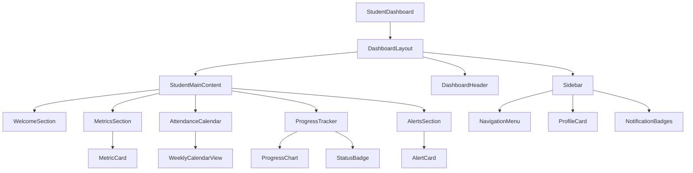
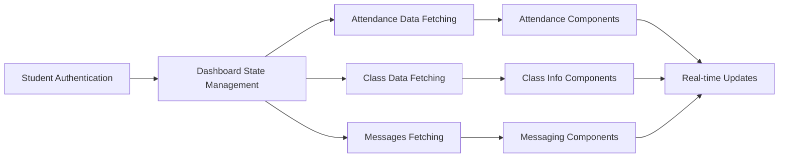

# Student Dashboard Design Document

## Overview

The Student Dashboard is a visually stunning, user-friendly interface that serves as the central hub for students within the University Attendance System. Built with Next.js 15, React 19, and modern UI libraries, the dashboard emphasizes visual excellence through glassmorphism design, smooth animations, and intuitive interactions. The design follows the established UI guidelines with gradient backgrounds, shadow-based depth, and responsive layouts that work seamlessly across all devices.

The dashboard uses a **green color scheme** as the primary theme, creating a fresh, motivating, and positive learning environment. The primary colors are `emerald-50`, `emerald-100`, `emerald-500`, `emerald-600`, and `emerald-700` with gradients like `from-emerald-50 to-emerald-100/50`.

The dashboard is organized into distinct functional areas: Attendance Overview, Weekly Calendar, Progress Tracking, Class Information, Messaging System, and Help & Support. Each area features modern card-based layouts with animated transitions, 3D hover effects, and contextual information that enhances the student experience.

### Student Color Palette

- **Primary Green**: `emerald-500` (#10b981) - Main action buttons and icons
- **Light Green**: `emerald-50` - Card backgrounds and subtle highlights
- **Medium Green**: `emerald-100` - Hover states and secondary backgrounds
- **Dark Green**: `emerald-600`, `emerald-700` - Text and emphasis elements
- **Gradient**: `bg-gradient-to-br from-emerald-50 to-emerald-100/50` - Card backgrounds
- **Text Colors**: `text-emerald-600`, `text-emerald-700` - Consistent with student theme
- **Accent Colors**: 
  - Success/Present: `green-500` (#22c55e)
  - Warning/Approaching: `yellow-500` (#eab308)
  - Alert/Critical: `orange-500` (#f97316)
  - Danger/Absent: `red-500` (#ef4444)

### Design Principles

1. **Read-Only Interface**: All data displays are view-only with no edit capabilities
2. **Motivational Design**: Positive reinforcement through colors, messages, and achievements
3. **Transparency**: Clear visibility into attendance records and academic standing
4. **Accessibility**: WCAG 2.1 AA compliant with full keyboard and screen reader support
5. **Fully Responsive**: Mobile-first design with adaptive layouts for all screen sizes (375px to 2560px+)
6. **Performance**: Fast loading with skeleton screens and optimized animations

### Responsive Design Strategy

The student dashboard follows a **mobile-first approach** with progressive enhancement:

**Core Responsive Features:**
- ✅ Fluid layouts that adapt from 375px (mobile) to 2560px+ (large desktop)
- ✅ Touch-optimized interactions with 44px minimum touch targets
- ✅ Collapsible sidebar navigation on mobile devices
- ✅ Responsive typography scaling across breakpoints
- ✅ Adaptive component layouts (single column → multi-column)
- ✅ Mobile-specific UI patterns (bottom sheets, floating action buttons)
- ✅ Optimized images and assets for different screen sizes
- ✅ Smooth animations that respect reduced motion preferences

**Breakpoint Strategy:**
```typescript
// Tailwind breakpoints used throughout
xs: '375px'   // Small mobile
sm: '640px'   // Large mobile
md: '768px'   // Tablet
lg: '1024px'  // Desktop
xl: '1280px'  // Large desktop
2xl: '1536px' // Extra large desktop
```


## Architecture

### Component Architecture



### Data Flow Architecture



### State Management Strategy

The dashboard uses a combination of React Query for server state management and Zustand for client state management:

- **Server State**: Attendance records, class information, messages, notifications
- **Client State**: UI preferences, filter states, modal states, sidebar collapsed state
- **Real-time Updates**: WebSocket connections for live attendance updates and message notifications


## Components and Interfaces

### 1. Dashboard Layout Structure

#### Main Dashboard Container

The student dashboard reuses the existing dashboard layout pattern with student-specific content and green theme:

```typescript
interface StudentDashboardProps {
  student: Student;
  attendanceData: AttendanceData;
  classInfo: ClassInfo;
  initialMetrics: DashboardMetrics;
  layoutProps: DashboardLayoutProps;
}

interface DashboardMetrics {
  totalClasses: number;
  attendanceRate: number;
  presentDays: number;
  absentDays: number;
  sickDays: number;
  leaveDays: number;
  academicStatus: 'good' | 'warning' | 'mahroom' | 'tasdiq';
  remainingAbsences: number;
}

interface Student {
  id: string;
  firstName: string;
  lastName: string;
  email: string;
  studentId: string;
  classId: string;
  className: string;
  avatar?: string;
  enrollmentDate: Date;
}
```

#### Layout Structure

```
┌─────────────────────────────────────────────────────────────┐
│              [Dashboard Header - Green Theme]                │
│  [Student Avatar] [Welcome Message] [Notifications] [Menu]  │
├──────────┬──────────────────────────────────────────────────┤
│ Sidebar  │                                                  │
│          │  ┌────────────────────────────────────────────┐  │
│ ├ Dash   │  │         Welcome Section                    │  │
│ ├ Attend │  │  "Welcome back, Ahmed!"                    │  │
│ ├ Class  │  │  [View Attendance] [Contact Teacher]       │  │
│ ├ Message│  └────────────────────────────────────────────┘  │
│ └ Help   │                                                  │
│          │  ┌──────┐ ┌──────┐ ┌──────┐ ┌──────┐          │
│ Profile  │  │Total │ │Attend│ │Prese │ │Absen │          │
│ Ahmed    │  │Class │ │Rate  │ │nt    │ │t     │          │
│ CS 101   │  │  36  │ │94.2% │ │  34  │ │  2   │          │
│          │  └──────┘ └──────┘ └──────┘ └──────┘          │
│ [Logout] │                                                  │
│          │  ┌────────────────────────────────────────────┐  │
│          │  │      Weekly Attendance Calendar            │  │
│          │  │  Sat  Sun  Mon  Tue  Wed  Thu              │  │
│          │  │  [✓]  [✓]  [✓]  [✗]  [✓]  [✓]             │  │
│          │  └────────────────────────────────────────────┘  │
│          │                                                  │
│          │  ┌────────────────────────────────────────────┐  │
│          │  │      Academic Standing                     │  │
│          │  │  Status: ✅ Good Standing                  │  │
│          │  │  Progress: ████████░░ 94.2%                │  │
│          │  └────────────────────────────────────────────┘  │
└──────────┴──────────────────────────────────────────────────┘
```


#### Design Specifications

**Header Section:**
- Uses the existing dashboard header component with role-based customization
- Same height, gradient background, and layout as teacher/office dashboards
- Student avatar with green accent ring
- Welcome message adapted for student role with motivational greeting
- Notification bell icon with green badge for unread messages
- Mobile hamburger menu with green theme

**Sidebar Navigation:**
- Glass morphism design with `bg-white/80 backdrop-blur-xl` and `border-0`
- Green gradient for active items: `bg-gradient-to-r from-emerald-500 to-emerald-600`
- Navigation items with icons:
  - 🏠 Dashboard
  - 📊 My Attendance
  - 📚 Class Information
  - 💬 Messages (with unread badge)
  - ❓ Help & Support
- Profile section at top with:
  - Student avatar with green ring
  - Student name
  - Class name and code
  - Student ID
- Logout button at bottom with confirmation dialog
- Collapsible on mobile with smooth slide animation
- Width: 280px on desktop, full-screen overlay on mobile

**Metric Cards:**
- Glass morphism design with `bg-white/80 backdrop-blur-xl` and `border-0`
- Green gradient backgrounds: `bg-gradient-to-br from-emerald-50 to-emerald-100/50`
- 3D hover effects with `hover:scale-[1.02] hover:shadow-xl` (disabled on mobile)
- Count-up animations for numeric values
- Icon backgrounds with `bg-emerald-500` and white icons
- **Fully Responsive Grid:**
  - Mobile (375px-639px): `grid-cols-1` - Single column, stacked vertically
  - Small Mobile (640px-767px): `grid-cols-2` - Two columns
  - Tablet (768px-1023px): `grid-cols-2` - Two columns with more spacing
  - Desktop (1024px+): `grid-cols-4` - Four columns, full layout
- **Responsive Padding:**
  - Mobile: `p-4` with `gap-3`
  - Tablet: `p-5` with `gap-4`
  - Desktop: `p-6` with `gap-6`
- **Responsive Text:**
  - Title: `text-xs sm:text-sm` (uppercase, tracking-wide)
  - Value: `text-xl sm:text-2xl lg:text-3xl` (bold)
  - Label: `text-xs sm:text-sm`


### 2. Welcome Section

#### Welcome Banner Design

```typescript
interface WelcomeSectionProps {
  studentName: string;
  greeting: string;
  motivationalMessage: string;
  academicStatus: AcademicStatus;
}

interface AcademicStatus {
  status: 'excellent' | 'good' | 'warning' | 'critical';
  message: string;
  icon: string;
}
```

**Visual Design:**
- Full-width banner with green gradient background
- Animated floating elements (hidden on mobile for performance)
- Personalized greeting with student's first name
- Motivational message based on attendance performance
- Quick action buttons with filled backgrounds (no outline variants)

**Motivational Messages by Status:**
- **Excellent (95%+)**: "Outstanding attendance! Keep up the excellent work! 🌟"
- **Good (85-94%)**: "Great job! You're doing well. Stay consistent! 👍"
- **Warning (75-84%)**: "Your attendance needs attention. Let's improve together! ⚠️"
- **Critical (<75%)**: "Urgent: Your attendance is at risk. Please contact your teacher. 🚨"

**Quick Action Buttons:**
- "View Attendance" button: `bg-gradient-to-r from-emerald-600 to-emerald-700 hover:from-emerald-700 hover:to-emerald-800 shadow-xl shadow-emerald-500/25 border-0`
- "Contact Teacher" button: `bg-white/60 backdrop-blur-sm hover:bg-white/80 shadow-lg border-0`


### 3. Attendance Calendar Component

#### Weekly Calendar View

```typescript
interface AttendanceCalendarProps {
  weekData: WeekAttendance[];
  currentWeek: number;
  onWeekChange: (week: number) => void;
  onDayClick: (date: Date) => void;
}

interface WeekAttendance {
  date: Date;
  dayName: string;
  status: 'present' | 'absent' | 'sick' | 'leave' | 'no-class';
  sessions: SessionAttendance[];
}

interface SessionAttendance {
  sessionNumber: number;
  time: string;
  status: 'present' | 'absent' | 'sick' | 'leave';
  markedBy: string;
  markedAt: Date;
}
```

**Visual Design:**
- Card with glass morphism: `bg-white/80 backdrop-blur-xl rounded-2xl shadow-xl border-0`
- Week navigation with arrow buttons and week number display
- Grid layout showing Saturday to Thursday (5 days)
- Each day card with:
  - Day name and date
  - Large status icon with color coding
  - Session count indicator
  - Click to expand for session details

**Status Color Coding:**
- **Present**: `bg-green-50 text-green-700 border-green-200` with ✓ icon
- **Absent**: `bg-red-50 text-red-700 border-red-200` with ✗ icon
- **Sick**: `bg-yellow-50 text-yellow-700 border-yellow-200` with 🤒 icon
- **Leave**: `bg-blue-50 text-blue-700 border-blue-200` with 📅 icon
- **No Class**: `bg-slate-50 text-slate-400 border-slate-200` with - icon

**Interactive Features:**
- Hover effect: `hover:scale-[1.02] hover:shadow-lg transition-all duration-300`
- Click to expand: Smooth accordion animation showing session details
- Week navigation: Smooth slide transition between weeks
- Current day highlight: Green ring and pulsing animation


### 4. Progress Tracker Component

#### Progress Visualization

```typescript
interface ProgressTrackerProps {
  attendanceRate: number;
  presentHours: number;
  absentHours: number;
  sickHours: number;
  leaveHours: number;
  totalHours: number;
  mahroomThreshold: number;
  tasdiqThreshold: number;
  remainingAbsences: number;
}
```

**Card Design:**
- Glass morphism container with green gradient
- Animated circular progress indicator showing attendance percentage
- Horizontal progress bars for each status type
- Warning indicators when approaching thresholds
- Comparison with class average

**Progress Bars:**
- Present: Green gradient with animated fill
- Absent: Red gradient with warning pulse if high
- Sick: Yellow gradient
- Leave: Blue gradient
- Each bar shows hours and percentage

**Threshold Warnings:**
- Green zone (>85%): "Excellent! Keep it up!"
- Yellow zone (75-85%): "Good, but watch your absences"
- Orange zone (approaching محروم): "Warning: X absences remaining"
- Red zone (محروم or تصدیق طلب): Critical alert with action required


### 5. Academic Standing Alert Cards

#### Alert Card Component

```typescript
interface AlertCardProps {
  type: 'info' | 'warning' | 'critical';
  title: string;
  message: string;
  actionRequired: boolean;
  actionButton?: {
    label: string;
    onClick: () => void;
  };
}
```

**Alert Types:**

1. **Good Standing (Info)**
   - Background: `bg-gradient-to-br from-green-50 to-green-100/50`
   - Icon: ✅ with green color
   - Message: "You're in good standing! Keep up the great work."
   - No action required

2. **Approaching Warning (Warning)**
   - Background: `bg-gradient-to-br from-yellow-50 to-yellow-100/50`
   - Icon: ⚠️ with yellow color
   - Message: "You have X absences remaining before reaching the threshold."
   - Action: "View Attendance Policy"

3. **محروم Status (Critical)**
   - Background: `bg-gradient-to-br from-red-50 to-red-100/50`
   - Icon: 🚫 with red color and pulsing animation
   - Title: "Disqualified (محروم)"
   - Message: "You have exceeded the maximum allowed absences. You are not eligible for final exams."
   - Action: "Contact Teacher" or "Contact Office"

4. **تصدیق طلب Status (Critical)**
   - Background: `bg-gradient-to-br from-orange-50 to-orange-100/50`
   - Icon: 📋 with orange color
   - Title: "Certification Required (تصدیق طلب)"
   - Message: "You need to submit medical certificates to restore exam eligibility."
   - Action: "Upload Documentation"


### 6. Messaging System

#### Message Interface Component

```typescript
interface MessagingSystemProps {
  conversations: Conversation[];
  onSendMessage: (message: Message) => void;
  onAttachFile: (file: File) => void;
}

interface Conversation {
  id: string;
  recipientType: 'teacher' | 'office';
  recipientName: string;
  messages: Message[];
  unreadCount: number;
  lastMessageAt: Date;
}

interface Message {
  id: string;
  senderId: string;
  senderName: string;
  senderRole: 'student' | 'teacher' | 'office';
  content: string;
  category: 'attendance_inquiry' | 'documentation' | 'general' | 'urgent';
  attachments: Attachment[];
  timestamp: Date;
  isRead: boolean;
}

interface Attachment {
  id: string;
  filename: string;
  fileType: string;
  fileSize: number;
  url: string;
}
```

**Message Interface Design:**

**Conversation List:**
- Left sidebar showing all conversations
- Each conversation card shows:
  - Recipient avatar and name
  - Last message preview
  - Timestamp
  - Unread badge with green background
- Active conversation highlighted with green gradient

**Message Thread:**
- Chat-style interface with message bubbles
- Student messages: Right-aligned with green background
- Teacher/Office messages: Left-aligned with gray background
- Timestamp below each message
- Attachment previews with download buttons
- Read receipts (✓✓ for read, ✓ for sent)

**Compose Message:**
- Text area with placeholder: "Type your message..."
- Category selector dropdown
- File attachment button with drag-and-drop support
- Send button: `bg-gradient-to-r from-emerald-600 to-emerald-700 border-0`
- Character count indicator
- Attachment preview with remove option

**Message Categories:**
- 🔍 Attendance Inquiry
- 📄 Documentation Submission
- 💬 General Question
- 🚨 Urgent Matter


### 7. Class Information Section

#### Class Details Component

```typescript
interface ClassInfoProps {
  classData: ClassData;
  teacherInfo: TeacherInfo;
  schedule: ClassSchedule[];
  attendancePolicy: AttendancePolicy;
}

interface ClassData {
  id: string;
  name: string;
  code: string;
  semester: number;
  academicYear: string;
  credits: number;
  room: string;
  building: string;
}

interface TeacherInfo {
  id: string;
  name: string;
  email: string;
  officeHours: string;
  officeLocation: string;
  avatar?: string;
}

interface ClassSchedule {
  day: string;
  startTime: string;
  endTime: string;
  room: string;
  sessionType: 'lecture' | 'lab' | 'tutorial';
}

interface AttendancePolicy {
  maxAbsences: number;
  mahroomThreshold: number;
  tasdiqThreshold: number;
  policyText: string;
}
```

**Visual Layout:**

**Class Overview Card:**
- Glass morphism design with green accents
- Class name and code prominently displayed
- Semester, year, and credits information
- Room and building location
- Schedule grid showing weekly timetable

**Teacher Information Card:**
- Teacher avatar with green ring
- Teacher name and title
- Contact email (clickable to open messaging)
- Office hours and location
- "Contact Teacher" button with green gradient

**Attendance Policy Card:**
- Clear explanation of attendance rules
- Visual representation of thresholds
- محروم (Disqualified) explanation in English
- تصدیق طلب (Certification Required) explanation in English
- FAQ accordion for common questions


### 8. Attendance History View

#### History Component

```typescript
interface AttendanceHistoryProps {
  records: AttendanceRecord[];
  filters: HistoryFilters;
  onFilterChange: (filters: HistoryFilters) => void;
  onExport: (format: 'pdf' | 'csv') => void;
}

interface AttendanceRecord {
  id: string;
  date: Date;
  sessionNumber: number;
  status: 'present' | 'absent' | 'sick' | 'leave';
  markedBy: string;
  markedAt: Date;
  notes?: string;
}

interface HistoryFilters {
  dateRange: { start: Date; end: Date };
  statusTypes: string[];
  month?: number;
}
```

**Visual Design:**

**Filter Panel:**
- Date range picker with calendar dropdown
- Status type multi-select checkboxes
- Month selector for quick filtering
- "Reset Filters" button
- Export buttons for PDF and CSV

**Timeline View:**
- Vertical timeline with date markers
- Each record displayed as a card with:
  - Date and session number
  - Status badge with color coding
  - Time marked and by whom
  - Any notes or comments
- Infinite scroll for large datasets
- Skeleton loading for smooth UX

**Statistics Summary:**
- Total records displayed
- Breakdown by status type
- Date range covered
- Visual mini-charts


### 9. Help & Support Section

#### Help Interface Component

```typescript
interface HelpSupportProps {
  faqs: FAQ[];
  policies: Policy[];
  contactInfo: ContactInfo;
}

interface FAQ {
  id: string;
  question: string;
  answer: string;
  category: string;
}

interface Policy {
  id: string;
  title: string;
  content: string;
  lastUpdated: Date;
}

interface ContactInfo {
  officeEmail: string;
  officePhone: string;
  officeHours: string;
  emergencyContact: string;
}
```

**Visual Layout:**

**FAQ Accordion:**
- Searchable FAQ list
- Categories: Attendance, Policies, Technical, General
- Expandable accordion items with smooth animation
- Green highlight for active item
- "Was this helpful?" feedback buttons

**Policy Documents:**
- Attendance Policy (English)
- محروم (Disqualified) Explanation
- تصدیق طلب (Certification Required) Process
- Student Rights and Responsibilities
- Each policy in expandable card format

**Contact Information:**
- Office contact details
- Emergency contact information
- "Send Message to Office" button
- Office hours and location
- Quick links to common actions

**Helpful Resources:**
- Video tutorials (if available)
- Step-by-step guides
- Downloadable forms
- System status and announcements


## Data Models

### Student Dashboard State

```typescript
interface StudentDashboardState {
  student: Student;
  attendanceData: AttendanceData;
  classInfo: ClassInfo;
  messages: Message[];
  notifications: Notification[];
  preferences: StudentPreferences;
  activeView: DashboardView;
}

interface AttendanceData {
  weeklyRecords: WeekAttendance[];
  statistics: AttendanceStatistics;
  history: AttendanceRecord[];
  academicStatus: AcademicStatus;
}

interface AttendanceStatistics {
  totalClasses: number;
  presentCount: number;
  absentCount: number;
  sickCount: number;
  leaveCount: number;
  attendanceRate: number;
  classAverage: number;
  ranking: number;
  remainingAbsences: number;
}

interface StudentPreferences {
  theme: 'light' | 'dark' | 'auto';
  notificationSettings: NotificationSettings;
  displaySettings: DisplaySettings;
}

interface DisplaySettings {
  animationsEnabled: boolean;
  compactMode: boolean;
  language: 'en';
}

interface NotificationSettings {
  attendanceMarked: boolean;
  statusChanges: boolean;
  messageReceived: boolean;
  scheduleChanges: boolean;
  emailNotifications: boolean;
}
```

### Real-time Data Updates

```typescript
interface RealtimeUpdate {
  type: 'attendance_marked' | 'message_received' | 'status_changed' | 'notification';
  payload: any;
  timestamp: Date;
}
```


## Error Handling

### User Experience Error Handling

#### Loading States
- **Skeleton Cards**: Replace content with animated skeleton placeholders (never simple spinners)
- **Progressive Loading**: Load critical content first, then secondary information
- **Shimmer Effects**: Gradient shimmer animations during data fetching

```typescript
const SkeletonMetricCard = () => (
  <Card className="rounded-2xl shadow-sm bg-white border-0">
    <CardContent className="p-5">
      <div className="animate-pulse">
        <div className="flex items-start justify-between mb-4">
          <div className="flex items-center gap-3">
            <div className="h-11 w-11 bg-gradient-to-br from-emerald-200 to-emerald-300 rounded-xl animate-shimmer" />
            <div>
              <div className="h-5 w-32 bg-gradient-to-r from-slate-200 to-slate-300 rounded mb-2 animate-shimmer" />
              <div className="h-4 w-24 bg-gradient-to-r from-slate-200 to-slate-300 rounded animate-shimmer" />
            </div>
          </div>
        </div>
      </div>
    </CardContent>
  </Card>
);
```

#### Error States
- **Network Errors**: Retry mechanism with exponential backoff
- **Data Not Found**: Friendly message with helpful suggestions
- **Permission Errors**: Clear explanation with contact information

#### Offline Handling
- **Service Worker**: Cache critical dashboard data for offline viewing
- **Offline Indicator**: Visual indicator when connection is lost
- **Read-Only Mode**: All data remains viewable offline


## Testing Strategy

### Component Testing
- **Unit Tests**: Individual component functionality and props handling
- **Integration Tests**: Component interaction and data flow
- **Visual Regression Tests**: Screenshot comparison for UI consistency

### User Experience Testing
- **Accessibility Testing**: WCAG 2.1 AA compliance verification
- **Performance Testing**: Load time optimization and animation smoothness
- **Responsive Testing**: Cross-device compatibility and touch interactions

### Business Logic Testing
- **Attendance Calculation**: Verify attendance rate and status calculations
- **Permission Testing**: Ensure read-only access is enforced
- **Data Privacy**: Validate that students can only see their own data

## Performance Optimizations

### Rendering Performance
- **Memoization**: React.memo for expensive components
- **Code Splitting**: Lazy load secondary features
- **Virtual Scrolling**: For large attendance history lists

### Data Management
- **Caching Strategy**: Intelligent caching of attendance data
- **Background Sync**: Periodic data refresh without user interruption
- **Optimistic UI**: Show data immediately while fetching updates

### Animation Performance
- **Hardware Acceleration**: Use transform3d for smooth animations
- **Reduced Motion**: Respect user preferences for motion sensitivity
- **Frame Rate Optimization**: Maintain 60fps for all interactions


## Accessibility Features

### Keyboard Navigation
- **Tab Order**: Logical navigation through all interactive elements
- **Keyboard Shortcuts**: Quick access to common sections
- **Focus Management**: Clear focus indicators and proper focus trapping in modals

### Screen Reader Support
- **ARIA Labels**: Comprehensive labeling for all interactive elements
- **Live Regions**: Announce dynamic content changes (attendance updates, messages)
- **Semantic HTML**: Proper heading hierarchy and landmark roles

### Visual Accessibility
- **High Contrast**: Support for high contrast mode
- **Color Independence**: Information not conveyed by color alone (icons + text)
- **Text Scaling**: Support for 200% text scaling without horizontal scrolling
- **Focus Indicators**: Clear, visible focus indicators with green theme

## Mobile Responsiveness

### Responsive Breakpoints
The student dashboard follows a mobile-first approach with these breakpoints:
- **Mobile**: 375px - 767px (xs, sm)
- **Tablet**: 768px - 1023px (md)
- **Desktop**: 1024px - 1439px (lg)
- **Large Desktop**: 1440px+ (xl, 2xl)

### Touch Interactions
- **Touch Targets**: Minimum 44px touch targets for all interactive elements
- **Gesture Support**: Swipe gestures for calendar navigation and sidebar
- **Haptic Feedback**: Tactile feedback for important actions (messages sent, attendance viewed)
- **Touch-Optimized Buttons**: All buttons use `touch-manipulation` CSS class

### Mobile Layout Adaptations (375px - 767px)

**Sidebar Navigation:**
- Full-screen overlay on mobile
- Hamburger menu button in header
- Smooth slide-in animation from left
- Backdrop blur overlay when open
- Swipe-to-close gesture support

**Metric Cards:**
- Single column layout: `grid-cols-1`
- Stacked vertically with spacing
- Reduced padding: `p-4` instead of `p-6`
- Smaller text sizes: `text-sm` for labels, `text-xl` for values

**Welcome Section:**
- Reduced padding: `p-4 sm:p-6 lg:p-12`
- Smaller heading: `text-xl sm:text-2xl lg:text-5xl`
- Stacked buttons: `flex-col` instead of `flex-row`
- Full-width buttons on mobile

**Attendance Calendar:**
- Horizontal scroll for week view
- Larger touch targets for day cards
- Bottom sheet for session details
- Simplified view with essential info only

**Progress Tracker:**
- Vertical layout for progress bars
- Larger circular progress indicator
- Simplified statistics display

**Messaging Interface:**
- Full-screen on mobile
- Bottom sheet for compose message
- Simplified conversation list
- Floating action button for new message

### Tablet Layout Adaptations (768px - 1023px)

**Sidebar Navigation:**
- Collapsible sidebar (can be toggled)
- Reduced width: 240px instead of 280px
- Icons with abbreviated labels

**Metric Cards:**
- Two columns: `grid-cols-2`
- Medium padding: `p-5`

**Attendance Calendar:**
- Full week visible without scroll
- Medium-sized day cards

**Messaging Interface:**
- Split view: conversation list + active thread
- Side-by-side layout

### Desktop Layout Adaptations (1024px+)

**Sidebar Navigation:**
- Always visible sidebar (280px width)
- Full labels and icons
- Smooth hover effects

**Metric Cards:**
- Four columns: `grid-cols-4`
- Full padding: `p-6`
- 3D hover effects enabled

**Attendance Calendar:**
- Full week view with spacious layout
- Hover effects and tooltips

**Messaging Interface:**
- Three-column layout: contacts + thread + details
- Full feature set visible

### Responsive Typography
```typescript
// Heading sizes
h1: "text-xl sm:text-2xl md:text-3xl lg:text-5xl"
h2: "text-lg sm:text-xl lg:text-2xl xl:text-3xl"
h3: "text-base sm:text-lg lg:text-xl"

// Body text
body: "text-sm sm:text-base"
small: "text-xs sm:text-sm"

// Button text
button: "text-sm sm:text-base lg:text-lg"
```

### Responsive Spacing
```typescript
// Container padding
container: "p-4 sm:p-6 lg:p-8 xl:p-12"

// Card padding
card: "p-4 sm:p-5 lg:p-6"

// Section margins
section: "mb-6 sm:mb-8 lg:mb-12"

// Gap between elements
gap: "gap-3 sm:gap-4 lg:gap-6"
```

### Responsive Images and Icons
```typescript
// Icon sizes
small: "h-4 w-4 sm:h-5 sm:w-5"
medium: "h-5 w-5 sm:h-6 sm:w-6 lg:h-7 lg:w-7"
large: "h-6 w-6 sm:h-7 sm:w-7 lg:h-8 lg:w-8"

// Avatar sizes
avatar: "h-10 w-10 sm:h-12 sm:w-12 lg:h-14 lg:w-14"
```

### Progressive Web App Features
- **Offline Support**: View attendance data without internet
- **Push Notifications**: Real-time alerts for attendance updates
- **Home Screen Installation**: Add to home screen capability
- **Responsive Images**: Optimized images for different screen sizes
- **Lazy Loading**: Load images and components as needed


## Language and Localization

### English Interface
All interface elements are displayed in English with the following guidelines:

**Status Labels:**
- Present (not "Attended")
- Absent (not "Missing")
- Sick (with 🤒 icon)
- Leave (with 📅 icon)

**Arabic Terms with English Translations:**
- **محروم (Disqualified)**: "You have exceeded the maximum allowed absences and are not eligible for final exams."
- **تصدیق طلب (Certification Required)**: "You need to submit medical certificates to restore your exam eligibility."

**Buttons and Actions:**
- View Attendance (not "Check Attendance")
- Contact Teacher (not "Message Teacher")
- Upload Documentation (not "Submit Files")
- Export Records (not "Download Data")

**Help Documentation:**
- All FAQs in English
- Policy documents in English
- Error messages in English
- Success notifications in English

## Security Considerations

### Data Privacy
- Students can only view their own attendance data
- No access to other students' information
- Secure session management with auto-logout
- HTTPS for all data transmission

### Read-Only Access
- All attendance data is read-only for students
- No ability to modify or delete records
- Clear messaging when attempting unauthorized actions
- Audit trail for all data access

### File Upload Security
- File type validation for attachments
- File size limits (max 10MB per file)
- Virus scanning for uploaded files
- Secure storage with access controls


## Responsive Design Implementation Checklist

### ✅ Layout Responsiveness
- [ ] All components use responsive Tailwind classes (sm:, md:, lg:, xl:)
- [ ] Grid layouts adapt: 1 column (mobile) → 2 columns (tablet) → 4 columns (desktop)
- [ ] Flexbox layouts switch between column and row based on screen size
- [ ] Sidebar collapses to hamburger menu on mobile (<768px)
- [ ] All modals and dialogs use bottom sheets on mobile
- [ ] Floating action buttons appear only on mobile for quick actions

### ✅ Typography Responsiveness
- [ ] All headings scale: `text-xl sm:text-2xl lg:text-5xl`
- [ ] Body text scales: `text-sm sm:text-base`
- [ ] Button text scales: `text-sm sm:text-base lg:text-lg`
- [ ] Line heights adjust for readability on small screens
- [ ] Text truncation with ellipsis on mobile where needed

### ✅ Spacing Responsiveness
- [ ] Container padding: `p-4 sm:p-6 lg:p-12`
- [ ] Card padding: `p-4 sm:p-5 lg:p-6`
- [ ] Section margins: `mb-6 sm:mb-8 lg:mb-12`
- [ ] Gap between elements: `gap-3 sm:gap-4 lg:gap-6`
- [ ] Consistent spacing scale across all components

### ✅ Interactive Elements
- [ ] All buttons minimum 44px height on mobile: `min-h-[44px]`
- [ ] Touch targets properly sized with `touch-manipulation` class
- [ ] Hover effects disabled on mobile: `hover:scale-[1.02]` wrapped in `!isMobile` check
- [ ] Click/tap feedback with scale animations: `whileTap={{ scale: 0.95 }}`
- [ ] Swipe gestures for navigation on mobile

### ✅ Images and Icons
- [ ] Icons scale: `h-4 w-4 sm:h-5 sm:w-5 lg:h-6 lg:w-6`
- [ ] Avatars scale: `h-10 w-10 sm:h-12 sm:w-12 lg:h-14 lg:w-14`
- [ ] Images use responsive srcset for different resolutions
- [ ] Lazy loading for images below the fold
- [ ] Optimized image formats (WebP with fallbacks)

### ✅ Navigation
- [ ] Sidebar: 280px on desktop, full-screen overlay on mobile
- [ ] Hamburger menu icon visible only on mobile
- [ ] Navigation items stack vertically on mobile
- [ ] Active page indicator adapts to mobile layout
- [ ] Smooth slide animations for mobile menu

### ✅ Forms and Inputs
- [ ] Input fields full-width on mobile: `w-full`
- [ ] Labels above inputs on mobile, inline on desktop
- [ ] Form buttons full-width on mobile, auto-width on desktop
- [ ] File upload optimized for mobile camera access
- [ ] Keyboard avoidance on mobile when inputs are focused

### ✅ Tables and Data Display
- [ ] Tables scroll horizontally on mobile with `overflow-x-auto`
- [ ] Card-based layout for data on mobile instead of tables
- [ ] Simplified data display on mobile (show essential info only)
- [ ] Expandable rows for detailed information on mobile

### ✅ Performance
- [ ] Animations disabled on mobile if performance is poor
- [ ] Reduced motion respected: `prefers-reduced-motion`
- [ ] Lazy loading for off-screen components
- [ ] Code splitting for mobile-specific components
- [ ] Optimized bundle size for mobile networks

### ✅ Testing Requirements
- [ ] Test on iPhone SE (375px) - smallest mobile
- [ ] Test on iPhone 12/13/14 (390px) - standard mobile
- [ ] Test on iPad (768px) - tablet
- [ ] Test on iPad Pro (1024px) - large tablet
- [ ] Test on Desktop (1440px) - standard desktop
- [ ] Test on 4K (2560px) - large desktop
- [ ] Test landscape and portrait orientations
- [ ] Test with browser zoom at 200%
- [ ] Test with touch interactions on actual devices
- [ ] Test with keyboard navigation on all screen sizes

