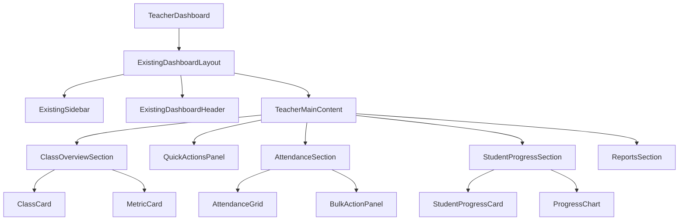
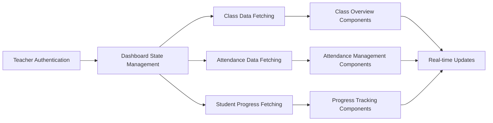

# Teacher Dashboard Design Document

## Overview

The Teacher Dashboard is a sophisticated, visually stunning interface that serves as the central hub for teachers within the University Attendance System. Built with Next.js 15, React 19, and modern UI libraries, the dashboard emphasizes visual excellence through glassmorphism design, smooth animations, and intuitive interactions. The design follows the established UI guidelines with gradient backgrounds, shadow-based depth, and responsive layouts that work seamlessly across all devices.

The dashboard uses the established **orange color scheme** from the existing teacher portal, maintaining visual consistency across all teacher-facing interfaces. The primary colors are `orange-50`, `orange-100`, `orange-600`, and `orange-700` with gradients like `from-orange-50 to-orange-100/50`.

The dashboard is organized into distinct functional areas: Class Overview, Attendance Management, Student Progress Tracking, Reports & Analytics, and Notification Center. Each area features modern card-based layouts with animated transitions, 3D hover effects, and contextual quick actions that enhance the teaching workflow.

### Teacher Color Palette

- **Primary Orange**: `orange-600` - Main action buttons and icons
- **Light Orange**: `orange-50` - Card backgrounds and subtle highlights  
- **Medium Orange**: `orange-100` - Hover states and secondary backgrounds
- **Dark Orange**: `orange-700` - Text and emphasis elements
- **Gradient**: `bg-gradient-to-br from-orange-50 to-orange-100/50` - Card backgrounds
- **Text Colors**: `text-orange-600`, `text-orange-700` - Consistent with existing teacher portal

## Architecture

### Component Architecture



### Data Flow Architecture



### State Management Strategy

The dashboard uses a combination of React Query for server state management and Zustand for client state management:

- **Server State**: Class data, attendance records, student information, reports
- **Client State**: UI preferences, filter states, notification settings, modal states
- **Real-time Updates**: WebSocket connections for live attendance updates and notifications

## Components and Interfaces

### 1. Dashboard Layout Structure

#### Main Dashboard Container

The teacher dashboard extends the existing office dashboard layout with teacher-specific content:

```typescript
interface TeacherDashboardProps {
  teacher: Teacher;
  classes: Class[];
  initialMetrics: DashboardMetrics;
  // Reuses existing dashboard layout props
  layoutProps: ExistingDashboardLayoutProps;
}

interface DashboardMetrics {
  totalStudents: number;
  totalClasses: number;
  weeklyAttendanceRate: number;
  studentsAtRisk: number;
  pendingActions: number;
}
```

The teacher dashboard reuses the existing office dashboard layout structure with teacher-specific content:

```
┌─────────────────────────────────────────────────────────────┐
│              [Existing Dashboard Header]                    │
│  [Teacher Avatar] [Welcome Message] [Notifications] [Menu]  │
├─────────────────────────────────────────────────────────────┤
│ [Existing Sidebar]                                          │
│ ├ Dashboard                                                 │
│ ├ My Classes                                                │
│ ├ Attendance                                                │
│ ├ Reports                                                   │
│ └ Settings                                                  │
│                                                             │
│  ┌─────────────┐ ┌─────────────┐ ┌─────────────┐ ┌────────┐ │
│  │   Total     │ │  Classes    │ │ Attendance  │ │At-Risk │ │
│  │  Students   │ │   Active    │ │    Rate     │ │Students│ │
│  │     247     │ │      8      │ │    94.2%    │ │   12   │ │
│  └─────────────┘ └─────────────┘ └─────────────┘ └────────┘ │
│                                                             │
│  ┌─────────────────────────────────────────────────────────┐ │
│  │                Quick Actions Panel                      │ │
│  │  [Mark Attendance] [View Reports] [Student Progress]    │ │
│  └─────────────────────────────────────────────────────────┘ │
│                                                             │
│  ┌─────────────────────────────────────────────────────────┐ │
│  │                   My Classes                            │ │
│  │  ┌─────────┐ ┌─────────┐ ┌─────────┐ ┌─────────┐       │ │
│  │  │Class A  │ │Class B  │ │Class C  │ │Class D  │       │ │
│  │  │25 Stud. │ │30 Stud. │ │28 Stud. │ │22 Stud. │       │ │
│  │  └─────────┘ └─────────┘ └─────────┘ └─────────┘       │ │
│  └─────────────────────────────────────────────────────────┘ │
│                                                             │
└─────────────────────────────────────────────────────────────┘
```

#### Design Specifications

**Header Section:**
- Uses the existing office dashboard header component with role-based customization
- Same height, gradient background, and layout as office dashboard
- Teacher avatar replaces office user avatar with same styling
- Welcome message adapted for teacher role with dynamic time-based greeting
- Same notification system and mobile hamburger menu as office dashboard

**Metric Cards:**
- Glass morphism design with `bg-white/80 backdrop-blur-xl` and `border-0` (no borders)
- Orange gradient backgrounds: `bg-gradient-to-br from-orange-50 to-orange-100/50`
- 3D hover effects with `hover:scale-[1.02] hover:shadow-xl`
- Count-up animations for numeric values
- Icon backgrounds with `bg-orange-600` and white icons

### 2. Class Overview Section

#### Class Cards Design

```typescript
interface ClassCardProps {
  class: {
    id: string;
    name: string;
    studentCount: number;
    schedule: WeeklySchedule;
    attendanceRate: number;
    nextSession: Date;
    room: string;
  };
  onMarkAttendance: (classId: string) => void;
  onViewDetails: (classId: string) => void;
}
```

**Visual Design:**
- Card dimensions: Responsive grid with `grid-cols-1 md:grid-cols-2 lg:grid-cols-3 xl:grid-cols-4`
- Background: `bg-gradient-to-br from-orange-50 to-orange-100/50` (teacher orange theme)
- Border radius: `rounded-2xl` with `shadow-lg` and `border-0` (no borders)
- Hover effects: 3D tilt animation with shadow elevation

**Card Content Structure:**
```
┌─────────────────────────────────┐
│  [📚 Icon]     [⋮ Menu]         │
│                                 │
│  Computer Science 101           │
│  Room: A-204                    │
│                                 │
│  👥 28 Students                │
│  📊 94.2% Attendance            │
│                                 │
│  Next: Today 10:00 AM           │
│                                 │
│  [Mark Attendance] [View Class] │
└─────────────────────────────────┘
```

**Interactive Elements:**
- Quick action buttons with filled colored backgrounds (never outline variants)
- "Mark Attendance" button: `bg-orange-50 text-orange-700 hover:bg-orange-100 shadow-sm border-0`
- "View Class" button: `bg-orange-100 text-orange-700 hover:bg-orange-200 shadow-sm border-0`
- Dropdown menu with smooth slide animation

### 3. Attendance Management Interface

#### Attendance Grid Component

```typescript
interface AttendanceGridProps {
  classId: string;
  students: Student[];
  currentDate: Date;
  onStatusChange: (studentId: string, status: AttendanceStatus) => void;
  onBulkAction: (studentIds: string[], status: AttendanceStatus) => void;
}

interface Student {
  id: string;
  name: string;
  avatar?: string;
  currentStatus: AttendanceStatus;
  attendanceRate: number;
  isAtRisk: boolean;
  riskType?: 'محروم' | 'تصدیق طلب';
}
```

**Grid Layout Design:**
- Responsive table with glass morphism container and `border-0`
- Header with gradient background `from-orange-50 to-orange-100`
- No borders on cells, using alternating row colors and shadows instead
- Hover effects on rows with `hover:bg-orange-50/30 transition-colors`

**Status Toggle Buttons:**
Each student row contains status toggle buttons with filled backgrounds (no outline variants):

- **Present**: `bg-green-50 text-green-700 hover:bg-green-100 shadow-sm border-0`
- **Absent**: `bg-red-50 text-red-700 hover:bg-red-100 shadow-sm border-0`
- **Sick**: `bg-yellow-50 text-yellow-700 hover:bg-yellow-100 shadow-sm border-0`
- **Leave**: `bg-orange-50 text-orange-700 hover:bg-orange-100 shadow-sm border-0` (teacher theme)

**Bulk Actions Panel:**
Floating panel that appears when students are selected:
- Glass morphism design with backdrop blur
- Bulk status change buttons with confirmation modals
- Smooth slide-up animation from bottom
- Auto-hide after 5 seconds of inactivity

### 4. Student Progress Tracking

#### Student Progress Cards

```typescript
interface StudentProgressCardProps {
  student: Student;
  attendanceHistory: AttendanceRecord[];
  progressMetrics: {
    attendanceRate: number;
    presentHours: number;
    absentHours: number;
    sickHours: number;
    leaveHours: number;
    isDisqualified: boolean;
    requiresCertification: boolean;
  };
}
```

**Card Design:**
- Expandable cards with smooth accordion animation
- Student avatar with status indicator ring
- Progress bars with animated fill effects
- Risk status badges with appropriate colors and icons

**Progress Visualization:**
```
┌─────────────────────────────────────────────────────────┐
│  [👤 Avatar] John Smith                    [📊 94.2%]   │
│                                                         │
│  ████████████████████░░░░ Present (94.2%)              │
│  ██░░░░░░░░░░░░░░░░░░░░░░ Absent (5.8%)                 │
│  ░░░░░░░░░░░░░░░░░░░░░░░░ Sick (0%)                     │
│                                                         │
│  Status: ✅ Good Standing                               │
│  Risk Level: 🟢 Low                                     │
│                                                         │
│  [View Details] [Contact Student]                      │
└─────────────────────────────────────────────────────────┘
```

**Risk Indicators:**
- **محروم Warning**: `bg-red-50 text-red-700 shadow-sm border-0` with pulsing animation
- **تصدیق طلب Warning**: `bg-orange-100 text-orange-700 shadow-sm border-0` with attention blink (teacher theme)
- **Good Standing**: `bg-green-50 text-green-700 shadow-sm border-0` with subtle glow

### 5. Reports and Analytics Section

#### Report Dashboard

```typescript
interface ReportDashboardProps {
  teacherId: string;
  dateRange: DateRange;
  filters: ReportFilters;
  onExport: (format: ExportFormat) => void;
}

interface ReportFilters {
  classIds: string[];
  statusTypes: AttendanceStatus[];
  riskLevels: RiskLevel[];
}
```

**Report Cards Layout:**
- Grid layout with responsive columns
- Each report type has its own card with specific gradient
- Export buttons with download progress animations
- Filter panel with smooth slide-out animation

**Available Reports:**
1. **Weekly Attendance Summary**
   - Background: `bg-gradient-to-br from-orange-50 to-orange-100/50` (teacher theme)
   - Interactive charts with hover tooltips
   - Export formats: PDF, Excel, CSV

2. **Student Status Report**
   - Background: `bg-gradient-to-br from-orange-50 to-orange-100/50` (teacher theme)
   - محروم and تصدیق طلب tracking
   - Filterable by risk level

3. **Class Performance Analytics**
   - Background: `bg-gradient-to-br from-orange-50 to-orange-100/50` (teacher theme)
   - Comparative analysis across classes
   - Trend visualization with animated charts

### 6. Notification Center

#### Notification Panel Design

```typescript
interface NotificationCenterProps {
  notifications: Notification[];
  unreadCount: number;
  onMarkAsRead: (notificationId: string) => void;
  onMarkAllAsRead: () => void;
}

interface Notification {
  id: string;
  type: 'student_risk' | 'system_update' | 'schedule_change';
  title: string;
  message: string;
  timestamp: Date;
  isRead: boolean;
  actionUrl?: string;
}
```

**Panel Design:**
- Slide-out panel from right side with backdrop blur
- Glass morphism container with smooth animations
- Notification cards with type-specific colors
- Mark as read functionality with fade animation

**Notification Types:**
- **Student Risk**: Red accent with warning icon
- **System Update**: Blue accent with info icon
- **Schedule Change**: Orange accent with calendar icon

## Data Models

### Teacher Dashboard State

```typescript
interface TeacherDashboardState {
  teacher: Teacher;
  classes: Class[];
  metrics: DashboardMetrics;
  notifications: Notification[];
  preferences: TeacherPreferences;
  activeView: DashboardView;
}

interface TeacherPreferences {
  defaultView: 'overview' | 'attendance' | 'progress';
  notificationSettings: NotificationSettings;
  displaySettings: DisplaySettings;
}

interface DisplaySettings {
  theme: 'light' | 'dark' | 'auto';
  animationsEnabled: boolean;
  compactMode: boolean;
  gridColumns: number;
}
```

### Real-time Data Updates

```typescript
interface RealtimeUpdate {
  type: 'attendance_change' | 'student_status_change' | 'notification';
  payload: any;
  timestamp: Date;
  affectedClasses: string[];
}
```

## Error Handling

### User Experience Error Handling

#### Loading States
- **Skeleton Cards**: Replace content with animated skeleton placeholders (never simple spinners)
- **Progressive Loading**: Load critical content first, then secondary information
- **Shimmer Effects**: Gradient shimmer animations during data fetching

```typescript
const SkeletonClassCard = () => (
  <Card className="rounded-2xl shadow-sm bg-white border-0">
    <CardContent className="p-5">
      <div className="animate-pulse">
        <div className="flex items-start justify-between mb-4">
          <div className="flex items-center gap-3">
            <div className="h-11 w-11 bg-gradient-to-br from-slate-200 to-slate-300 rounded-xl animate-shimmer" />
            <div>
              <div className="h-5 w-32 bg-gradient-to-r from-slate-200 to-slate-300 rounded mb-2 animate-shimmer" />
              <div className="h-4 w-24 bg-gradient-to-r from-slate-200 to-slate-300 rounded animate-shimmer" />
            </div>
          </div>
        </div>
        <div className="h-4 w-full bg-gradient-to-r from-slate-200 to-slate-300 rounded animate-shimmer" />
      </div>
    </CardContent>
  </Card>
);
```

#### Error States
- **Network Errors**: Retry mechanism with exponential backoff
- **Data Validation Errors**: Inline error messages with correction suggestions
- **Permission Errors**: Graceful degradation with alternative actions

#### Offline Handling
- **Service Worker**: Cache critical dashboard data for offline access
- **Sync Queue**: Queue attendance changes when offline, sync when online
- **Offline Indicator**: Visual indicator when connection is lost

## Testing Strategy

### Component Testing
- **Unit Tests**: Individual component functionality and props handling
- **Integration Tests**: Component interaction and data flow
- **Visual Regression Tests**: Screenshot comparison for UI consistency

### User Experience Testing
- **Accessibility Testing**: WCAG 2.1 AA compliance verification
- **Performance Testing**: Load time optimization and animation smoothness
- **Responsive Testing**: Cross-device compatibility and touch interactions

### Business Logic Testing
- **Attendance Calculation**: Verify محروم and تصدیق طلب logic
- **Permission Testing**: Role-based access control validation
- **Data Integrity**: Ensure attendance data consistency and audit trails

## Performance Optimizations

### Rendering Performance
- **Virtual Scrolling**: For large student lists and attendance grids
- **Memoization**: React.memo for expensive components
- **Code Splitting**: Lazy load secondary features and reports

### Data Management
- **Optimistic Updates**: Immediate UI feedback for attendance changes
- **Background Sync**: Periodic data refresh without user interruption
- **Caching Strategy**: Intelligent caching of frequently accessed data

### Animation Performance
- **Hardware Acceleration**: Use transform3d for smooth animations
- **Reduced Motion**: Respect user preferences for motion sensitivity
- **Frame Rate Optimization**: Maintain 60fps for all interactions

## Accessibility Features

### Keyboard Navigation
- **Tab Order**: Logical navigation through all interactive elements
- **Keyboard Shortcuts**: Quick access to common actions
- **Focus Management**: Clear focus indicators and proper focus trapping

### Screen Reader Support
- **ARIA Labels**: Comprehensive labeling for all interactive elements
- **Live Regions**: Announce dynamic content changes
- **Semantic HTML**: Proper heading hierarchy and landmark roles

### Visual Accessibility
- **High Contrast**: Support for high contrast mode
- **Color Independence**: Information not conveyed by color alone
- **Text Scaling**: Support for 200% text scaling without horizontal scrolling

## Mobile Responsiveness

### Touch Interactions
- **Touch Targets**: Minimum 44px touch targets for all interactive elements
- **Gesture Support**: Swipe gestures for navigation and actions
- **Haptic Feedback**: Tactile feedback for important actions

### Mobile Layout Adaptations
- **Collapsible Sidebar**: Slide-out navigation for mobile devices
- **Stacked Cards**: Single-column layout for class cards on mobile
- **Bottom Sheet**: Modal presentations optimized for mobile interaction

### Progressive Web App Features
- **Offline Support**: Core functionality available without internet
- **Push Notifications**: Real-time alerts for important updates
- **Home Screen Installation**: Add to home screen capability