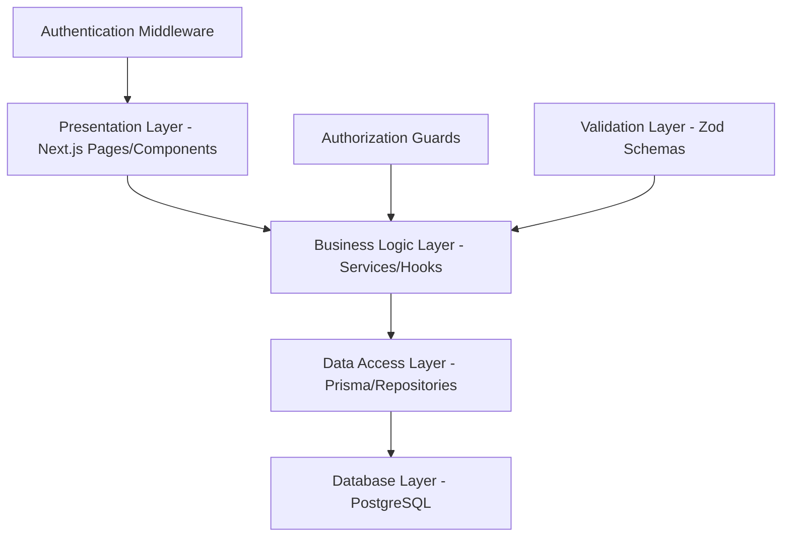

# Design Document

## Overview

The University Attendance System is a modern, visually stunning, high-trust web application built with Next.js 15, React 19, and PostgreSQL. The system implements a sophisticated role-based architecture supporting Office administrators, Teachers, and Students with comprehensive dashboard functionality featuring cutting-edge UI/UX design with modern component libraries, beautiful animations, and 3D iconography. The application follows a weekly attendance tracking model (Saturday-Thursday) with advanced academic rule enforcement for disqualification and certification requirements, featuring extensive reporting and analytics capabilities with immersive animations and interactions.

### Core Design Principles
- **Visual Excellence**: Modern glassmorphism design with vibrant gradients, 3D icons from Lucide React and Heroicons, smooth micro-interactions, and contemporary aesthetics
- **Modern Interactions**: Framer Motion animations with spring physics, hover effects with 3D transforms, gesture-based interactions, and delightful micro-animations
- **Comprehensive Navigation**: Floating navigation with blur effects, animated sidebar with 3D depth, smooth page transitions, and gesture-based menu systems
- **Role-Based Dashboards**: Office sees system control with animated metric cards and 3D charts, Teachers see class management with interactive progress rings, Students see personal overview with gamified elements
- **Business Rule Implementation**: Sophisticated logic for disqualification (pure absence tracking) and certification workflow with animated status indicators and progress visualization
- **Advanced Reporting**: Interactive dashboards with animated charts, student status tracking with 3D badges, and multi-format export with progress animations
- **Responsive Design**: Mobile-first approach with touch-optimized interactions, gesture navigation, and adaptive 3D layouts
- **Accessibility**: WCAG 2.1 AA compliance with keyboard navigation, screen reader support, and reduced motion preferences
- **Performance**: Optimized for large user bases with skeleton loading states, lazy loading, and smooth 60fps animations

### Visual Design System (Modern UI Library Integration)

#### Color Palette & Gradients
- **Primary Palette**: 
  - Electric Blue: #0066FF (primary), #0052CC (dark), #3B82F6 (light)
  - Accent Purple: #8B5CF6 (primary), #7C3AED (dark), #A78BFA (light)
  - Success Green: #10B981 (primary), #059669 (dark), #34D399 (light)
  - Warning Amber: #F59E0B (primary), #D97706 (dark), #FBBF24 (light)
  - Error Red: #EF4444 (primary), #DC2626 (dark), #F87171 (light)

- **Modern Gradients**:
  - Hero: `from-blue-600 via-purple-600 to-indigo-700`
  - Cards: `from-white/90 via-white/95 to-white/90`
  - Buttons: `from-blue-500 to-purple-600`, `from-emerald-500 to-teal-600`
  - Backgrounds: `from-slate-50 via-blue-50/30 to-purple-50/20`
  - Dark mode: `from-slate-900 via-purple-900/20 to-slate-900`

- **Neutral Colors**:
  - Surface: #FFFFFF, #FAFAFA, #F8FAFC
  - Text: #0F172A (primary), #475569 (secondary), #64748B (muted)
  - Borders: #E2E8F0, #CBD5E1, #94A3B8
  - Glass morphism: `bg-white/80 backdrop-blur-xl border-white/20`

#### Status Colors & 3D Icons (with Physics-Based Animations)
- **🟢 Present**: #10B981 (emerald-500)
  - Icon: `CheckCircle` with 3D depth shadow and bounce spring animation
  - Animation: Scale bounce (1 → 1.2 → 1) with green glow pulse
  - Hover: Rotate 360° with shadow elevation

- **🔴 Absent**: #EF4444 (red-500)
  - Icon: `XCircle` with 3D layered shadow and shake animation
  - Animation: Horizontal shake with red warning pulse
  - Hover: Slight tilt with shadow depth increase

- **🟡 Sick**: #F59E0B (amber-500)
  - Icon: `Heart` with 3D gradient and gentle pulse glow
  - Animation: Heartbeat pulse with warm amber glow
  - Hover: Scale with soft yellow halo effect

- **🔵 Leave**: #06B6D4 (cyan-500)
  - Icon: `Calendar` with 3D perspective and slide transition
  - Animation: Slide-in from left with cyan shimmer
  - Hover: Flip animation with depth shadow

- **🟣 Disqualified**: #8B5CF6 (violet-500)
  - Icon: `AlertTriangle` with 3D warning depth and urgent pulse
  - Animation: Warning pulse with violet glow and slight shake
  - Hover: Intense glow with shadow expansion

- **🟠 Certification Required**: #F97316 (orange-500)
  - Icon: `FileText` with 3D document stack and attention blink
  - Animation: Attention blink with orange highlight sweep
  - Hover: Document stack effect with shadow layers

#### Typography System
- **Primary Font**: Inter Variable (300-900 weights)
  - Headings: 600-700 weights with tight letter-spacing (-0.025em)
  - Body: 400-500 weights with optimized line-height (1.6)
  - Captions: 400 weight with relaxed letter-spacing (0.025em)

- **Display Font**: Clash Display (500-700 weights)
  - Hero titles: 700 weight with gradient text effects
  - Section headers: 600 weight with subtle shadows
  - Feature callouts: 500 weight with animated underlines

- **Monospace**: JetBrains Mono Variable
  - Code snippets: 400 weight with syntax highlighting
  - Data tables: 400 weight with tabular numbers
  - System info: 300 weight with subtle background

#### Spacing & Layout System
- **Base Unit**: 4px with golden ratio scaling
  - Micro: 4px, 8px (borders, fine details)
  - Small: 12px, 16px (component padding, gaps)
  - Medium: 24px, 32px (card padding, section spacing)
  - Large: 48px, 64px (page margins, hero spacing)
  - XL: 96px, 128px (section breaks, landing areas)

- **Layout Patterns**:
  - CSS Grid with subgrid for complex layouts
  - Flexbox for component-level alignment
  - Container queries for responsive components
  - Aspect ratio containers for media consistency

#### Animation & Interaction System
- **Timing Functions**:
  - Micro interactions: 150ms ease-out
  - Standard transitions: 300ms cubic-bezier(0.4, 0, 0.2, 1)
  - Complex animations: 500ms spring physics
  - Page transitions: 400ms ease-in-out

- **Spring Physics** (Framer Motion):
  ```typescript
  const springConfig = {
    type: "spring",
    stiffness: 300,
    damping: 30,
    mass: 1
  };
  ```

- **Hover Effects**:
  - Cards: Scale 1.02, shadow elevation, border glow
  - Buttons: Scale 1.05, gradient shift, shadow expansion
  - Icons: Rotate, color shift, glow effect
  - Images: Scale 1.1 with overlay fade

- **Loading States**:
  - Skeleton screens with shimmer wave animation
  - Pulse effects for loading placeholders
  - Progress bars with smooth value transitions
  - Spinner with custom SVG animations

- **Page Transitions**:
  - Slide transitions with parallax depth
  - Scale animationsys
  - Flip animations for card interactions
  - Fade with blur for content changes

#### Shadows & Depth System
- **Elevation Levels**:
  - Level 1: `shadow-sm` (0 1px 2px rgba(0,0,0,0.05))
  - Level 2: `shadow-md` (0 4px 6px rgba(0,0,0,0)
  - Level 3: `shadow-lg` (0 10px 15px rgba(0,0,0,0.1))
  - Level 4: `shadow-xl` (0 20px 25px rgba(0,0,0,0.1))
  - Level 5: `shadow-2xl` (0 25px 50px rgba(0,0,0,0.25))

- **Dynamic Sha
sition
  - Animated shadow expansion oion
  - Colored shadows matching element themes
n

- **3D T
  - Perspective containers: `perspective-1000`
  - Card tilts: `rotateX(5deg) rotateY(5deg)`
  - Button presses: `translateZ(-2px)` won
  - fset

#### Modern UI Component Library
- **Base Components**:
  -

  - Headless UI for complex interact
  - React Aria for keyboard navigation

- **Animation Libraries**:

  - React Spring for physions
  - Lottie React for micro-animations
  - React Transition Group for page transitions

- **Icon Systems**:
  - Lucide React (primary, 3D varian

  - Phosphor Icons (specialt
upportation s with animcons iVGCustom S-   ns)icoy ne/solid)ary, outliv2 (secondons  - Heroic able)ilts ava interactsedics-baationsplex animon for com Motiramer  - Fnsioancempliibility cocess for acitivesUI primix - Rad  rideseme over custom thadcn/ui with Shwith ofow layers ple shadultidepth: MIcon ow reductiith shadm Effects**:ansforrlusioD depth ilor 3dows fd sha  - Layerenteractn i cursor poowfollthat s r shadow  - Hovedows**:.07)verla for modal o
### Technology Stack
- **Frontend**: Next.js 15 with React 19, TypeScript, Tailwind CSS v4
- **UI Library**: Shadcn/ui, Radix UI, Headless UI, Mantine (for complex components)
- **Animations**: 
  - Framer Motion (primary animation library)
  - React Spring (physics-based animations)
  - Lottie React (complex micro-animations)
  - React Transition Group (page transitions)
  - Auto-Animate (automatic layout animations)
- **3D & Visual Effects**:
  - Three.js (3D graphics and effects)
  - React Three Fiber (React integration for Three.js)
  - Spline (3D design integration)
  - CSS 3D Transforms (hardware-accelerated animations)
- **Icons & Graphics**: 
  - Lucide React (primary icon set with 3D variants)
  - Heroicons v2 (secondary icons)
  - Phosphor Icons (specialty icons)
  - React Icons (comprehensive icon library)
  - Custom SVG animations
- **Charts & Data Visualization**:
  - Recharts (animated charts)
  - D3.js (custom visualizations)
  - Chart.js with React wrapper
  - Victory (component-based charts)
- **Database**: PostgreSQL with Prisma ORM
- **Forms**: React Hook Form with Zod validation and real-time feedback
- **Authentication**: NextAuth.js with animated login flows
- **Styling**: Tailwind CSS v4 with custom design system and CSS-in-JS for complex animations
- **Performance**: React Query for data fetching, Intersection Observer for lazy loading

### Modern Animation Patterns & 3D Effects

#### Micro-Interactions
```typescript
// Button hover with 3D effect
const buttonVariants = {
  idle: { 
    scale: 1, 
    rotateX: 0, 
    rotateY: 0,
    boxShadow: "0 4px 6px rgba(0,0,0,0.1)"
  },
  hover: { 
    scale: 1.05, 
    rotateX: -5, 
    rotateY: 5,
    boxShadow: "0 20px 25px rgba(0,0,0,0.15)",
    transition: { type: "spring", stiffness: 300, damping: 20 }
  },
  tap: { 
    scale: 0.98,
    rotateX: 0,
    rotateY: 0,
    boxShadow: "0 2px 4px rgba(0,0,0,0.1)"
  }
};

// Status badge pulse animation
const statusPulse = {
  scale: [1, 1.1, 1],
  opacity: [1, 0.8, 1],
  transition: {
    duration: 2,
    repeat: Infinity,
    ease: "easeInOut"
  }
};
```

#### Page Transitions
```typescript
// Smooth page transitions with parallax
const pageVariants = {
  initial: { 
    opacity: 0, 
    x: -100, 
    scale: 0.95,
    filter: "blur(10px)"
  },
  in: { 
    opacity: 1, 
    x: 0, 
    scale: 1,
    filter: "blur(0px)",
    transition: { 
      duration: 0.4, 
      ease: "easeOut" 
    }
  },
  out: { 
    opacity: 0, 
    x: 100, 
    scale: 1.05,
    filter: "blur(5px)",
    transition: { 
      duration: 0.3, 
      ease: "easeIn" 
    }
  }
};
```

#### 3D Card Effects
```typescript
// Glass morphism card with 3D hover
const cardVariants = {
  rest: {
    rotateX: 0,
    rotateY: 0,
    scale: 1,
    background: "rgba(255,255,255,0.8)",
    backdropFilter: "blur(20px)",
    boxShadow: "0 8px 32px rgba(0,0,0,0.1)"
  },
  hover: {
    rotateX: -10,
    rotateY: 10,
    scale: 1.02,
    background: "rgba(255,255,255,0.9)",
    backdropFilter: "blur(25px)",
    boxShadow: "0 20px 40px rgba(0,0,0,0.15)",
    transition: {
      type: "spring",
      stiffness: 300,
      damping: 20
    }
  }
};
```

#### Data Loading Animations
```typescript
// Skeleton loading with shimmer effect
const shimmerVariants = {
  initial: { x: "-100%" },
  animate: { 
    x: "100%",
    transition: {
      repeat: Infinity,
      duration: 1.5,
      ease: "linear"
    }
  }
};

// Count-up animation for metrics
const countUpVariants = {
  initial: { scale: 0.8, opacity: 0 },
  animate: { 
    scale: 1, 
    opacity: 1,
    transition: { 
      type: "spring", 
      stiffness: 200, 
      damping: 15 
    }
  }
};
```

#### Interactive Chart Animations
```typescript
// Chart data point hover effects
const chartPointVariants = {
  rest: { 
    scale: 1, 
    fill: "#3B82F6" 
  },
  hover: { 
    scale: 1.5, 
    fill: "#1D4ED8",
    transition: { 
      type: "spring", 
      stiffness: 400, 
      damping: 10 
    }
  }
};

// Bar chart growth animation
const barGrowth = {
  initial: { scaleY: 0, originY: 1 },
  animate: { 
    scaleY: 1,
    transition: { 
      duration: 0.8, 
      ease: "easeOut",
      delay: (index: number) => index * 0.1
    }
  }
};
```

#### Notification System
```typescript
// Toast notification slide-in
const toastVariants = {
  initial: { 
    x: 300, 
    opacity: 0, 
    scale: 0.8 
  },
  animate: { 
    x: 0, 
    opacity: 1, 
    scale: 1,
    transition: { 
      type: "spring", 
      stiffness: 300, 
      damping: 25 
    }
  },
  exit: { 
    x: 300, 
    opacity: 0, 
    scale: 0.8,
    transition: { 
      duration: 0.2 
    }
  }
};
```

### Modern Responsive Design & Accessibility

#### Responsive Breakpoints
```typescript
const breakpoints = {
  xs: '320px',   // Mobile portrait
  sm: '640px',   // Mobile landscape
  md: '768px',   // Tablet portrait
  lg: '1024px',  // Tablet landscape / Small desktop
  xl: '1280px',  // Desktop
  '2xl': '1536px' // Large desktop
};
```

#### Mobile-First Approach
- **Touch Optimizations**:
  - Minimum 44px touch targets
  - Gesture-based navigation (swipe, pinch, tap)
  - Haptic feedback for interactions
  - Pull-to-refresh functionality
  - Smooth momentum scrolling

- **Adaptive Layouts**:
  - CSS Grid with container queries
  - Flexible typography with clamp()
  - Responsive spacing with fluid scales
  - Adaptive component sizing
  - Progressive enhancement

#### Accessibility Features (WCAG 2.1 AA Compliance)
- **Keyboard Navigation**:
  - Focus management with visible indicators
  - Skip links for main content
  - Logical tab order
  - Keyboard shortcuts for power users
  - Escape key handling for modals

- **Screen Reader Support**:
  - Semantic HTML structure
  - ARIA labels and descriptions
  - Live regions for dynamic content
  - Proper heading hierarchy
  - Alternative text for images

- **Visual Accessibility**:
  - High contrast mode support
  - Reduced motion preferences
  - Color-blind friendly palettes
  - Scalable text up to 200%
  - Focus indicators with 3px minimum

- **Cognitive Accessibility**:
  - Clear error messages
  - Consistent navigation patterns
  - Progress indicators for multi-step processes
  - Timeout warnings and extensions
  - Simple language and clear instructions

#### Dark Mode Support
```typescript
const darkModeColors = {
  background: {
    primary: '#0F172A',
    secondary: '#1E293B',
    tertiary: '#334155'
  },
  text: {
    primary: '#F8FAFC',
    secondary: '#CBD5E1',
    muted: '#64748B'
  },
  accent: {
    blue: '#3B82F6',
    purple: '#8B5CF6',
    green: '#10B981'
  }
};
```

#### Performance Optimizations
- **Loading Strategies**:
  - Lazy loading for images and components
  - Skeleton screens during data fetching
  - Progressive image loading with blur-up
  - Code splitting by routes and features
  - Service worker for offline functionality

- **Animation Performance**:
  - Hardware acceleration with transform3d
  - RequestAnimationFrame for smooth animations
  - Intersection Observer for scroll-triggered animations
  - Reduced motion preferences respect
  - 60fps target for all animations

## Architecture

### System Architecture Pattern
The application follows a **layered architecture** with clear separation of concerns:



### Role-Based Access Control (RBAC)
- **Administrator**: Full system access, account management, configuration, reporting
- **Teacher**: Class-specific attendance management, student viewing
- **Student**: Read-only access to personal attendance data

### Security Architecture
- JWT-based authentication with secure session management
- Role-based middleware for API route protection
- Input validation using Zod schemas
- SQL injection prevention through Prisma ORM
- CSRF protection and secure headers

## Components and Interfaces

### Dashboard Navigation Structure

```
Dashboard Navigation Hierarchy:
├── User Management/
│   ├── All Users (list, search, filter, pagination)
│   ├── Add User (single + CSV bulk import)
│   └── Roles & Permissions (role management interface)
├── Classes & Schedule/
│   ├── All Classes (class listing and overview)
│   ├── Schedule Builder (drag-and-drop interface)
│   └── Class Management (assignments and enrollment)
├── Attendance/
│   ├── Overview (system-wide attendance dashboard)
│   ├── Mark Attendance (teacher interface with grid)
│   └── Attendance History (detailed timeline view)
├── Reports & Analytics/
│   ├── Weekly Reports (Present/Absent/Sick/Leave/Total)
│   ├── Student Status (محروم and تصدیق طلب tracking)
│   └── Export Data (CSV/PDF/Excel with filters)
└── System Settings/
    ├── General Settings (system configuration)
    ├── Academic Calendar (semester/term setup)
    └── Attendance Rules (thresholds and business rules)
```

### Modern Dashboard Component Architecture

```
components/
├── layout/
│   ├── DashboardLayout.tsx      # Main layout with gradient backgrounds and glass morphism
│   ├── ModernSidebar.tsx        # Animated sidebar with 3D icons and smooth hover effects
│   ├── DashboardHeader.tsx      # Header with animated user avatar and notification system
│   ├── MobileNavigation.tsx     # Touch-optimized mobile nav with gesture support
│   ├── PageTransition.tsx       # Smooth page transitions with parallax effects
│   └── FloatingActionButton.tsx # Floating FAB with ripple animations and quick actions
├── dashboard/
│   ├── OfficeDashboard.tsx      # Admin overview with 3D metric cards and interactive charts
│   ├── TeacherDashboard.tsx     # Class management with animated progress rings and alerts
│   ├── StudentDashboard.tsx     # Personal attendance with gamified progress and 3D calendar
│   ├── DashboardCard.tsx        # Reusable card with glass morphism and 3D hover effects
│   ├── MetricCard.tsx           # Animated metric cards with count-up animations
│   ├── QuickActions.tsx         # Quick action grid with 3D button effects
│   └── StatusOverview.tsx       # Real-time status overview with pulse animations
├── user-management/
│   ├── ModernUserList.tsx       # Users table with 3D cards, search animations, and filters
│   ├── AddUserForm.tsx          # Multi-step form with real-time validation and success confetti
│   ├── BulkImportWizard.tsx     # Drag-and-drop CSV import with animated progress bars
│   ├── RolePermissionMatrix.tsx # Interactive 3D permission grid with smooth toggle animations
│   ├── UserProfileCard.tsx      # 3D user cards with animated avatars and status badges
│   ├── UserAvatar.tsx           # Animated avatar with online status and hover effects
│   └── UserActions.tsx          # Floating action menu with smooth reveal animations
├── classes/
│   ├── ClassGrid.tsx            # 3D class cards with animated enrollment indicators
│   ├── ScheduleBuilder.tsx      # Drag-and-drop with physics-based animations and conflict detection
│   ├── ClassManagement.tsx      # Class details with animated student avatars and progress rings
│   ├── TimeSlotCard.tsx         # 3D time slot cards with hover tilt and selection glow
│   ├── ClassCard.tsx            # Beautiful class cards with gradient backgrounds and 3D icons
│   ├── EnrollmentIndicator.tsx  # Animated enrollment progress with particle effects
│   └── ScheduleCalendar.tsx     # Interactive calendar with smooth month transitions
├── attendance/
│   ├── AttendanceGrid.tsx       # Interactive 3D grid with smooth status cycling animations
│   ├── AttendanceOverview.tsx   # Real-time dashboard with animated charts and pulse indicators
│   ├── AttendanceHistory.tsx    # Timeline with 3D calendar view and infinite scroll
│   ├── BulkActionPanel.tsx      # Floating glass panel with confirmation modals and ripple effects
│   ├── AttendanceCalendar.tsx   # 3D monthly calendar with color-coded attendance and hover details
│   ├── StatusToggle.tsx         # Animated status toggle with 3D icons and smooth transitions
│   ├── AttendanceCard.tsx       # Student attendance cards with progress animations
│   └── QuickMarkPanel.tsx       # Quick attendance marking with gesture support
├── reports/
│   ├── WeeklyReportsTable.tsx   # 3D data table with sorting animations and export progress
│   ├── StudentStatusGrid.tsx    # Animated status cards with 3D محروم/تصدیق طلب badges
│   ├── AnalyticsDashboard.tsx   # Interactive 3D charts with hover details and smooth transitions
│   ├── ExportControls.tsx       # Floating export panel with format selection and download animations
│   ├── ReportFilters.tsx        # Advanced filters with smooth accordion animations
│   ├── DataVisualization.tsx    # Beautiful charts with particle effects and smooth data transitions
│   ├── ReportCard.tsx           # Report summary cards with gradient backgrounds
│   └── ProgressChart.tsx        # Animated progress charts with count-up effects
├── settings/
│   ├── SettingsLayout.tsx       # Settings page with tabbed navigation
│   ├── GeneralSettings.tsx      # System config with toggle switches and sliders
│   ├── AcademicCalendar.tsx     # Calendar management with date picker animations
│   ├── AttendanceRules.tsx      # Threshold sliders with real-time preview
│   └── SystemHealth.tsx         # System status with animated indicators
├── certification/
│   ├── CertUploadZone.tsx       # Drag-and-drop file upload with progress
│   ├── CertReviewPanel.tsx      # Document viewer with approval workflow
│   ├── CertHistory.tsx          # Timeline of certifications with status badges
│   └── CertificationModal.tsx   # Modal for cert details with smooth transitions
└── ui/
    ├── ModernDataTable.tsx      # Advanced 3D table with sorting animations and hover effects
    ├── AnimatedStatusBadge.tsx  # 3D status badges with icons, pulse animations, and glow effects
    ├── ProgressIndicator.tsx    # Animated progress bars with particle trails and count-up effects
    ├── MetricCard.tsx           # 3D dashboard cards with gradient backgrounds and hover tilt
    ├── InteractiveChart.tsx     # Beautiful charts with smooth data transitions and hover tooltips
    ├── LoadingStates.tsx        # Skeleton screens with shimmer effects and pulse animations
    ├── NotificationToast.tsx    # Toast notifications with slide-in animations and auto-dismiss
    ├── ConfirmationModal.tsx    # Glass morphism modals with backdrop blur and scale animations
    ├── SearchInput.tsx          # Search with real-time results, animations, and keyboard shortcuts
    ├── ActionButton.tsx         # 3D buttons with ripple effects, loading states, and success feedback
    ├── GlassCard.tsx            # Glass morphism cards with backdrop blur and subtle shadows
    ├── FloatingPanel.tsx        # Floating panels with smooth reveal animations
    ├── AnimatedIcon.tsx         # 3D icons with hover animations and color transitions
    ├── GradientButton.tsx       # Gradient buttons with hover effects and click animations
    ├── ParticleBackground.tsx   # Animated particle background for hero sections
    ├── SmoothScroll.tsx         # Smooth scrolling container with momentum
    ├── HoverCard.tsx            # Cards with 3D hover effects and shadow elevation
    ├── RippleEffect.tsx         # Material Design ripple effect component
    ├── CountUpAnimation.tsx     # Number count-up animations for metrics
    └── MorphingShape.tsx        # Morphing SVG shapes for decorative elements
```


#### Accessibility Features
- **Focus Management**: Clear focus rings with 4px offset, logical tab order
- **Screen Reader Support**: Proper ARIA labels, semantic HTML structure
- **Color Contrast**: Minimum 4.5:1 ratio for all text, 3:1 for UI components
- **Keyboard Navigation**: Full functionality without mouse, escape key handling
- **Motion Preferences**: Respect `prefers-reduced-motion` for animations

### Performance Optimization Strategy

#### Loading Performance
- **Code Splitting**: Route-based splitting with dynamic imports
- **Lazy Loading**: Images and non-critical components loaded on scroll
- **Bundle Optimization**: Tree shaking, compression, and minification
- **Caching Strategy**: Service worker for offline functionality, browser caching for assets

#### Runtime Performance
- **Virtual Scrolling**: For large data tables and lists
- **Debounced Search**: 300ms delay for search inputs
- **Optimistic Updates**: Immediate UI feedback before server confirmation
- **Memory Management**: Proper cleanup of event listeners and subscriptions

#### Database Performance
- **Query Optimization**: Indexed queries, efficient joins
- **Connection Pooling**: Reuse database connections
- **Caching Layer**: Redis for frequently accessed data
- **Pagination**: Limit data transfer with cursor-based pagination