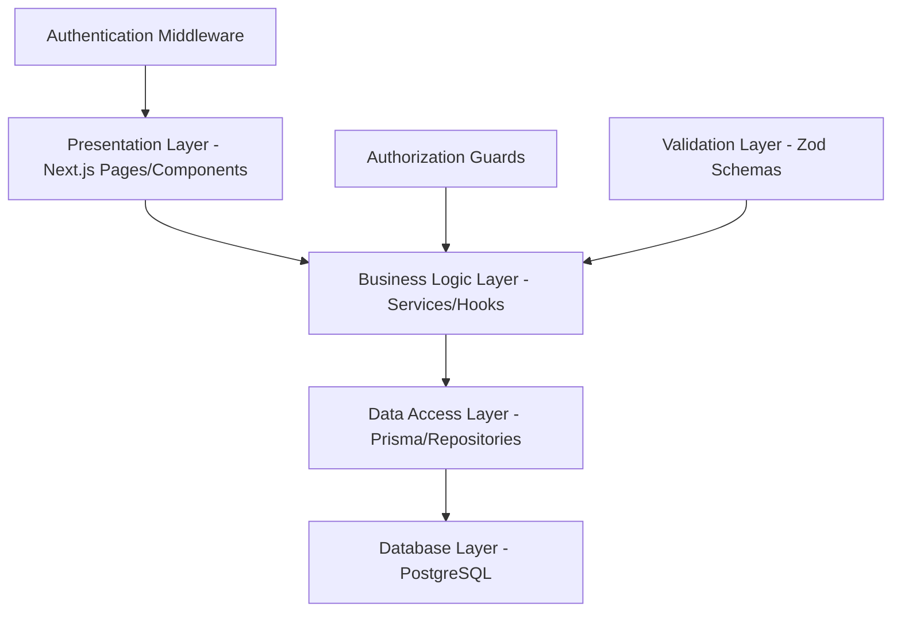

# Design Document

## Overview

The University Attendance System is a modern, visually stunning, high-trust web application built with Next.js 15, React 19, and PostgreSQL. The system implements a sophisticated role-based architecture supporting Office administrators, Teachers, and Students with comprehensive dashboard functionality featuring cutting-edge UI/UX design that matches the existing login page aesthetics with university blue palette, smooth animations, and professional campus look. The application follows a weekly attendance tracking model (Saturday-Thursday) with advanced academic rule enforcement for disqualification (محروم) and certification requirements (تصدیق طلب), featuring extensive reporting and analytics capabilities with immersive animations and interactions.

### Key Business Rules
- **Weekly Schedule**: Saturday to Thursday academic week with 6 class hours per day (45 minutes each), totaling 36 hours per week with configurable adjustments
- **Disqualification (محروم)**: Based purely on Absent hours (excluding Sick and Leave), prevents final exam registration
- **Certification Requirement (تصدیق طلب)**: Based on combined (Absent + Sick + Leave) hours, requires medical documentation for exam eligibility
- **Break Rules**: Automatic 15-minute breaks after every 3 hours of class
- **Single Class Enrollment**: Students can only be enrolled in one class to maintain data integrity

### Core Design Principles
- **Visual Excellence**: Modern glassmorphism design with vibrant gradients, 3D icons from Lucide React and Heroicons, smooth micro-interactions, and contemporary aesthetics
- **Modern Interactions**: Framer Motion animations with spring physics, hover effects with 3D transforms, gesture-based interactions, and delightful micro-animations
- **Comprehensive Navigation**: Floating navigation with blur effects, animated sidebar with 3D depth, smooth page transitions, and gesture-based menu systems
- **Role-Based Dashboards**: Office sees system control with animated metric cards and 3D charts, Teachers see class management with interactive progress rings, Students see personal overview with gamified elements
- **Business Rule Implementation**: Sophisticated logic for disqualification (pure absence tracking) and certification workflow with animated status indicators and progress visualization
- **Advanced Reporting**: Interactive dashboards with animated charts, student status tracking with 3D badges, and multi-format export with progress animations
- **Responsive Design**: Mobile-first approach with touch-optimized interactions, gesture navigation, and adaptive 3D layouts
- **Accessibility**: WCAG 2.1 AA compliance with keyboard navigation, screen reader support, and reduced motion preferences
- **Performance**: Optimized for large user bases with skeleton loading states, lazy loading, and smooth 60fps animations

### Visual Design System (Modern UI Library Integration)

#### Color Palette & Gradients
- **Primary Palette**: 
  - Electric Blue: #0066FF (primary), #0052CC (dark), #3B82F6 (light)
  - Accent Purple: #8B5CF6 (primary), #7C3AED (dark), #A78BFA (light)
  - Success Green: #10B981 (primary), #059669 (dark), #34D399 (light)
  - Warning Amber: #F59E0B (primary), #D97706 (dark), #FBBF24 (light)
  - Error Red: #EF4444 (primary), #DC2626 (dark), #F87171 (light)

- **Modern Gradients**:
  - Hero: `from-blue-600 via-purple-600 to-indigo-700`
  - Cards: `from-white/90 via-white/95 to-white/90`
  - Buttons: `from-blue-500 to-purple-600`, `from-emerald-500 to-teal-600`
  - Backgrounds: `from-slate-50 via-blue-50/30 to-purple-50/20`
  - Dark mode: `from-slate-900 via-purple-900/20 to-slate-900`

- **Neutral Colors**:
  - Surface: #FFFFFF, #FAFAFA, #F8FAFC
  - Text: #0F172A (primary), #475569 (secondary), #64748B (muted)
  - Borders: #E2E8F0, #CBD5E1, #94A3B8
  - Glass morphism: `bg-white/80 backdrop-blur-xl border-white/20`

#### Status Colors & 3D Icons (with Physics-Based Animations)
- **🟢 Present**: #10B981 (emerald-500)
  - Icon: `CheckCircle` with 3D depth shadow and bounce spring animation
  - Animation: Scale bounce (1 → 1.2 → 1) with green glow pulse
  - Hover: Rotate 360° with shadow elevation
  - Business Logic: Counts toward attendance requirements

- **🔴 Absent**: #EF4444 (red-500)
  - Icon: `XCircle` with 3D layered shadow and shake animation
  - Animation: Horizontal shake with red warning pulse
  - Hover: Slight tilt with shadow depth increase
  - Business Logic: Pure absence - counts toward محروم threshold only

- **🟡 Sick**: #F59E0B (amber-500)
  - Icon: `Heart` with 3D gradient and gentle pulse glow
  - Animation: Heartbeat pulse with warm amber glow
  - Hover: Scale with soft yellow halo effect
  - Business Logic: Counts toward تصدیق طلب threshold but NOT محروم

- **🔵 Leave**: #06B6D4 (cyan-500)
  - Icon: `Calendar` with 3D perspective and slide transition
  - Animation: Slide-in from left with cyan shimmer
  - Hover: Flip animation with depth shadow
  - Business Logic: Counts toward تصدیق طلب threshold but NOT محروم

- **🟣 محروم (Disqualified)**: #8B5CF6 (violet-500)
  - Icon: `AlertTriangle` with 3D warning depth and urgent pulse
  - Animation: Warning pulse with violet glow and slight shake
  - Hover: Intense glow with shadow expansion
  - Business Logic: Prevents final exam registration, requires class repetition

- **🟠 تصدیق طلب (Certification Required)**: #F97316 (orange-500)
  - Icon: `FileText` with 3D document stack and attention blink
  - Animation: Attention blink with orange highlight sweep
  - Hover: Document stack effect with shadow layers
  - Business Logic: Requires medical certificate upload and Office approval for exam eligibility

#### Typography System
- **Primary Font**: Inter Variable (300-900 weights)
  - Headings: 600-700 weights with tight letter-spacing (-0.025em)
  - Body: 400-500 weights with optimized line-height (1.6)
  - Captions: 400 weight with relaxed letter-spacing (0.025em)

- **Display Font**: Clash Display (500-700 weights)
  - Hero titles: 700 weight with gradient text effects
  - Section headers: 600 weight with subtle shadows
  - Feature callouts: 500 weight with animated underlines

- **Monospace**: JetBrains Mono Variable
  - Code snippets: 400 weight with syntax highlighting
  - Data tables: 400 weight with tabular numbers
  - System info: 300 weight with subtle background

#### Spacing & Layout System
- **Base Unit**: 4px with golden ratio scaling
  - Micro: 4px, 8px (borders, fine details)
  - Small: 12px, 16px (component padding, gaps)
  - Medium: 24px, 32px (card padding, section spacing)
  - Large: 48px, 64px (page margins, hero spacing)
  - XL: 96px, 128px (section breaks, landing areas)

- **Layout Patterns**:
  - CSS Grid with subgrid for complex layouts
  - Flexbox for component-level alignment
  - Container queries for responsive components
  - Aspect ratio containers for media consistency

#### Animation & Interaction System
- **Timing Functions**:
  - Micro interactions: 150ms ease-out
  - Standard transitions: 300ms cubic-bezier(0.4, 0, 0.2, 1)
  - Complex animations: 500ms spring physics
  - Page transitions: 400ms ease-in-out

- **Spring Physics** (Framer Motion):
  ```typescript
  const springConfig = {
    type: "spring",
    stiffness: 300,
    damping: 30,
    mass: 1
  };
  ```

- **Hover Effects**:
  - Cards: Scale 1.02, shadow elevation, border glow
  - Buttons: Scale 1.05, gradient shift, shadow expansion
  - Icons: Rotate, color shift, glow effect
  - Images: Scale 1.1 with overlay fade

- **Loading States**:
  - Skeleton screens with shimmer wave animation
  - Pulse effects for loading placeholders
  - Progress bars with smooth value transitions
  - Spinner with custom SVG animations

- **Page Transitions**:
  - Slide transitions with parallax depth
  - Scale animationsys
  - Flip animations for card interactions
  - Fade with blur for content changes

#### Shadows & Depth System
- **Elevation Levels**:
  - Level 1: `shadow-sm` (0 1px 2px rgba(0,0,0,0.05))
  - Level 2: `shadow-md` (0 4px 6px rgba(0,0,0,0)
  - Level 3: `shadow-lg` (0 10px 15px rgba(0,0,0,0.1))
  - Level 4: `shadow-xl` (0 20px 25px rgba(0,0,0,0.1))
  - Level 5: `shadow-2xl` (0 25px 50px rgba(0,0,0,0.25))

- **Dynamic Sha
sition
  - Animated shadow expansion oion
  - Colored shadows matching element themes
n

- **3D T
  - Perspective containers: `perspective-1000`
  - Card tilts: `rotateX(5deg) rotateY(5deg)`
  - Button presses: `translateZ(-2px)` won
  - fset

#### Modern UI Component Library
- **Base Components**:
  -

  - Headless UI for complex interact
  - React Aria for keyboard navigation

- **Animation Libraries**:

  - React Spring for physions
  - Lottie React for micro-animations
  - React Transition Group for page transitions

- **Icon Systems**:
  - Lucide React (primary, 3D varian

  - Phosphor Icons (specialt
upportation s with animcons iVGCustom S-   ns)icoy ne/solid)ary, outliv2 (secondons  - Heroic able)ilts ava interactsedics-baationsplex animon for com Motiramer  - Fnsioancempliibility cocess for acitivesUI primix - Rad  rideseme over custom thadcn/ui with Shwith ofow layers ple shadultidepth: MIcon ow reductiith shadm Effects**:ansforrlusioD depth ilor 3dows fd sha  - Layerenteractn i cursor poowfollthat s r shadow  - Hovedows**:.07)verla for modal o
### Technology Stack
- **Frontend**: Next.js 15 with React 19, TypeScript, Tailwind CSS v4
- **UI Library**: Shadcn/ui, Radix UI, Headless UI, Mantine (for complex components)
- **Animations**: 
  - Framer Motion (primary animation library)
  - React Spring (physics-based animations)
  - Lottie React (complex micro-animations)
  - React Transition Group (page transitions)
  - Auto-Animate (automatic layout animations)
- **3D & Visual Effects**:
  - Three.js (3D graphics and effects)
  - React Three Fiber (React integration for Three.js)
  - Spline (3D design integration)
  - CSS 3D Transforms (hardware-accelerated animations)
- **Icons & Graphics**: 
  - Lucide React (primary icon set with 3D variants)
  - Heroicons v2 (secondary icons)
  - Phosphor Icons (specialty icons)
  - React Icons (comprehensive icon library)
  - Custom SVG animations
- **Charts & Data Visualization**:
  - Recharts (animated charts)
  - D3.js (custom visualizations)
  - Chart.js with React wrapper
  - Victory (component-based charts)
- **Database**: PostgreSQL with Prisma ORM
- **Forms**: React Hook Form with Zod validation and real-time feedback
- **Authentication**: NextAuth.js with animated login flows
- **Styling**: Tailwind CSS v4 with custom design system and CSS-in-JS for complex animations
- **Performance**: React Query for data fetching, Intersection Observer for lazy loading

### Modern Animation Patterns & 3D Effects

#### Micro-Interactions
```typescript
// Button hover with 3D effect
const buttonVariants = {
  idle: { 
    scale: 1, 
    rotateX: 0, 
    rotateY: 0,
    boxShadow: "0 4px 6px rgba(0,0,0,0.1)"
  },
  hover: { 
    scale: 1.05, 
    rotateX: -5, 
    rotateY: 5,
    boxShadow: "0 20px 25px rgba(0,0,0,0.15)",
    transition: { type: "spring", stiffness: 300, damping: 20 }
  },
  tap: { 
    scale: 0.98,
    rotateX: 0,
    rotateY: 0,
    boxShadow: "0 2px 4px rgba(0,0,0,0.1)"
  }
};

// Status badge pulse animation
const statusPulse = {
  scale: [1, 1.1, 1],
  opacity: [1, 0.8, 1],
  transition: {
    duration: 2,
    repeat: Infinity,
    ease: "easeInOut"
  }
};
```

#### Page Transitions
```typescript
// Smooth page transitions with parallax
const pageVariants = {
  initial: { 
    opacity: 0, 
    x: -100, 
    scale: 0.95,
    filter: "blur(10px)"
  },
  in: { 
    opacity: 1, 
    x: 0, 
    scale: 1,
    filter: "blur(0px)",
    transition: { 
      duration: 0.4, 
      ease: "easeOut" 
    }
  },
  out: { 
    opacity: 0, 
    x: 100, 
    scale: 1.05,
    filter: "blur(5px)",
    transition: { 
      duration: 0.3, 
      ease: "easeIn" 
    }
  }
};
```

#### 3D Card Effects
```typescript
// Glass morphism card with 3D hover
const cardVariants = {
  rest: {
    rotateX: 0,
    rotateY: 0,
    scale: 1,
    background: "rgba(255,255,255,0.8)",
    backdropFilter: "blur(20px)",
    boxShadow: "0 8px 32px rgba(0,0,0,0.1)"
  },
  hover: {
    rotateX: -10,
    rotateY: 10,
    scale: 1.02,
    background: "rgba(255,255,255,0.9)",
    backdropFilter: "blur(25px)",
    boxShadow: "0 20px 40px rgba(0,0,0,0.15)",
    transition: {
      type: "spring",
      stiffness: 300,
      damping: 20
    }
  }
};
```

#### Data Loading Animations
```typescript
// Skeleton loading with shimmer effect
const shimmerVariants = {
  initial: { x: "-100%" },
  animate: { 
    x: "100%",
    transition: {
      repeat: Infinity,
      duration: 1.5,
      ease: "linear"
    }
  }
};

// Count-up animation for metrics
const countUpVariants = {
  initial: { scale: 0.8, opacity: 0 },
  animate: { 
    scale: 1, 
    opacity: 1,
    transition: { 
      type: "spring", 
      stiffness: 200, 
      damping: 15 
    }
  }
};
```

#### Interactive Chart Animations
```typescript
// Chart data point hover effects
const chartPointVariants = {
  rest: { 
    scale: 1, 
    fill: "#3B82F6" 
  },
  hover: { 
    scale: 1.5, 
    fill: "#1D4ED8",
    transition: { 
      type: "spring", 
      stiffness: 400, 
      damping: 10 
    }
  }
};

// Bar chart growth animation
const barGrowth = {
  initial: { scaleY: 0, originY: 1 },
  animate: { 
    scaleY: 1,
    transition: { 
      duration: 0.8, 
      ease: "easeOut",
      delay: (index: number) => index * 0.1
    }
  }
};
```

#### Notification System
```typescript
// Toast notification slide-in
const toastVariants = {
  initial: { 
    x: 300, 
    opacity: 0, 
    scale: 0.8 
  },
  animate: { 
    x: 0, 
    opacity: 1, 
    scale: 1,
    transition: { 
      type: "spring", 
      stiffness: 300, 
      damping: 25 
    }
  },
  exit: { 
    x: 300, 
    opacity: 0, 
    scale: 0.8,
    transition: { 
      duration: 0.2 
    }
  }
};
```

### Modern Responsive Design & Accessibility

#### Responsive Breakpoints
```typescript
const breakpoints = {
  xs: '320px',   // Mobile portrait
  sm: '640px',   // Mobile landscape
  md: '768px',   // Tablet portrait
  lg: '1024px',  // Tablet landscape / Small desktop
  xl: '1280px',  // Desktop
  '2xl': '1536px' // Large desktop
};
```

#### Mobile-First Approach
- **Touch Optimizations**:
  - Minimum 44px touch targets
  - Gesture-based navigation (swipe, pinch, tap)
  - Haptic feedback for interactions
  - Pull-to-refresh functionality
  - Smooth momentum scrolling

- **Adaptive Layouts**:
  - CSS Grid with container queries
  - Flexible typography with clamp()
  - Responsive spacing with fluid scales
  - Adaptive component sizing
  - Progressive enhancement

#### Accessibility Features (WCAG 2.1 AA Compliance)
- **Keyboard Navigation**:
  - Focus management with visible indicators
  - Skip links for main content
  - Logical tab order
  - Keyboard shortcuts for power users
  - Escape key handling for modals

- **Screen Reader Support**:
  - Semantic HTML structure
  - ARIA labels and descriptions
  - Live regions for dynamic content
  - Proper heading hierarchy
  - Alternative text for images

- **Visual Accessibility**:
  - High contrast mode support
  - Reduced motion preferences
  - Color-blind friendly palettes
  - Scalable text up to 200%
  - Focus indicators with 3px minimum

- **Cognitive Accessibility**:
  - Clear error messages
  - Consistent navigation patterns
  - Progress indicators for multi-step processes
  - Timeout warnings and extensions
  - Simple language and clear instructions

#### Dark Mode Support
```typescript
const darkModeColors = {
  background: {
    primary: '#0F172A',
    secondary: '#1E293B',
    tertiary: '#334155'
  },
  text: {
    primary: '#F8FAFC',
    secondary: '#CBD5E1',
    muted: '#64748B'
  },
  accent: {
    blue: '#3B82F6',
    purple: '#8B5CF6',
    green: '#10B981'
  }
};
```

#### Performance Optimizations
- **Loading Strategies**:
  - Lazy loading for images and components
  - Skeleton screens during data fetching
  - Progressive image loading with blur-up
  - Code splitting by routes and features
  - Service worker for offline functionality

- **Animation Performance**:
  - Hardware acceleration with transform3d
  - RequestAnimationFrame for smooth animations
  - Intersection Observer for scroll-triggered animations
  - Reduced motion preferences respect
  - 60fps target for all animations

## Data Models

### Core Database Schema

The database design supports the complex business rules while maintaining data integrity and performance.

```typescript
// User Management
interface User {
  id: string;
  email: string;
  name: string;
  role: 'OFFICE' | 'TEACHER' | 'STUDENT';
  createdAt: Date;
  updatedAt: Date;
  createdBy: string; // Office user who created this account
  isActive: boolean;
}

// Academic Structure
interface Class {
  id: string;
  name: string;
  teacherId: string;
  schedule: WeeklySchedule;
  maxStudents: number;
  academicYear: string;
  semester: string;
  createdAt: Date;
}

interface WeeklySchedule {
  saturday: TimeSlot[];
  sunday: TimeSlot[];
  monday: TimeSlot[];
  tuesday: TimeSlot[];
  wednesday: TimeSlot[];
  thursday: TimeSlot[];
}

interface TimeSlot {
  startTime: string; // "08:00"
  endTime: string;   // "08:45"
  sessionNumber: number; // 1-6
  breakAfter?: boolean; // true after sessions 3 and 6
}

// Attendance Tracking
interface AttendanceRecord {
  id: string;
  studentId: string;
  classId: string;
  date: Date;
  sessionNumber: number;
  status: 'PRESENT' | 'ABSENT' | 'SICK' | 'LEAVE';
  markedBy: string; // Teacher or Office user
  markedAt: Date;
  modifiedBy?: string;
  modifiedAt?: Date;
  notes?: string;
}

// Student Status Tracking
interface StudentStatus {
  id: string;
  studentId: string;
  classId: string;
  weekStartDate: Date;
  presentHours: number;
  absentHours: number; // Pure absences for محروم calculation
  sickHours: number;
  leaveHours: number;
  totalHours: number;
  isDisqualified: boolean; // محروم status
  requiresCertification: boolean; // تصدیق طلب status
  calculatedAt: Date;
}

// Medical Certification
interface MedicalCertificate {
  id: string;
  studentId: string;
  classId: string;
  uploadedAt: Date;
  fileName: string;
  fileUrl: string;
  status: 'PENDING' | 'APPROVED' | 'REJECTED';
  reviewedBy?: string;
  reviewedAt?: Date;
  reviewNotes?: string;
}

// System Configuration
interface AttendanceRules {
  id: string;
  disqualificationThreshold: number; // Pure absence hours for محروم
  certificationThreshold: number; // Combined absence hours for تصدیق طلب
  hoursPerDay: number; // Default 6
  sessionDuration: number; // Default 45 minutes
  weeklyTotalHours: number; // Default 36
  breakDuration: number; // Default 15 minutes
  breakAfterSessions: number[]; // Default [3, 6]
  updatedBy: string;
  updatedAt: Date;
}
```

**Design Rationale**: The schema separates concerns while maintaining referential integrity. The StudentStatus table provides pre-calculated weekly summaries for performance, while AttendanceRecord maintains granular session-level data for accuracy and audit trails.

### Business Logic Implementation

#### Attendance Calculation Engine

```typescript
class AttendanceCalculator {
  // Calculate weekly totals with proper business rule separation
  calculateWeeklyStatus(studentId: string, weekStart: Date): StudentStatus {
    const records = this.getWeeklyRecords(studentId, weekStart);
    
    return {
      presentHours: records.filter(r => r.status === 'PRESENT').length * 0.75, // 45min sessions
      absentHours: records.filter(r => r.status === 'ABSENT').length * 0.75, // Pure absences only
      sickHours: records.filter(r => r.status === 'SICK').length * 0.75,
      leaveHours: records.filter(r => r.status === 'LEAVE').length * 0.75,
      totalHours: this.getConfiguredWeeklyHours(),
      isDisqualified: this.checkDisqualification(studentId),
      requiresCertification: this.checkCertificationRequirement(studentId)
    };
  }

  // محروم calculation - pure absences only
  checkDisqualification(studentId: string): boolean {
    const totalAbsentHours = this.getTotalAbsentHours(studentId);
    const threshold = this.getDisqualificationThreshold();
    return totalAbsentHours >= threshold;
  }

  // تصدیق طلب calculation - combined absences
  checkCertificationRequirement(studentId: string): boolean {
    const combinedAbsences = this.getTotalAbsentHours(studentId) + 
                           this.getTotalSickHours(studentId) + 
                           this.getTotalLeaveHours(studentId);
    const threshold = this.getCertificationThreshold();
    return combinedAbsences >= threshold;
  }
}
```

#### Medical Certification Workflow

```typescript
class CertificationWorkflow {
  async submitCertificate(studentId: string, file: File): Promise<MedicalCertificate> {
    // Validate student is flagged for certification
    const student = await this.getStudentStatus(studentId);
    if (!student.requiresCertification) {
      throw new Error('Student does not require certification');
    }

    // Upload and create certificate record
    const certificate = await this.createCertificateRecord(studentId, file);
    
    // Notify Office administrators
    await this.notifyOfficeForReview(certificate);
    
    return certificate;
  }

  async approveCertificate(certificateId: string, reviewerId: string): Promise<void> {
    const certificate = await this.getCertificate(certificateId);
    
    // Update certificate status
    certificate.status = 'APPROVED';
    certificate.reviewedBy = reviewerId;
    certificate.reviewedAt = new Date();
    
    // Restore exam eligibility
    await this.updateStudentExamEligibility(certificate.studentId, true);
    
    // Notify student of approval
    await this.notifyStudentOfApproval(certificate.studentId);
  }
}
```

**Design Rationale**: The business logic clearly separates the two different absence calculations (محروم vs تصدیق طلب) to ensure accurate academic rule enforcement while maintaining flexibility for configuration changes.

## Error Handling

### Navigation and Routing Issues

#### Problem: User Management Navigation Blocking
**Issue**: When opening the "Add Teacher" page, users cannot navigate to other pages within the User Management section due to improper navigation handling.

**Root Cause**: The navigation handler in pages only updates local state without triggering actual route changes.

**Solution**: Implement proper Next.js router integration for navigation.

```typescript
// Fixed Navigation Implementation
'use client'

import { useRouter } from 'next/navigation'

export default function AddTeacherPage() {
  const router = useRouter()

  const handleNavigation = (href: string) => {
    // Use Next.js router for actual navigation
    router.push(href)
  }

  // Rest of component...
}
```

#### Navigation Error Handling Strategy

```typescript
class NavigationErrorHandler {
  static handleNavigationError(error: Error, fallbackRoute: string) {
    console.error('Navigation failed:', error)
    
    // Attempt fallback navigation
    try {
      window.location.href = fallbackRoute
    } catch (fallbackError) {
      // Show user-friendly error message
      this.showNavigationError()
    }
  }

  static showNavigationError() {
    // Display toast notification or modal
    // "Navigation failed. Please refresh the page and try again."
  }
}
```

### Form Validation and Data Integrity

#### Real-time Validation System
```typescript
interface ValidationRule {
  field: string
  validator: (value: any) => boolean | string
  message: string
  severity: 'error' | 'warning' | 'info'
}

class FormValidator {
  static validateUserForm(data: UserFormData): ValidationResult {
    const rules: ValidationRule[] = [
      {
        field: 'email',
        validator: (email) => /^[^\s@]+@[^\s@]+\.[^\s@]+$/.test(email),
        message: 'Please enter a valid email address',
        severity: 'error'
      },
      {
        field: 'role',
        validator: (role) => ['OFFICE', 'TEACHER', 'STUDENT'].includes(role),
        message: 'Invalid role selected',
        severity: 'error'
      },
      {
        field: 'name',
        validator: (name) => name && name.trim().length >= 2,
        message: 'Name must be at least 2 characters long',
        severity: 'error'
      }
    ]

    return this.runValidation(data, rules)
  }
}
```

### Business Rule Enforcement Errors

#### Attendance Calculation Error Handling
```typescript
class AttendanceErrorHandler {
  static handleCalculationError(studentId: string, error: Error): void {
    // Log error for debugging
    console.error(`Attendance calculation failed for student ${studentId}:`, error)
    
    // Notify administrators
    this.notifyAdministrators({
      type: 'CALCULATION_ERROR',
      studentId,
      error: error.message,
      timestamp: new Date()
    })
    
    // Use fallback calculation or cached values
    this.useFallbackCalculation(studentId)
  }

  static validateBusinessRules(attendanceData: AttendanceRecord[]): ValidationResult {
    const errors: string[] = []
    
    // Check for duplicate entries
    const duplicates = this.findDuplicateEntries(attendanceData)
    if (duplicates.length > 0) {
      errors.push(`Duplicate attendance entries found: ${duplicates.join(', ')}`)
    }
    
    // Validate date ranges
    const invalidDates = this.validateDateRanges(attendanceData)
    if (invalidDates.length > 0) {
      errors.push(`Invalid dates found: ${invalidDates.join(', ')}`)
    }
    
    return { isValid: errors.length === 0, errors }
  }
}
```

### Database and API Error Handling

#### Comprehensive Error Response System
```typescript
interface APIError {
  code: string
  message: string
  details?: any
  timestamp: Date
  requestId: string
}

class APIErrorHandler {
  static handleDatabaseError(error: any): APIError {
    const errorMap = {
      'P2002': 'A record with this information already exists',
      'P2025': 'The requested record was not found',
      'P2003': 'This action would violate data integrity rules',
      'P2016': 'Query interpretation error occurred'
    }

    return {
      code: error.code || 'DATABASE_ERROR',
      message: errorMap[error.code] || 'A database error occurred',
      details: process.env.NODE_ENV === 'development' ? error : undefined,
      timestamp: new Date(),
      requestId: this.generateRequestId()
    }
  }

  static handleValidationError(validationErrors: any[]): APIError {
    return {
      code: 'VALIDATION_ERROR',
      message: 'The provided data is invalid',
      details: validationErrors,
      timestamp: new Date(),
      requestId: this.generateRequestId()
    }
  }
}
```

### User Experience Error Handling

#### Graceful Degradation Strategy
```typescript
class UXErrorHandler {
  static handleComponentError(error: Error, componentName: string): React.ReactElement {
    // Log error for monitoring
    console.error(`Component error in ${componentName}:`, error)
    
    // Return fallback UI
    return (
      <div className="bg-red-50 border border-red-200 rounded-lg p-4">
        <div className="flex items-center gap-3">
          <AlertTriangle className="h-5 w-5 text-red-600" />
          <div>
            <h4 className="font-semibold text-red-900">Something went wrong</h4>
            <p className="text-sm text-red-700">
              We're having trouble loading this section. Please refresh the page or try again later.
            </p>
          </div>
        </div>
      </div>
    )
  }

  static handleLoadingError(retryFunction: () => void): React.ReactElement {
    return (
      <div className="text-center py-8">
        <div className="bg-yellow-50 border border-yellow-200 rounded-lg p-6 max-w-md mx-auto">
          <AlertTriangle className="h-8 w-8 text-yellow-600 mx-auto mb-3" />
          <h3 className="font-semibold text-yellow-900 mb-2">Loading Failed</h3>
          <p className="text-sm text-yellow-700 mb-4">
            We couldn't load the requested data. This might be due to a network issue.
          </p>
          <button
            onClick={retryFunction}
            className="bg-yellow-600 text-white px-4 py-2 rounded-lg hover:bg-yellow-700 transition-colors"
          >
            Try Again
          </button>
        </div>
      </div>
    )
  }
}
```

**Design Rationale**: The error handling system provides comprehensive coverage for navigation, validation, business logic, and user experience issues. Each error type has specific handling strategies that maintain system stability while providing clear feedback to users and administrators.

## Testing Strategy

### Navigation Testing Framework

#### Automated Navigation Tests
```typescript
// Navigation Integration Tests
describe('User Management Navigation', () => {
  test('should navigate between user management pages without blocking', async () => {
    const { user } = render(<AddTeacherPage />)
    
    // Navigate to different sections
    await user.click(screen.getByText('All Users'))
    expect(window.location.pathname).toBe('/user-management/all-users')
    
    await user.click(screen.getByText('Add Student'))
    expect(window.location.pathname).toBe('/user-management/add-student')
    
    // Verify no navigation blocking occurs
    await user.click(screen.getByText('Teachers'))
    expect(window.location.pathname).toBe('/user-management/teachers')
  })

  test('should handle navigation errors gracefully', async () => {
    // Mock navigation failure
    const mockRouter = { push: jest.fn().mockRejectedValue(new Error('Navigation failed')) }
    
    const { user } = render(<AddTeacherPage />, { router: mockRouter })
    
    await user.click(screen.getByText('All Users'))
    
    // Verify error handling
    expect(screen.getByText(/navigation failed/i)).toBeInTheDocument()
  })
})
```

### Business Logic Testing

#### Attendance Calculation Tests
```typescript
describe('Attendance Business Logic', () => {
  test('should calculate محروم status correctly', () => {
    const calculator = new AttendanceCalculator()
    const studentRecords = [
      { status: 'ABSENT', sessionNumber: 1, date: '2024-01-01' },
      { status: 'ABSENT', sessionNumber: 2, date: '2024-01-01' },
      { status: 'SICK', sessionNumber: 3, date: '2024-01-01' },
      { status: 'LEAVE', sessionNumber: 4, date: '2024-01-01' }
    ]
    
    const result = calculator.calculateWeeklyStatus('student-1', new Date('2024-01-01'))
    
    // Only pure absences count toward محروم
    expect(result.absentHours).toBe(1.5) // 2 sessions * 0.75 hours
    expect(result.isDisqualified).toBe(false) // Below threshold
  })

  test('should calculate تصدیق طلب status correctly', () => {
    const calculator = new AttendanceCalculator()
    // Test combined absence calculation
    const result = calculator.checkCertificationRequirement('student-1')
    
    expect(result).toBe(true) // Combined absences exceed threshold
  })
})
```

### Component Testing Strategy

#### Modern UI Component Tests
```typescript
describe('ModernDashboardLayout', () => {
  test('should render with proper navigation structure', () => {
    const mockUser = { name: 'Test User', role: 'OFFICE', email: 'test@test.com' }
    
    render(
      <ModernDashboardLayout user={mockUser} currentPath="/user-management">
        <div>Test Content</div>
      </ModernDashboardLayout>
    )
    
    // Verify navigation items are rendered
    expect(screen.getByText('User Management')).toBeInTheDocument()
    expect(screen.getByText('Classes & Schedule')).toBeInTheDocument()
    expect(screen.getByText('Attendance')).toBeInTheDocument()
  })

  test('should handle role-based navigation correctly', () => {
    const teacherUser = { name: 'Teacher', role: 'TEACHER', email: 'teacher@test.com' }
    
    render(<ModernDashboardLayout user={teacherUser} />)
    
    // Teachers should not see user management
    expect(screen.queryByText('User Management')).not.toBeInTheDocument()
    expect(screen.getByText('My Classes')).toBeInTheDocument()
  })
})
```

### End-to-End Testing

#### Critical User Workflows
```typescript
// E2E Tests using Playwright
test.describe('Office Administrator Workflow', () => {
  test('should complete full user creation workflow', async ({ page }) => {
    await page.goto('/user-management/add-teacher')
    
    // Fill form
    await page.fill('[data-testid="firstName"]', 'John')
    await page.fill('[data-testid="lastName"]', 'Doe')
    await page.fill('[data-testid="email"]', 'john.doe@university.edu')
    
    // Submit form
    await page.click('[data-testid="submit-button"]')
    
    // Verify success
    await expect(page.locator('[data-testid="success-message"]')).toBeVisible()
    
    // Navigate to user list
    await page.click('[data-testid="nav-all-users"]')
    
    // Verify user appears in list
    await expect(page.locator('text=John Doe')).toBeVisible()
  })

  test('should handle attendance marking workflow', async ({ page }) => {
    await page.goto('/attendance/mark')
    
    // Select class
    await page.selectOption('[data-testid="class-select"]', 'CS-101')
    
    // Mark attendance for students
    await page.click('[data-testid="student-1-present"]')
    await page.click('[data-testid="student-2-absent"]')
    
    // Submit attendance
    await page.click('[data-testid="submit-attendance"]')
    
    // Verify confirmation
    await expect(page.locator('text=Attendance saved successfully')).toBeVisible()
  })
})
```

### Performance Testing

#### Load Testing Strategy
```typescript
describe('Performance Tests', () => {
  test('should handle large user lists efficiently', async () => {
    // Mock 1000+ users
    const largeUserList = Array.from({ length: 1000 }, (_, i) => ({
      id: `user-${i}`,
      name: `User ${i}`,
      email: `user${i}@test.com`,
      role: 'STUDENT'
    }))
    
    const startTime = performance.now()
    
    render(<UserList users={largeUserList} />)
    
    const endTime = performance.now()
    const renderTime = endTime - startTime
    
    // Should render within 100ms
    expect(renderTime).toBeLessThan(100)
  })

  test('should optimize attendance calculations', async () => {
    const calculator = new AttendanceCalculator()
    const largeDataset = generateLargeAttendanceDataset(10000) // 10k records
    
    const startTime = performance.now()
    
    const results = calculator.calculateBulkStatus(largeDataset)
    
    const endTime = performance.now()
    const calculationTime = endTime - startTime
    
    // Should calculate within 500ms
    expect(calculationTime).toBeLessThan(500)
    expect(results).toHaveLength(largeDataset.length)
  })
})
```

### Accessibility Testing

#### WCAG Compliance Tests
```typescript
describe('Accessibility Tests', () => {
  test('should meet WCAG 2.1 AA standards', async () => {
    const { container } = render(<AddTeacherPage />)
    
    const results = await axe(container)
    
    expect(results).toHaveNoViolations()
  })

  test('should support keyboard navigation', async () => {
    const { user } = render(<UserManagementLayout />)
    
    // Tab through navigation items
    await user.tab()
    expect(screen.getByText('Dashboard')).toHaveFocus()
    
    await user.tab()
    expect(screen.getByText('User Management')).toHaveFocus()
    
    // Enter to expand submenu
    await user.keyboard('{Enter}')
    expect(screen.getByText('Add User')).toBeVisible()
  })

  test('should provide proper ARIA labels', () => {
    render(<AttendanceGrid />)
    
    // Verify ARIA labels exist
    expect(screen.getByLabelText('Mark student as present')).toBeInTheDocument()
    expect(screen.getByLabelText('Mark student as absent')).toBeInTheDocument()
    
    // Verify screen reader announcements
    expect(screen.getByRole('status')).toHaveTextContent('Attendance grid loaded')
  })
})
```

### Security Testing

#### Authentication and Authorization Tests
```typescript
describe('Security Tests', () => {
  test('should prevent unauthorized access to Office features', async () => {
    const studentUser = { role: 'STUDENT', name: 'Student', email: 'student@test.com' }
    
    render(<UserManagementLayout />, { user: studentUser })
    
    // Should redirect or show error
    expect(screen.queryByText('User Management')).not.toBeInTheDocument()
  })

  test('should validate input sanitization', async () => {
    const { user } = render(<AddTeacherForm />)
    
    // Attempt XSS injection
    await user.type(screen.getByLabelText('Name'), '<script>alert("xss")</script>')
    
    // Should be sanitized
    expect(screen.getByDisplayValue('<script>alert("xss")</script>')).not.toBeInTheDocument()
  })
})
```

**Design Rationale**: The comprehensive testing strategy ensures system reliability, performance, accessibility, and security. Each testing layer validates different aspects of the system, from unit-level business logic to end-to-end user workflows, providing confidence in the system's robustness and user experience quality.

## Architecture

### System Architecture Pattern
The application follows a **layered architecture** with clear separation of concerns:



### Role-Based Access Control (RBAC)

The system implements strict role-based access control with clear permission boundaries and audit trails.

#### Office Administrator Role
- **User Management**: Exclusive authority to create, modify, and delete user accounts
- **System Configuration**: Full access to attendance rules, academic calendar, and system settings
- **Reporting**: Complete access to all reports, analytics, and export functionality
- **Attendance Management**: Can view and modify all attendance records with audit logging
- **Certification Workflow**: Manages medical certificate approvals and student status updates

#### Teacher Role
- **Class Management**: Access only to assigned classes and enrolled students
- **Attendance Marking**: Can mark attendance for assigned classes with deadline enforcement
- **Student Viewing**: Read access to student information within assigned classes only
- **Limited Reporting**: Class-specific reports and attendance statistics
- **Historical Access**: Can review and correct previous attendance entries within administrative guidelines

#### Student Role
- **Personal Data**: Read-only access to own attendance records and academic standing
- **Single Class Enforcement**: System prevents enrollment in multiple classes
- **Status Monitoring**: Can view محروم and تصدیق طلب status with explanatory information
- **Certification Submission**: Can upload medical certificates when flagged as تصدیق طلب
- **Privacy Protection**: Cannot access other students' data or modify any attendance records

**Design Rationale**: The three-tier role system ensures proper separation of duties while maintaining data integrity and academic policy compliance. Each role has clearly defined boundaries with appropriate error handling and informative feedback.

### Security Architecture
- JWT-based authentication with secure session management
- Role-based middleware for API route protection
- Input validation using Zod schemas
- SQL injection prevention through Prisma ORM
- CSRF protection and secure headers

## Components and Interfaces

### Dashboard Navigation Structure

The navigation structure is designed to provide intuitive access to all system features with role-based visibility and smooth animations matching the login page quality.

```
Dashboard Navigation Hierarchy:
├── User Management/ (Office Only)
│   ├── All Users (animated user cards with search, filter, pagination)
│   ├── Add User (single form + CSV bulk import with progress tracking)
│   └── Roles & Permissions (interactive permission matrix)
├── Classes & Schedule/ (Office + Teachers)
│   ├── All Classes (animated class cards with enrollment indicators)
│   ├── Schedule Builder (drag-and-drop with conflict detection)
│   └── Class Management (teacher assignments and student enrollment)
├── Attendance/ (All Roles - Filtered by Permission)
│   ├── Overview (system-wide dashboard for Office, class-specific for Teachers)
│   ├── Mark Attendance (teacher grid interface with bulk actions)
│   └── Attendance History (timeline view with export capabilities)
├── Reports & Analytics/ (Office + Limited Teacher Access)
│   ├── Weekly Reports (Present/Absent/Sick/Leave/Total with business rule calculations)
│   ├── Student Status (محروم and تصدیق طلب tracking with visual indicators)
│   └── Export Data (CSV/PDF/Excel with flexible filtering)
└── System Settings/ (Office Only)
    ├── General Settings (system configuration and notifications)
    ├── Academic Calendar (semester/term setup with holiday management)
    └── Attendance Rules (configurable thresholds for محروم and تصدیق طلب)
```

**Design Rationale**: The hierarchical structure ensures logical grouping of related functionality while maintaining clear role-based access control. Each section uses consistent visual language with animated transitions and modern card-based layouts.

### Modern Dashboard Component Architecture

```
components/
├── layout/
│   ├── DashboardLayout.tsx      # Main layout with gradient backgrounds and glass morphism
│   ├── ModernSidebar.tsx        # Animated sidebar with 3D icons and smooth hover effects
│   ├── DashboardHeader.tsx      # Header with animated user avatar and notification system
│   ├── MobileNavigation.tsx     # Touch-optimized mobile nav with gesture support
│   ├── PageTransition.tsx       # Smooth page transitions with parallax effects
│   └── FloatingActionButton.tsx # Floating FAB with ripple animations and quick actions
├── dashboard/
│   ├── OfficeDashboard.tsx      # Admin overview with 3D metric cards and interactive charts
│   ├── TeacherDashboard.tsx     # Class management with animated progress rings and alerts
│   ├── StudentDashboard.tsx     # Personal attendance with gamified progress and 3D calendar
│   ├── DashboardCard.tsx        # Reusable card with glass morphism and 3D hover effects
│   ├── MetricCard.tsx           # Animated metric cards with count-up animations
│   ├── QuickActions.tsx         # Quick action grid with 3D button effects
│   └── StatusOverview.tsx       # Real-time status overview with pulse animations
├── user-management/
│   ├── ModernUserList.tsx       # Users table with 3D cards, search animations, and filters
│   ├── AddUserForm.tsx          # Multi-step form with real-time validation and success confetti
│   ├── BulkImportWizard.tsx     # Drag-and-drop CSV import with animated progress bars
│   ├── RolePermissionMatrix.tsx # Interactive 3D permission grid with smooth toggle animations
│   ├── UserProfileCard.tsx      # 3D user cards with animated avatars and status badges
│   ├── UserAvatar.tsx           # Animated avatar with online status and hover effects
│   └── UserActions.tsx          # Floating action menu with smooth reveal animations
├── classes/
│   ├── ClassGrid.tsx            # 3D class cards with animated enrollment indicators
│   ├── ScheduleBuilder.tsx      # Drag-and-drop with physics-based animations and conflict detection
│   ├── ClassManagement.tsx      # Class details with animated student avatars and progress rings
│   ├── TimeSlotCard.tsx         # 3D time slot cards with hover tilt and selection glow
│   ├── ClassCard.tsx            # Beautiful class cards with gradient backgrounds and 3D icons
│   ├── EnrollmentIndicator.tsx  # Animated enrollment progress with particle effects
│   └── ScheduleCalendar.tsx     # Interactive calendar with smooth month transitions
├── attendance/
│   ├── AttendanceGrid.tsx       # Interactive 3D grid with smooth status cycling animations
│   ├── AttendanceOverview.tsx   # Real-time dashboard with animated charts and pulse indicators
│   ├── AttendanceHistory.tsx    # Timeline with 3D calendar view and infinite scroll
│   ├── BulkActionPanel.tsx      # Floating glass panel with confirmation modals and ripple effects
│   ├── AttendanceCalendar.tsx   # 3D monthly calendar with color-coded attendance and hover details
│   ├── StatusToggle.tsx         # Animated status toggle with 3D icons and smooth transitions
│   ├── AttendanceCard.tsx       # Student attendance cards with progress animations
│   └── QuickMarkPanel.tsx       # Quick attendance marking with gesture support
├── reports/
│   ├── WeeklyReportsTable.tsx   # 3D data table with sorting animations and export progress
│   ├── StudentStatusGrid.tsx    # Animated status cards with 3D محروم/تصدیق طلب badges
│   ├── AnalyticsDashboard.tsx   # Interactive 3D charts with hover details and smooth transitions
│   ├── ExportControls.tsx       # Floating export panel with format selection and download animations
│   ├── ReportFilters.tsx        # Advanced filters with smooth accordion animations
│   ├── DataVisualization.tsx    # Beautiful charts with particle effects and smooth data transitions
│   ├── ReportCard.tsx           # Report summary cards with gradient backgrounds
│   └── ProgressChart.tsx        # Animated progress charts with count-up effects
├── settings/
│   ├── SettingsLayout.tsx       # Settings page with tabbed navigation
│   ├── GeneralSettings.tsx      # System config with toggle switches and sliders
│   ├── AcademicCalendar.tsx     # Calendar management with date picker animations
│   ├── AttendanceRules.tsx      # Threshold sliders with real-time preview
│   └── SystemHealth.tsx         # System status with animated indicators
├── certification/
│   ├── CertUploadZone.tsx       # Drag-and-drop file upload with progress
│   ├── CertReviewPanel.tsx      # Document viewer with approval workflow
│   ├── CertHistory.tsx          # Timeline of certifications with status badges
│   └── CertificationModal.tsx   # Modal for cert details with smooth transitions
└── ui/
    ├── ModernDataTable.tsx      # Advanced 3D table with sorting animations and hover effects
    ├── AnimatedStatusBadge.tsx  # 3D status badges with icons, pulse animations, and glow effects
    ├── ProgressIndicator.tsx    # Animated progress bars with particle trails and count-up effects
    ├── MetricCard.tsx           # 3D dashboard cards with gradient backgrounds and hover tilt
    ├── InteractiveChart.tsx     # Beautiful charts with smooth data transitions and hover tooltips
    ├── LoadingStates.tsx        # Skeleton screens with shimmer effects and pulse animations
    ├── NotificationToast.tsx    # Toast notifications with slide-in animations and auto-dismiss
    ├── ConfirmationModal.tsx    # Glass morphism modals with backdrop blur and scale animations
    ├── SearchInput.tsx          # Search with real-time results, animations, and keyboard shortcuts
    ├── ActionButton.tsx         # 3D buttons with ripple effects, loading states, and success feedback
    ├── GlassCard.tsx            # Glass morphism cards with backdrop blur and subtle shadows
    ├── FloatingPanel.tsx        # Floating panels with smooth reveal animations
    ├── AnimatedIcon.tsx         # 3D icons with hover animations and color transitions
    ├── GradientButton.tsx       # Gradient buttons with hover effects and click animations
    ├── ParticleBackground.tsx   # Animated particle background for hero sections
    ├── SmoothScroll.tsx         # Smooth scrolling container with momentum
    ├── HoverCard.tsx            # Cards with 3D hover effects and shadow elevation
    ├── RippleEffect.tsx         # Material Design ripple effect component
    ├── CountUpAnimation.tsx     # Number count-up animations for metrics
    └── MorphingShape.tsx        # Morphing SVG shapes for decorative elements
```


#### Accessibility Features
- **Focus Management**: Clear focus rings with 4px offset, logical tab order
- **Screen Reader Support**: Proper ARIA labels, semantic HTML structure
- **Color Contrast**: Minimum 4.5:1 ratio for all text, 3:1 for UI components
- **Keyboard Navigation**: Full functionality without mouse, escape key handling
- **Motion Preferences**: Respect `prefers-reduced-motion` for animations

### Performance Optimization Strategy

#### Loading Performance
- **Code Splitting**: Route-based splitting with dynamic imports
- **Lazy Loading**: Images and non-critical components loaded on scroll
- **Bundle Optimization**: Tree shaking, compression, and minification
- **Caching Strategy**: Service worker for offline functionality, browser caching for assets

#### Runtime Performance
- **Virtual Scrolling**: For large data tables and lists
- **Debounced Search**: 300ms delay for search inputs
- **Optimistic Updates**: Immediate UI feedback before server confirmation
- **Memory Management**: Proper cleanup of event listeners and subscriptions

#### Database Performance
- **Query Optimization**: Indexed queries, efficient joins
- **Connection Pooling**: Reuse database connections
- **Caching Layer**: Redis for frequently accessed data
- **Pagination**: Limit data transfer with cursor-based pagination