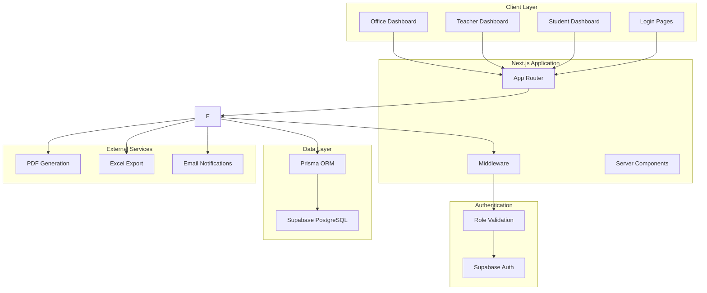

# Design Document

## Overview

The University Attendance System is built as a modern web application using Next.js 15 with App Router, Prisma ORM connected to Supabase PostgreSQL, and Supabase Auth for authentication. The system follows a role-based architecture with three distinct user types: Office administrators, Teachers, and Students. The application emphasizes mobile-first design with touch-friendly interfaces, real-time data synchronization, and comprehensive audit trails.

The architecture separates concerns through a layered approach: presentation layer (React components), business logic layer (API routes), data access layer (Prisma), and authentication layer (Supabase Auth). This design ensures scalability, maintainability, and security while providing an intuitive user experience across all devices.

## Architecture

### System Architecture



### Technology Stack

- **Frontend Framework**: Next.js 15 with App Router and React 19
- **Styling**: Tailwind CSS 4 with custom design system
- **Animations**: Framer Motion for smooth transitions and micro-interactions
- **Icons**: Lucide React with custom 3D animated icons using Lottie
- **Database**: Supabase PostgreSQL with Prisma ORM
- **Authentication**: Supabase Auth with custom role management
- **File Generation**: jsPDF for PDF reports, SheetJS for Excel exports
- **State Management**: React Server Components with selective client-side state
- **Form Handling**: React Hook Form with Zod validation
- **Deployment**: Vercel with automatic CI/CD

### Security Architecture

The system implements defense-in-depth security:

1. **Authentication Layer**: Supabase Auth handles secure login with JWT tokens
2. **Authorization Layer**: Custom middleware validates user roles and permissions
3. **API Security**: Server-side validation on all endpoints with role-based access control
4. **Database Security**: Prisma with parameterized queries prevents SQL injection
5. **Transport Security**: HTTPS enforcement with secure headers
6. **Session Management**: Automatic token refresh and secure session handling

## Components and Interfaces

### Core Components Structure

```
app/
├── (auth)/
│   ├── login/
│   │   ├── office/page.tsx
│   │   ├── teacher/page.tsx
│   │   └── student/page.tsx
│   └── layout.tsx
├── (dashboard)/
│   ├── office/
│   │   ├── users/page.tsx
│   │   ├── schedules/page.tsx
│   │   ├── attendance/page.tsx
│   │   └── reports/page.tsx
│   ├── teacher/
│   │   ├── dashboard/page.tsx
│   │   └── attendance/[sessionId]/page.tsx
│   ├── student/
│   │   └── attendance/page.tsx
│   └── layout.tsx
├── api/
│   ├── auth/
│   ├── users/
│   ├── schedules/
│   ├── attendance/
│   └── reports/
└── components/
    ├── ui/
    ├── forms/
    ├── charts/
    └── layout/
```

### Key Interface Components

#### Authentication Components
- **LoginForm**: Reusable login component with role-specific styling
- **RoleGuard**: Higher-order component for route protection
- **AuthProvider**: Context provider for authentication state

#### Dashboard Components
- **DashboardLayout**: Responsive layout with navigation and user menu
- **StatsCard**: Animated cards displaying key metrics
- **DataTable**: Sortable, filterable table with pagination
- **AttendanceGrid**: Touch-optimized grid for marking attendance

#### Form Components
- **UserForm**: Create/edit user accounts with role assignment
- **ScheduleForm**: Create class schedules with teacher and student assignment
- **AttendanceMarker**: Individual student attendance toggle component
- **ReportGenerator**: Form for configuring and generating reports

#### UI Components
- **Button**: Consistent button styling with loading states
- **Modal**: Accessible modal dialogs with animations
- **Toast**: Non-intrusive notifications for user feedback
- **LoadingSpinner**: Animated loading indicators

### API Interface Design

#### Authentication Endpoints
```typescript
POST /api/auth/login
POST /api/auth/logout
GET /api/auth/profile
PUT /api/auth/profile
```

#### User Management Endpoints
```typescript
GET /api/users
POST /api/users
PUT /api/users/[id]
DELETE /api/users/[id]
GET /api/users/[id]/attendance
```

#### Schedule Management Endpoints
```typescript
GET /api/schedules
POST /api/schedules
PUT /api/schedules/[id]
DELETE /api/schedules/[id]
GET /api/schedules/teacher/[teacherId]
```

#### Attendance Endpoints
```typescript
GET /api/attendance/session/[sessionId]
POST /api/attendance/session/[sessionId]
PUT /api/attendance/session/[sessionId]
GET /api/attendance/student/[studentId]
GET /api/attendance/audit/[sessionId]
```

#### Reporting Endpoints
```typescript
GET /api/reports/attendance
POST /api/reports/export/excel
POST /api/reports/export/pdf
GET /api/reports/monthly/[month]
```

## Data Models

### Database Schema

```prisma
model User {
  id          String   @id @default(cuid())
  email       String   @unique
  supabaseId  String   @unique
  role        UserRole
  createdAt   DateTime @default(now())
  updatedAt   DateTime @updatedAt
  
  profile     Profile?
  teacherProfile TeacherProfile?
  studentProfile StudentProfile?
  
  // Audit fields
  createdBy   String?
  updatedBy   String?
  
  @@map("users")
}

model Profile {
  id        String @id @default(cuid())
  userId    String @unique
  firstName String
  lastName  String
  phone     String?
  avatar    String?
  
  user User @relation(fields: [userId], references: [id], onDelete: Cascade)
  
  @@map("profiles")
}

model StudentProfile {
  id             String @id @default(cuid())
  userId         String @unique
  studentId      String @unique
  fatherName     String
  grandfatherName String
  dateOfBirth    DateTime?
  enrollmentDate DateTime @default(now())
  
  user User @relation(fields: [userId], references: [id], onDelete: Cascade)
  
  // Relationships
  enrollments    Enrollment[]
  attendanceRecords AttendanceRecord[]
  
  @@map("student_profiles")
}

model TeacherProfile {
  id       String @id @default(cuid())
  userId   String @unique
  employeeId String @unique
  department String?
  
  user User @relation(fields: [userId], references: [id], onDelete: Cascade)
  
  // Relationships
  subjects      TeacherSubject[]
  sessions      Session[]
  attendanceRecords AttendanceRecord[]
  
  @@map("teacher_profiles")
}

model Subject {
  id          String @id @default(cuid())
  code        String @unique
  name        String
  description String?
  credits     Int    @default(3)
  
  // Relationships
  teachers    TeacherSubject[]
  sessions    Session[]
  
  @@map("subjects")
}

model TeacherSubject {
  id        String @id @default(cuid())
  teacherId String
  subjectId String
  
  teacher TeacherProfile @relation(fields: [teacherId], references: [id], onDelete: Cascade)
  subject Subject @relation(fields: [subjectId], references: [id], onDelete: Cascade)
  
  @@unique([teacherId, subjectId])
  @@map("teacher_subjects")
}

model Class {
  id       String @id @default(cuid())
  name     String
  section  String?
  semester String
  year     Int
  
  // Relationships
  enrollments Enrollment[]
  sessions    Session[]
  
  @@unique([name, section, semester, year])
  @@map("classes")
}

model Enrollment {
  id        String @id @default(cuid())
  studentId String
  classId   String
  
  student StudentProfile @relation(fields: [studentId], references: [id], onDelete: Cascade)
  class   Class @relation(fields: [classId], references: [id], onDelete: Cascade)
  
  @@unique([studentId, classId])
  @@map("enrollments")
}

model Session {
  id        String   @id @default(cuid())
  subjectId String
  classId   String
  teacherId String
  date      DateTime
  startTime DateTime
  endTime   DateTime
  location  String?
  
  subject Subject @relation(fields: [subjectId], references: [id])
  class   Class @relation(fields: [classId], references: [id])
  teacher TeacherProfile @relation(fields: [teacherId], references: [id])
  
  // Relationships
  attendanceRecords AttendanceRecord[]
  auditLogs        AttendanceAuditLog[]
  
  @@map("sessions")
}

model AttendanceRecord {
  id        String   @id @default(cuid())
  sessionId String
  studentId String
  teacherId String
  isPresent Boolean
  markedAt  DateTime @default(now())
  notes     String?
  
  session Session @relation(fields: [sessionId], references: [id], onDelete: Cascade)
  student StudentProfile @relation(fields: [studentId], references: [id], onDelete: Cascade)
  teacher TeacherProfile @relation(fields: [teacherId], references: [id], onDelete: Cascade)
  
  @@unique([sessionId, studentId])
  @@map("attendance_records")
}

model AttendanceAuditLog {
  id           String   @id @default(cuid())
  sessionId    String
  studentId    String
  oldValue     Boolean?
  newValue     Boolean
  changedBy    String
  changedAt    DateTime @default(now())
  reason       String?
  
  session Session @relation(fields: [sessionId], references: [id], onDelete: Cascade)
  
  @@map("attendance_audit_logs")
}

model ReportExport {
  id         String     @id @default(cuid())
  type       ReportType
  format     ExportFormat
  parameters Json
  filePath   String?
  exportedBy String
  exportedAt DateTime   @default(now())
  
  @@map("report_exports")
}

enum UserRole {
  OFFICE
  TEACHER
  STUDENT
}

enum ReportType {
  MONTHLY_SUMMARY
  ATTENDANCE_SHEET
  STUDENT_REPORT
  CLASS_REPORT
}

enum ExportFormat {
  PDF
  EXCEL
}
```

### Data Relationships

The database design follows these key relationships:

1. **User-Profile Relationship**: One-to-one relationship with role-specific profiles
2. **Teacher-Subject Assignment**: Many-to-many relationship allowing teachers to handle multiple subjects
3. **Student-Class Enrollment**: Many-to-many relationship for flexible class assignments
4. **Session Management**: Links teachers, subjects, and classes for specific time slots
5. **Attendance Tracking**: Records linked to sessions with full audit trail
6. **Audit Logging**: Complete change history for all attendance modifications

## Error Handling

### Error Classification

#### Client-Side Errors
- **Validation Errors**: Form validation with real-time feedback
- **Network Errors**: Retry mechanisms with exponential backoff
- **Authentication Errors**: Automatic token refresh and re-login prompts
- **Permission Errors**: Clear messaging with suggested actions

#### Server-Side Errors
- **Database Errors**: Transaction rollback with error logging
- **Authentication Failures**: Secure error messages without information leakage
- **Validation Failures**: Detailed field-level error responses
- **Rate Limiting**: Graceful degradation with retry-after headers

### Error Handling Strategy

```typescript
// Global error boundary for React components
class ErrorBoundary extends Component {
  // Catch and display user-friendly error messages
  // Log errors to monitoring service
  // Provide recovery options
}

// API error handling middleware
export function errorHandler(error: Error, req: Request, res: Response) {
  // Log error details
  // Return appropriate HTTP status
  // Sanitize error messages for security
  // Track error metrics
}

// Database error handling
export function handlePrismaError(error: PrismaClientKnownRequestError) {
  // Map Prisma errors to user-friendly messages
  // Handle constraint violations
  // Manage connection issues
}
```

### User Experience for Errors

- **Inline Validation**: Real-time form validation with clear error messages
- **Toast Notifications**: Non-intrusive error alerts with action buttons
- **Fallback UI**: Graceful degradation when components fail to load
- **Retry Mechanisms**: Automatic retry for transient failures
- **Offline Support**: Basic functionality when network is unavailable

## Testing Strategy

### Testing Pyramid

#### Unit Tests (70%)
- **Component Testing**: React Testing Library for UI components
- **Utility Functions**: Jest for business logic and helper functions
- **API Route Testing**: Supertest for endpoint testing
- **Database Layer**: Prisma client testing with test database

#### Integration Tests (20%)
- **API Integration**: End-to-end API workflow testing
- **Database Integration**: Multi-table operation testing
- **Authentication Flow**: Complete login/logout scenarios
- **Role-Based Access**: Permission validation across user types

#### End-to-End Tests (10%)
- **User Workflows**: Playwright for complete user journeys
- **Cross-Browser Testing**: Chrome, Firefox, Safari compatibility
- **Mobile Testing**: Touch interactions and responsive design
- **Performance Testing**: Load testing for concurrent users

### Test Data Management

```typescript
// Test data factories
export const createTestUser = (role: UserRole) => ({
  email: `test-${role.toLowerCase()}@example.com`,
  role,
  profile: {
    firstName: 'Test',
    lastName: 'User'
  }
});

// Database seeding for tests
export async function seedTestDatabase() {
  // Create test users for each role
  // Generate sample schedules and classes
  // Create attendance records for testing
}

// Test cleanup
export async function cleanupTestData() {
  // Remove test data after each test
  // Reset database state
}
```

### Continuous Integration

- **Pre-commit Hooks**: Lint, format, and run unit tests
- **Pull Request Checks**: Full test suite execution
- **Deployment Pipeline**: Automated testing before production deployment
- **Performance Monitoring**: Continuous performance regression testing

### Testing Tools

- **Jest**: Unit testing framework with coverage reporting
- **React Testing Library**: Component testing with user-centric approach
- **Playwright**: End-to-end testing with cross-browser support
- **MSW (Mock Service Worker)**: API mocking for isolated testing
- **Prisma Test Environment**: Isolated database testing setup