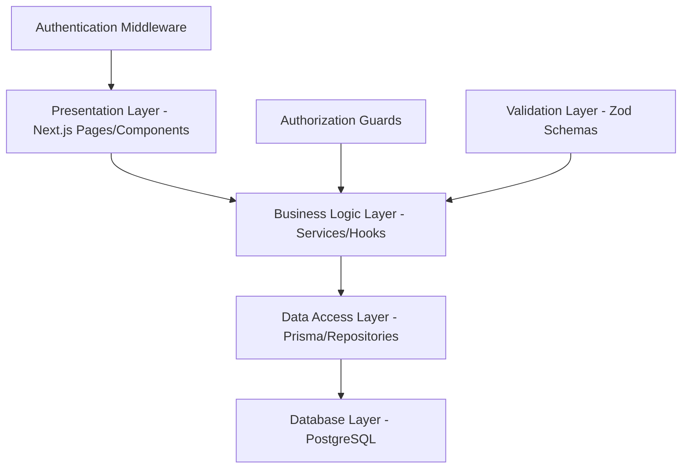
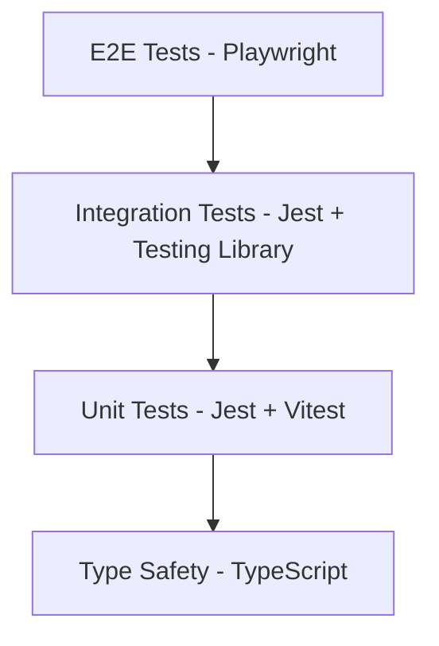

# Design Document

## Overview

The University Attendance System is a modern, visually stunning, high-trust web application built with Next.js 15, React 19, and PostgreSQL. The system implements a sophisticated role-based architecture supporting Office administrators, Teachers, and Students with comprehensive dashboard functionality that matches the beautiful design quality of the existing login page. The application follows a weekly attendance tracking model (Saturday-Thursday) with advanced academic rule enforcement for disqualification (محروم) and certification requirements (تصدیق طلب), featuring extensive reporting and analytics capabilities with modern animations and interactions.

### Core Design Principles
- **Visual Excellence**: Match the login page's beautiful design with university blue (#3b82f6) gradients, smooth animations, and professional campus aesthetics
- **Modern Interactions**: Micro-interactions with 300ms transitions, hover effects (scale 1.02x), and unobtrusive animations throughout
- **Comprehensive Navigation**: Structured hierarchy with animated sidebar, smooth page transitions, and role-based menu systems
- **Role-Based Dashboards**: Office sees full system control with metrics cards, Teachers see class management tools with progress indicators, Students see personal attendance overview with animated charts
- **Business Rule Implementation**: Sophisticated logic for محروم (pure absence tracking) and تصدیق طلب (medical certification workflow) with visual status indicators
- **Advanced Reporting**: Weekly reports with animated charts, student status tracking with color-coded badges, and multi-format export capabilities
- **Responsive Design**: Mobile-first approach with touch-optimized interactions, collapsible navigation, and adaptive layouts
- **Accessibility**: WCAG 2.1 AA compliance with keyboard navigation, screen reader support, and high contrast ratios
- **Performance**: Optimized for large user bases with skeleton loading states, lazy loading, and smooth data transitions

### Visual Design System (Matching Login Page)
- **Primary Palette**: 
  - University Blue: #3b82f6 (primary), #1e40af (dark variant)
  - Gradients: `from-blue-500 to-blue-600`, `from-slate-50 via-blue-50/30 to-emerald-50/20`
  - Neutral: Slate grays (#f8fafc, #e2e8f0, #64748b, #334155, #0f172a)
  - Surface: White with backdrop-blur and transparency (bg-white/80)

- **Status Colors & Icons** (with animations):
  - 🟢 Present: #10b981 (emerald-500) with pulse animation
  - 🔴 Absent: #ef4444 (red-500) with shake animation on warning
  - 🟡 Sick: #f59e0b (amber-500) with gentle glow
  - 🔵 Leave: #06b6d4 (cyan-500) with fade transition
  - 🟣 محروم: #8b5cf6 (violet-500) with warning pulse
  - 🟠 تصدیق طلب: #f97316 (orange-500) with attention blink

- **Typography**: 
  - Primary: Inter font family (400, 500, 600, 700 weights)
  - Headings: 600-700 weight with letter-spacing
  - Body: 400-500 weight with optimized line-height
  - Data/Numbers: Tabular numbers for alignment

- **Spacing & Layout**: 
  - Base unit: 4px (4, 8, 12, 16, 20, 24, 32, 40, 48, 64px)
  - Card padding: 24px (p-6), 32px (p-8) for larger cards
  - Roomy spacing with clear visual hierarchy
  - Grid system: 12-column responsive grid

- **Animations & Transitions**:
  - Duration: 150ms (micro), 300ms (standard), 500ms (complex)
  - Easing: `cubic-bezier(0.4, 0, 0.2, 1)` for natural feel
  - Hover: Scale 1.02x, shadow elevation, color transitions
  - Loading: Skeleton screens with shimmer effect
  - Page transitions: Slide-in from right, fade for modals
  - Data updates: Highlight changes with brief color flash

- **Shadows & Depth**:
  - Card shadows: `shadow-lg`, `shadow-xl` for elevated elements
  - Hover shadows: Increased elevation with smooth transition
  - Focus rings: Blue ring with 4px offset for accessibility

- **Theme Support**: 
  - Light mode primary with dark mode capability
  - High contrast mode for accessibility
  - Smooth theme transitions with CSS custom properties

### Technology Stack
- **Frontend**: Next.js 15 with React 19, TypeScript, Tailwind CSS
- **Backend**: Next.js API routes with server-side rendering
- **Database**: PostgreSQL with Prisma ORM
- **UI Components**: Radix UI primitives with custom styling
- **Forms**: React Hook Form with Zod validation
- **Authentication**: NextAuth.js (to be integrated)
- **Styling**: Tailwind CSS with custom design system
- **Animations**: Framer Motion for smooth transitions

## Architecture

### System Architecture Pattern
The application follows a **layered architecture** with clear separation of concerns:



### Role-Based Access Control (RBAC)
- **Administrator**: Full system access, account management, configuration, reporting
- **Teacher**: Class-specific attendance management, student viewing
- **Student**: Read-only access to personal attendance data

### Security Architecture
- JWT-based authentication with secure session management
- Role-based middleware for API route protection
- Input validation using Zod schemas
- SQL injection prevention through Prisma ORM
- CSRF protection and secure headers

## Components and Interfaces

### Dashboard Navigation Structure

```
Dashboard Navigation Hierarchy:
├── User Management/
│   ├── All Users (list, search, filter, pagination)
│   ├── Add User (single + CSV bulk import)
│   └── Roles & Permissions (role management interface)
├── Classes & Schedule/
│   ├── All Classes (class listing and overview)
│   ├── Schedule Builder (drag-and-drop interface)
│   └── Class Management (assignments and enrollment)
├── Attendance/
│   ├── Overview (system-wide attendance dashboard)
│   ├── Mark Attendance (teacher interface with grid)
│   └── Attendance History (detailed timeline view)
├── Reports & Analytics/
│   ├── Weekly Reports (Present/Absent/Sick/Leave/Total)
│   ├── Student Status (محروم and تصدیق طلب tracking)
│   └── Export Data (CSV/PDF/Excel with filters)
└── System Settings/
    ├── General Settings (system configuration)
    ├── Academic Calendar (semester/term setup)
    └── Attendance Rules (thresholds and business rules)
```

### Modern Dashboard Component Architecture

```
components/
├── layout/
│   ├── DashboardLayout.tsx      # Main layout with gradient backgrounds and animations
│   ├── ModernSidebar.tsx        # Animated sidebar with role-based navigation and icons
│   ├── DashboardHeader.tsx      # Header with user avatar, notifications bell, and smooth logout
│   ├── MobileNavigation.tsx     # Collapsible mobile nav with slide animations
│   └── PageTransition.tsx       # Smooth page transition wrapper
├── dashboard/
│   ├── OfficeDashboard.tsx      # Admin overview with animated metric cards and charts
│   ├── TeacherDashboard.tsx     # Class management with progress indicators and alerts
│   ├── StudentDashboard.tsx     # Personal attendance with animated progress and calendar
│   └── DashboardCard.tsx        # Reusable card with hover effects and gradients
├── user-management/
│   ├── ModernUserList.tsx       # Users table with search, filters, and smooth animations
│   ├── AddUserForm.tsx          # Form with real-time validation and success animations
│   ├── BulkImportWizard.tsx     # Multi-step CSV import with progress indicators
│   ├── RolePermissionMatrix.tsx # Interactive permission grid with toggle animations
│   └── UserProfileCard.tsx      # User card with avatar, status badge, and actions
├── classes/
│   ├── ClassGrid.tsx            # Modern class cards with enrollment indicators
│   ├── ScheduleBuilder.tsx      # Drag-and-drop with visual feedback and conflict detection
│   ├── ClassManagement.tsx      # Class details with animated student list
│   └── TimeSlotCard.tsx         # Individual time slot with hover and selection states
├── attendance/
│   ├── AttendanceGrid.tsx       # Interactive grid with status cycling animations
│   ├── AttendanceOverview.tsx   # System dashboard with real-time charts
│   ├── AttendanceHistory.tsx    # Timeline with calendar view and smooth scrolling
│   ├── BulkActionPanel.tsx      # Floating action panel with confirmation modals
│   └── AttendanceCalendar.tsx   # Monthly calendar with color-coded attendance
├── reports/
│   ├── WeeklyReportsTable.tsx   # Modern table with sorting and export animations
│   ├── StudentStatusGrid.tsx    # Status cards with محروم/تصدیق طلب indicators
│   ├── AnalyticsDashboard.tsx   # Interactive charts with hover details and animations
│   ├── ExportControls.tsx       # Export panel with format selection and progress
│   └── ReportFilters.tsx        # Advanced filters with smooth expand/collapse
├── settings/
│   ├── SettingsLayout.tsx       # Settings page with tabbed navigation
│   ├── GeneralSettings.tsx      # System config with toggle switches and sliders
│   ├── AcademicCalendar.tsx     # Calendar management with date picker animations
│   ├── AttendanceRules.tsx      # Threshold sliders with real-time preview
│   └── SystemHealth.tsx         # System status with animated indicators
├── certification/
│   ├── CertUploadZone.tsx       # Drag-and-drop file upload with progress
│   ├── CertReviewPanel.tsx      # Document viewer with approval workflow
│   ├── CertHistory.tsx          # Timeline of certifications with status badges
│   └── CertificationModal.tsx   # Modal for cert details with smooth transitions
└── ui/
    ├── ModernDataTable.tsx      # Advanced table with animations and interactions
    ├── AnimatedStatusBadge.tsx  # Status badges with icons and pulse animations
    ├── ProgressIndicator.tsx    # Animated progress bars with percentage counters
    ├── MetricCard.tsx           # Dashboard metric cards with hover effects
    ├── InteractiveChart.tsx     # Charts with hover details and smooth transitions
    ├── LoadingStates.tsx        # Skeleton screens and loading animations
    ├── NotificationToast.tsx    # Toast notifications with slide-in animations
    ├── ConfirmationModal.tsx    # Modals with backdrop blur and scale animations
    ├── SearchInput.tsx          # Search with real-time results and animations
    └── ActionButton.tsx         # Buttons with loading states and success feedback
```

### Modern Dashboard Layouts

#### Office Dashboard Layout
```tsx
// Modern Office Dashboard with animated cards and real-time metrics
const OfficeDashboard = () => (
  <div className="min-h-screen bg-gradient-to-br from-slate-50 via-blue-50/30 to-emerald-50/20">
    {/* Header with gradient and glass effect */}
    <header className="bg-white/80 backdrop-blur-sm border-b border-white/20 shadow-sm">
      <div className="flex items-center justify-between px-6 py-4">
        <h1 className="text-2xl font-bold text-slate-900">Office Dashboard</h1>
        <div className="flex items-center space-x-4">
          <NotificationBell count={5} />
          <UserAvatar />
        </div>
      </div>
    </header>

    {/* Main content with animated grid */}
    <main className="p-6">
      {/* Metrics Cards Row */}
      <div className="grid grid-cols-1 md:grid-cols-2 lg:grid-cols-5 gap-6 mb-8">
        <MetricCard
          title="Total Users"
          value="1,247"
          icon={Users}
          trend="+12%"
          color="blue"
          gradient="from-blue-500 to-blue-600"
        />
        <MetricCard
          title="Active Classes"
          value="45"
          icon={BookOpen}
          trend="+3"
          color="emerald"
          gradient="from-emerald-500 to-emerald-600"
        />
        <MetricCard
          title="Attendance Rate"
          value="94.2%"
          icon={CheckCircle}
          trend="+2.1%"
          color="green"
          gradient="from-green-500 to-green-600"
        />
        <MetricCard
          title="محروم Students"
          value="8"
          icon={AlertTriangle}
          trend="-2"
          color="red"
          gradient="from-red-500 to-red-600"
        />
        <MetricCard
          title="تصدیق طلب"
          value="15"
          icon={FileText}
          trend="+5"
          color="orange"
          gradient="from-orange-500 to-orange-600"
        />
      </div>

      {/* Charts and Analytics Row */}
      <div className="grid grid-cols-1 lg:grid-cols-2 gap-6 mb-8">
        <Card className="bg-white/80 backdrop-blur-sm shadow-lg">
          <CardHeader>
            <CardTitle>Weekly Attendance Trends</CardTitle>
          </CardHeader>
          <CardContent>
            <InteractiveChart type="line" data={attendanceTrends} />
          </CardContent>
        </Card>

        <Card className="bg-white/80 backdrop-blur-sm shadow-lg">
          <CardHeader>
            <CardTitle>Quick Actions</CardTitle>
          </CardHeader>
          <CardContent>
            <div className="grid grid-cols-2 gap-4">
              <ActionButton icon={UserPlus} label="Add User" />
              <ActionButton icon={FileBarChart} label="Generate Report" />
              <ActionButton icon={Settings} label="System Settings" />
              <ActionButton icon={Certificate} label="Review Certs" />
            </div>
          </CardContent>
        </Card>
      </div>

      {/* Critical Alerts */}
      <Card className="bg-gradient-to-r from-amber-50 to-orange-50 border-amber-200">
        <CardHeader>
          <CardTitle className="flex items-center text-amber-800">
            <AlertTriangle className="mr-2" />
            Critical Alerts
          </CardTitle>
        </CardHeader>
        <CardContent>
          <div className="space-y-3">
            <AlertItem 
              message="3 students approaching محروم threshold"
              action="Review Students"
              severity="warning"
            />
            <AlertItem 
              message="5 medical certificates pending review"
              action="Review Certificates"
              severity="info"
            />
            <AlertItem 
              message="2 teachers haven't submitted attendance this week"
              action="Send Reminder"
              severity="warning"
            />
          </div>
        </CardContent>
      </Card>
    </main>
  </div>
);
```

#### Teacher Dashboard Layout
```tsx
// Modern Teacher Dashboard with class management focus
const TeacherDashboard = () => (
  <div className="min-h-screen bg-gradient-to-br from-slate-50 via-blue-50/30 to-emerald-50/20">
    <header className="bg-white/80 backdrop-blur-sm border-b border-white/20 shadow-sm">
      <div className="flex items-center justify-between px-6 py-4">
        <h1 className="text-2xl font-bold text-slate-900">Teacher Dashboard</h1>
        <div className="flex items-center space-x-4">
          <TodaySchedule />
          <NotificationBell count={3} />
          <UserAvatar />
        </div>
      </div>
    </header>

    <main className="p-6">
      {/* My Classes Grid */}
      <div className="grid grid-cols-1 md:grid-cols-2 lg:grid-cols-3 gap-6 mb-8">
        <ClassCard
          name="Class 10-A"
          students={28}
          attendanceRate={92}
          status="mark_attendance"
          nextSession="Now"
        />
        <ClassCard
          name="Class 11-B"
          students={32}
          attendanceRate={88}
          status="completed"
          nextSession="Tomorrow 9:00 AM"
        />
        <ClassCard
          name="Class 12-C"
          students={25}
          attendanceRate={95}
          status="upcoming"
          nextSession="Today 2:00 PM"
        />
      </div>

      {/* Student Status Alerts */}
      <Card className="mb-8 bg-white/80 backdrop-blur-sm shadow-lg">
        <CardHeader>
          <CardTitle className="flex items-center">
            <AlertTriangle className="mr-2 text-amber-500" />
            Student Status Alerts
          </CardTitle>
        </CardHeader>
        <CardContent>
          <div className="space-y-4">
            <StudentAlert
              name="Ahmed Ali"
              class="10-A"
              issue="18 pure absences (محروم risk)"
              severity="high"
            />
            <StudentAlert
              name="Sara Khan"
              class="11-B"
              issue="25 total absences (تصدیق طلب)"
              severity="medium"
            />
            <StudentAlert
              name="Omar Hassan"
              class="10-A"
              issue="Approaching warning threshold"
              severity="low"
            />
          </div>
        </CardContent>
      </Card>

      {/* Performance Chart */}
      <Card className="bg-white/80 backdrop-blur-sm shadow-lg">
        <CardHeader>
          <CardTitle>My Classes Performance</CardTitle>
        </CardHeader>
        <CardContent>
          <InteractiveChart type="bar" data={classPerformance} />
        </CardContent>
      </Card>
    </main>
  </div>
);
```

#### Student Dashboard Layout
```tsx
// Modern Student Dashboard with personal attendance focus
const StudentDashboard = () => (
  <div className="min-h-screen bg-gradient-to-br from-slate-50 via-blue-50/30 to-emerald-50/20">
    <header className="bg-white/80 backdrop-blur-sm border-b border-white/20 shadow-sm">
      <div className="flex items-center justify-between px-6 py-4">
        <h1 className="text-2xl font-bold text-slate-900">My Attendance</h1>
        <div className="flex items-center space-x-4">
          <StatusBadge status="good" label="Good Standing" />
          <UserAvatar />
        </div>
      </div>
    </header>

    <main className="p-6">
      {/* Attendance Overview Cards */}
      <div className="grid grid-cols-1 md:grid-cols-3 gap-6 mb-8">
        <AttendanceCard
          period="This Week"
          percentage={82}
          hours="30/36 hours"
          color="emerald"
        />
        <AttendanceCard
          period="This Month"
          percentage={78}
          hours="140/180 hours"
          color="blue"
        />
        <AttendanceCard
          period="This Term"
          percentage={85}
          hours="612/720 hours"
          color="purple"
        />
      </div>

      {/* Weekly Calendar */}
      <Card className="mb-8 bg-white/80 backdrop-blur-sm shadow-lg">
        <CardHeader>
          <CardTitle>This Week's Attendance (Sat - Thu)</CardTitle>
        </CardHeader>
        <CardContent>
          <WeeklyCalendar attendanceData={weeklyData} />
        </CardContent>
      </Card>

      {/* Attendance Breakdown */}
      <Card className="mb-8 bg-white/80 backdrop-blur-sm shadow-lg">
        <CardHeader>
          <CardTitle>Attendance Breakdown</CardTitle>
        </CardHeader>
        <CardContent>
          <div className="grid grid-cols-2 md:grid-cols-4 gap-4">
            <StatusMetric label="Present" value="30 hrs" color="green" />
            <StatusMetric label="Absent" value="6 hrs" color="red" />
            <StatusMetric label="Sick" value="0 hrs" color="yellow" />
            <StatusMetric label="Leave" value="0 hrs" color="blue" />
          </div>
          <div className="mt-6 space-y-2">
            <ThresholdIndicator
              label="Pure Absences"
              current={6}
              threshold={20}
              type="محروم"
            />
            <ThresholdIndicator
              label="Total Absences"
              current={6}
              threshold={25}
              type="تصدیق طلب"
            />
          </div>
        </CardContent>
      </Card>

      {/* Motivational Message */}
      <Card className="bg-gradient-to-r from-green-50 to-emerald-50 border-green-200">
        <CardContent className="text-center py-8">
          <div className="text-4xl mb-4">🎯</div>
          <h3 className="text-lg font-semibold text-green-800 mb-2">
            Keep it up! You're maintaining good attendance.
          </h3>
          <p className="text-green-600">
            Goal: Maintain above 80% to stay in good standing
          </p>
        </CardContent>
      </Card>
    </main>
  </div>
);
```

### Key Interface Definitions

```typescript
// Core Types
interface User {
  id: string;
  email: string;
  name: string;
  role: UserRole;
  createdAt: Date;
  updatedAt: Date;
  isActive: boolean;
}

interface AttendanceRecord {
  id: string;
  studentId: string;
  classId: string;
  date: Date;
  session: number; // 1-6 for daily sessions
  status: AttendanceStatus;
  markedBy: string;
  markedAt: Date;
  editedBy?: string;
  editedAt?: Date;
  editReason?: string;
}

interface WeeklyReport {
  studentId: string;
  studentName: string;
  classId: string;
  weekStart: Date;
  weekEnd: Date;
  present: number;        // Hours actually attended
  absent: number;         // Pure absent hours (غیر حاضر)
  sick: number;           // Sick hours
  leave: number;          // Leave hours
  total: number;          // Total configured hours (default 36)
  pureAbsences: number;   // Only absent hours for محروم calculation
  aggregateAbsences: number; // Absent + Sick + Leave for تصدیق طلب
  isDisqualified: boolean;   // محروم status
  requiresCertification: boolean; // تصدیق طلب status
  attendancePercentage: number;
}

interface StudentStatus {
  studentId: string;
  status: 'good' | 'warning' | 'محروم' | 'تصدیق طلب';
  pureAbsenceCount: number;
  aggregateAbsenceCount: number;
  pureAbsenceThreshold: number;
  certificationThreshold: number;
  canTakeExams: boolean;
  requiresAction: boolean;
  badge: {
    color: 'green' | 'yellow' | 'red' | 'purple' | 'orange';
    icon: string;
    message: string;
    description: string;
  };
}

interface CertificationRequest {
  id: string;
  studentId: string;
  uploadedAt: Date;
  documentUrl: string;
  documentType: string;
  status: 'pending' | 'approved' | 'rejected';
  reviewedBy?: string;
  reviewedAt?: Date;
  reviewNotes?: string;
}

interface AuditLog {
  id: string;
  userId: string;
  action: string;
  resource: string;
  resourceId: string;
  oldValue?: any;
  newValue?: any;
  reason?: string;
  timestamp: Date;
  ipAddress?: string;
}

interface SystemSettings {
  weeklyTotalHours: number;        // Default 36
  dailyHours: number;              // Default 6
  sessionDuration: number;         // Default 45 minutes
  breakAfterHours: number;         // Default 3 (15-min break after 3 hours)
  pureAbsenceThreshold: number;    // محروم threshold
  certificationThreshold: number;  // تصدیق طلب threshold
  academicWeekStart: number;       // 6 = Saturday
  academicWeekEnd: number;         // 4 = Thursday
}

enum AttendanceStatus {
  PRESENT = 'PRESENT',
  ABSENT = 'ABSENT',
  SICK = 'SICK',
  LEAVE = 'LEAVE'
}

enum UserRole {
  OFFICE = 'OFFICE',    // Changed from ADMIN to match requirements
  TEACHER = 'TEACHER',
  STUDENT = 'STUDENT'
}

// UI Component Props
interface AttendanceGridProps {
  students: Student[];
  date: Date;
  onStatusChange: (studentId: string, status: AttendanceStatus) => void;
  bulkActions: boolean;
}

interface StatusBadgeProps {
  status: AttendanceStatus;
  animated?: boolean;
  size?: 'sm' | 'md' | 'lg';
}
```

## Data Models

### Database Schema Design

```prisma
model User {
  id        String   @id @default(cuid())
  email     String   @unique
  name      String
  role      UserRole
  createdAt DateTime @default(now())
  updatedAt DateTime @updatedAt
  
  // Relationships
  teacherProfile TeacherProfile?
  studentProfile StudentProfile?
  attendanceMarked AttendanceRecord[] @relation("MarkedBy")
  
  @@map("users")
}

model TeacherProfile {
  id       String @id @default(cuid())
  userId   String @unique
  user     User   @relation(fields: [userId], references: [id], onDelete: Cascade)
  
  // Relationships
  classes  Class[]
  
  @@map("teacher_profiles")
}

model StudentProfile {
  id       String @id @default(cuid())
  userId   String @unique
  user     User   @relation(fields: [userId], references: [id], onDelete: Cascade)
  classId  String
  class    Class  @relation(fields: [classId], references: [id])
  
  // Relationships
  attendanceRecords AttendanceRecord[]
  weeklyReports     WeeklyReport[]
  
  @@map("student_profiles")
}

model Class {
  id          String @id @default(cuid())
  name        String
  description String?
  teacherId   String
  teacher     TeacherProfile @relation(fields: [teacherId], references: [id])
  
  // Relationships
  students    StudentProfile[]
  attendance  AttendanceRecord[]
  schedules   ClassSchedule[]
  
  @@map("classes")
}

model ClassSchedule {
  id              String @id @default(cuid())
  classId         String
  class           Class  @relation(fields: [classId], references: [id])
  dayOfWeek       Int    // 0=Saturday, 1=Sunday, ..., 5=Thursday
  sessionNumber   Int    // 1-6 for daily sessions
  startTime       String // "08:00"
  endTime         String // "08:45"
  sessionDuration Int    @default(45) // minutes
  
  @@unique([classId, dayOfWeek, sessionNumber])
  @@map("class_schedules")
}

model AttendanceRecord {
  id        String          @id @default(cuid())
  studentId String
  student   StudentProfile  @relation(fields: [studentId], references: [id])
  classId   String
  class     Class           @relation(fields: [classId], references: [id])
  date      DateTime
  session   Int             // 1-6 for daily sessions
  status    AttendanceStatus
  markedBy  String
  marker    User            @relation("MarkedBy", fields: [markedBy], references: [id])
  markedAt  DateTime        @default(now())
  
  @@unique([studentId, date, session])
  @@map("attendance_records")
}

model WeeklyReport {
  id                    String         @id @default(cuid())
  studentId             String
  student               StudentProfile @relation(fields: [studentId], references: [id])
  weekStart             DateTime       // Start of academic week (Saturday)
  weekEnd               DateTime       // End of academic week (Thursday)
  presentHours          Int            @default(0)
  absentHours           Int            @default(0)
  sickHours             Int            @default(0)
  leaveHours            Int            @default(0)
  totalHours            Int            @default(36)
  pureAbsences          Int            @default(0) // Only absent hours
  isDisqualified        Boolean        @default(false)
  requiresCertification Boolean        @default(false)
  generatedAt           DateTime       @default(now())
  
  @@unique([studentId, weekStart])
  @@map("weekly_reports")
}

model SystemSettings {
  id                    String @id @default(cuid())
  key                   String @unique
  value                 String
  description           String?
  updatedAt             DateTime @updatedAt
  
  @@map("system_settings")
}

model AuditLog {
  id        String   @id @default(cuid())
  userId    String
  action    String   // CREATE, UPDATE, DELETE, LOGIN, etc.
  resource  String   // attendance, user, class, etc.
  resourceId String?
  details   Json?    // Additional context
  timestamp DateTime @default(now())
  ipAddress String?
  
  @@map("audit_logs")
}

enum UserRole {
  ADMIN
  TEACHER
  STUDENT
}

enum AttendanceStatus {
  PRESENT
  ABSENT
  SICK
  LEAVE
}
```

### Key Relationships
- **One-to-One**: User ↔ TeacherProfile, User ↔ StudentProfile
- **One-to-Many**: Teacher → Classes, Class → Students, Student → AttendanceRecords
- **Many-to-One**: AttendanceRecord → Student, AttendanceRecord → Class

## Error Handling

### Error Handling Strategy

```typescript
// Custom Error Classes
class AttendanceError extends Error {
  constructor(
    message: string,
    public code: string,
    public statusCode: number = 400
  ) {
    super(message);
    this.name = 'AttendanceError';
  }
}

class AuthorizationError extends AttendanceError {
  constructor(message: string = 'Unauthorized access') {
    super(message, 'UNAUTHORIZED', 401);
  }
}

class ValidationError extends AttendanceError {
  constructor(message: string, public field?: string) {
    super(message, 'VALIDATION_ERROR', 400);
  }
}

// Global Error Handler
export function handleApiError(error: unknown): Response {
  if (error instanceof AttendanceError) {
    return NextResponse.json(
      { error: error.message, code: error.code },
      { status: error.statusCode }
    );
  }
  
  // Log unexpected errors
  console.error('Unexpected error:', error);
  return NextResponse.json(
    { error: 'Internal server error' },
    { status: 500 }
  );
}
```

### Client-Side Error Handling
- Toast notifications for user feedback
- Form validation with real-time error display
- Retry mechanisms for network failures
- Graceful degradation for offline scenarios

## Testing Strategy

### Testing Pyramid Approach



### Test Categories

**Unit Tests (70%)**
- Business logic functions
- Utility functions
- Component logic
- Data transformations

**Integration Tests (20%)**
- API route testing
- Database operations
- Component integration
- Form submissions

**End-to-End Tests (10%)**
- Critical user journeys
- Authentication flows
- Attendance marking workflows
- Report generation

### Test Structure
```
__tests__/
├── unit/
│   ├── utils/
│   ├── services/
│   └── components/
├── integration/
│   ├── api/
│   └── database/
└── e2e/
    ├── auth.spec.ts
    ├── attendance.spec.ts
    └── reports.spec.ts
```

## User Experience Design

### Design System & Visual Language

**Color Palette**
```css
/* Primary Colors */
--primary-blue: #3b82f6;
--primary-dark: #1e40af;

/* Status Colors */
--present-green: #10b981;
--absent-red: #ef4444;
--sick-yellow: #f59e0b;
--leave-blue: #06b6d4;

/* Semantic Colors */
--success: #22c55e;
--warning: #eab308;
--error: #dc2626;
--info: #3b82f6;

/* Theme Colors */
--background-light: #ffffff;
--background-dark: #0f172a;
--surface-light: #f8fafc;
--surface-dark: #1e293b;
```

**Typography Scale**
- **Headings**: Inter (600-700 weight)
- **Body Text**: Inter (400-500 weight)
- **Data/Code**: JetBrains Mono (400-500 weight)
- **Captions**: Inter (400 weight, smaller size)

**Spacing System**: 4px base unit (4, 8, 12, 16, 20, 24, 32, 40, 48, 64px)

**Animation Principles**
- **Duration**: 150ms for micro-interactions, 300ms for transitions
- **Easing**: `cubic-bezier(0.4, 0, 0.2, 1)` for natural feel
- **Hover Effects**: Scale (1.02), shadow elevation, color transitions
- **Page Transitions**: Slide-in from right, fade-in for modals

### Responsive Design Strategy

**Breakpoints & Layouts**
- **Mobile (320-768px)**:
  - Single column layout
  - Touch-optimized buttons (44px minimum)
  - Collapsible navigation drawer
  - Swipe gestures for attendance marking
  
- **Tablet (768-1024px)**:
  - Two-column adaptive layout
  - Side navigation panel
  - Grid view for attendance
  
- **Desktop (1024px+)**:
  - Full three-column layout
  - Persistent sidebar navigation
  - Advanced data tables with sorting/filtering

### Role-Based Dashboard Designs

**Office Dashboard**
```
┌─────────────────────────────────────────────────────────────────┐
│ 🏛️ Office Dashboard                           🔔 Alerts (5)     │
├─────────────────────────────────────────────────────────────────┤
│ ┌─────────┐ ┌─────────┐ ┌─────────┐ ┌─────────┐ ┌─────────┐    │
│ │ 👥 Users │ │ 📚 Class│ │ ✅ Atten│ │ 🚫 محروم │ │ 📋 تصدیق │    │
│ │   1,247  │ │    45   │ │  94.2%  │ │    8     │ │    15    │    │
│ └─────────┘ └─────────┘ └─────────┘ └─────────┘ └─────────┘    │
├─────────────────────────────────────────────────────────────────┤
│ 📈 Weekly Attendance Trends    🎯 Quick Actions                 │
│ [Interactive Chart with        • Add User (Single/Bulk)        │
│  Present/Absent/Sick/Leave]    • Generate Weekly Report        │
│                               • Review Certifications          │
│                               • System Settings                │
├─────────────────────────────────────────────────────────────────┤
│ ⚠️ Critical Alerts                                              │
│ • 3 students approaching محروم threshold                        │
│ • 5 medical certificates pending review                        │
│ • 2 teachers haven't submitted attendance this week            │
└─────────────────────────────────────────────────────────────────┘
```

**Teacher Dashboard**
```
┌─────────────────────────────────────────────────────────────────┐
│ 👨‍🏫 Teacher Dashboard                        📅 Today's Schedule │
├─────────────────────────────────────────────────────────────────┤
│ ┌─────────────────┐ ┌─────────────────┐ ┌─────────────────┐    │
│ │ Class 10-A      │ │ Class 11-B      │ │ Class 12-C      │    │
│ │ 🎯 Mark Attend. │ │ ✅ Completed    │ │ ⏰ Next (2:00PM)│    │
│ │ 👥 28 students  │ │ 👥 32 students  │ │ 👥 25 students  │    │
│ │ 📊 92% avg      │ │ 📊 88% avg      │ │ 📊 95% avg      │    │
│ └─────────────────┘ └─────────────────┘ └─────────────────┘    │
├─────────────────────────────────────────────────────────────────┤
│ ⚠️ Student Status Alerts                                        │
│ • Ahmed Ali (10-A) - 18 pure absences (محروم risk)             │
│ • Sara Khan (11-B) - 25 total absences (تصدیق طلب)             │
│ • Omar Hassan (10-A) - Approaching warning threshold           │
├─────────────────────────────────────────────────────────────────┤
│ 📊 My Classes Performance                                       │
│ [Bar chart showing attendance rates by class]                  │
└─────────────────────────────────────────────────────────────────┘
```

**Student Dashboard**
```
┌─────────────────────────────────────────────────────────────────┐
│ 🎓 My Attendance Overview                  🎯 Status: Good ✅    │
├─────────────────────────────────────────────────────────────────┤
│ ┌─────────────────┐ ┌─────────────────┐ ┌─────────────────┐    │
│ │ This Week       │ │ This Month      │ │ This Term       │    │
│ │ ████████░░ 82%  │ │ ███████░░░ 78%  │ │ ████████░░ 85%  │    │
│ │ 30/36 hours     │ │ 140/180 hours   │ │ 612/720 hours   │    │
│ └─────────────────┘ └─────────────────┘ └─────────────────┘    │
├─────────────────────────────────────────────────────────────────┤
│ 📅 This Week's Attendance (Sat - Thu)                          │
│ ┌───┐ ┌───┐ ┌───┐ ┌───┐ ┌───┐ ┌───┐                          │
│ │Sat│ │Sun│ │Mon│ │Tue│ │Wed│ │Thu│                          │
│ │✅ │ │✅ │ │❌ │ │✅ │ │🏥 │ │✅ │                          │
│ │ 6 │ │ 6 │ │ 0 │ │ 6 │ │ 6 │ │ 6 │                          │
│ └───┘ └───┘ └───┘ └───┘ └───┘ └───┘                          │
├─────────────────────────────────────────────────────────────────┤
│ 📊 Attendance Breakdown                                         │
│ Present: 30 hrs | Absent: 6 hrs | Sick: 0 hrs | Leave: 0 hrs  │
│ Pure Absences: 6/20 (محروم threshold)                          │
│ Total Absences: 6/25 (تصدیق طلب threshold)                     │
├─────────────────────────────────────────────────────────────────┤
│ 💡 Keep it up! You're maintaining good attendance.             │
│ 🎯 Goal: Maintain above 80% to stay in good standing          │
└─────────────────────────────────────────────────────────────────┘
```

### Business Logic Implementation

**Weekly Report Calculation Engine**
```typescript
interface WeeklyCalculation {
  // Core calculation logic
  calculateWeeklyReport(studentId: string, weekStart: Date): WeeklyReport {
    const attendanceRecords = getWeekAttendance(studentId, weekStart);
    
    return {
      present: countStatus(attendanceRecords, 'PRESENT'),
      absent: countStatus(attendanceRecords, 'ABSENT'),      // Pure absences
      sick: countStatus(attendanceRecords, 'SICK'),
      leave: countStatus(attendanceRecords, 'LEAVE'),
      total: getConfiguredWeeklyHours(), // Default 36
      pureAbsences: countStatus(attendanceRecords, 'ABSENT'), // Only ABSENT
      aggregateAbsences: countStatus(attendanceRecords, ['ABSENT', 'SICK', 'LEAVE']),
      isDisqualified: checkMahroom(pureAbsences),
      requiresCertification: checkTasdeeqTalab(aggregateAbsences)
    };
  }
  
  // محروم calculation - only pure absences count
  checkMahroom(pureAbsences: number): boolean {
    return pureAbsences > getSystemSetting('pureAbsenceThreshold');
  }
  
  // تصدیق طلب calculation - all non-attendance counts
  checkTasdeeqTalab(aggregateAbsences: number): boolean {
    return aggregateAbsences > getSystemSetting('certificationThreshold');
  }
}
```

**Attendance Marking Interface Design**
```typescript
interface AttendanceGridProps {
  students: Student[];
  date: Date;
  sessions: number[]; // [1,2,3,4,5,6] for 6 daily sessions
  onStatusChange: (studentId: string, session: number, status: AttendanceStatus) => void;
  onBulkAction: (action: 'mark_all_present' | 'mark_day_sick' | 'mark_day_leave') => void;
}

// Status cycling: Present → Absent → Sick → Leave → Present
const statusCycle = ['PRESENT', 'ABSENT', 'SICK', 'LEAVE'];

// Bulk day actions for Sick/Leave
const applyDayStatus = (studentId: string, date: Date, status: 'SICK' | 'LEAVE') => {
  // Apply to all 6 sessions for the day
  for (let session = 1; session <= 6; session++) {
    updateAttendance(studentId, date, session, status);
  }
};
```

**Status Badge System**
```typescript
interface StatusBadgeConfig {
  good: { 
    color: 'green', 
    icon: '✅', 
    text: 'Good Standing',
    description: 'Attendance is within acceptable limits'
  };
  warning: { 
    color: 'yellow', 
    icon: '⚠️', 
    text: 'Warning',
    description: 'Approaching absence thresholds'
  };
  محروم: { 
    color: 'red', 
    icon: '🚫', 
    text: 'محروم',
    description: 'Disqualified from exams due to excessive pure absences'
  };
  تصدیق_طلب: { 
    color: 'orange', 
    icon: '📋', 
    text: 'تصدیق طلب',
    description: 'Medical certification required for exam eligibility'
  };
}
```

**Medical Certification Workflow**
```typescript
interface CertificationWorkflow {
  // Student uploads medical certificate
  uploadCertificate(studentId: string, file: File): Promise<CertificationRequest>;
  
  // Office reviews and approves/rejects
  reviewCertification(requestId: string, decision: 'approved' | 'rejected', notes?: string): Promise<void>;
  
  // Auto-update student status after approval
  updateStudentEligibility(studentId: string): Promise<void>;
  
  // Track certification history
  getCertificationHistory(studentId: string): Promise<CertificationRequest[]>;
}
```

**Schedule Builder Design**
```typescript
interface ScheduleBuilderProps {
  // Drag & Drop visual interface
  timeSlots: TimeSlot[];        // 8:00-8:45, 8:45-9:30, etc.
  days: WeekDay[];              // Saturday through Thursday
  classes: Class[];
  onScheduleChange: (schedule: ClassSchedule[]) => void;
  
  // Conflict detection
  detectConflicts: (newSchedule: ClassSchedule) => Conflict[];
  
  // Break rule enforcement
  enforceBreakRules: (schedule: ClassSchedule[]) => ScheduleWithBreaks[];
}

interface TimeSlot {
  id: string;
  startTime: string;    // "08:00"
  endTime: string;      // "08:45"
  duration: number;     // 45 minutes
  isBreak: boolean;     // Auto-calculated break after 3 hours
}
```

### Accessibility & Internationalization

**WCAG 2.1 AA Compliance**
- **Color Contrast**: Minimum 4.5:1 ratio for all text
- **Keyboard Navigation**: Full functionality without mouse
- **Screen Reader**: Proper ARIA labels and semantic HTML
- **Focus Management**: Clear focus indicators and logical tab order
- **Alternative Text**: Descriptive alt text for all images and icons

**Multi-language Support**
- **Languages**: English (default), Dari, Pashto
- **RTL Support**: Right-to-left layout for Dari/Pashto
- **Cultural Considerations**: Appropriate date formats, number systems
- **Dynamic Loading**: Language switching without page reload

**Dark Mode Implementation**
- **System Preference**: Automatic detection of user's system theme
- **Manual Toggle**: Persistent user preference storage
- **Smooth Transition**: Animated theme switching (300ms duration)
- **Consistent Branding**: Maintained visual hierarchy in both themes

### Performance & Animation Optimization

**Loading States**
- **Skeleton Screens**: Animated placeholders during data loading
- **Progressive Loading**: Critical content first, secondary content after
- **Lazy Loading**: Images and non-critical components loaded on demand
- **Optimistic Updates**: Immediate UI feedback before server confirmation

**Micro-interactions**
- **Button Hover**: Subtle scale (1.02x) and shadow elevation
- **Form Validation**: Real-time feedback with smooth error animations
- **Data Updates**: Highlight changed values with brief color animation
- **Navigation**: Smooth page transitions with loading ind

## Performance Considerations

### Optimization Strategies
- **Database**: Indexed queries, connection pooling, query optimization
- **Frontend**: Code splitting, lazy loading, image optimization
- **Caching**: Redis for session data, browser caching for static assets
- **API**: Response compression, pagination, rate limiting

### Scalability Design
- Horizontal scaling capability
- Database sharding considerations
- CDN integration for static assets
- Microservice migration path

## Security Measures

### Authentication & Authorization
- JWT tokens with refresh mechanism
- Role-based access control (RBAC)
- Session timeout management
- Multi-factor authentication (future enhancement)

### Data Protection
- Input sanitization and validation
- SQL injection prevention (Prisma ORM)
- XSS protection
- CSRF tokens
- Secure headers (HSTS, CSP)

### Audit & Compliance
- Comprehensive audit logging
- Data retention policies
- GDPR compliance considerations
- Regular security assessments
#
## Modern UI Components and Animations

#### Core Animated Components

```tsx
// MetricCard with hover animations and gradient backgrounds
const MetricCard = ({ title, value, icon: Icon, trend, color, gradient }) => (
  <motion.div
    whileHover={{ scale: 1.02, y: -2 }}
    transition={{ duration: 0.2 }}
    className={`bg-gradient-to-br ${gradient} rounded-xl p-6 text-white shadow-lg hover:shadow-xl transition-shadow duration-300`}
  >
    <div className="flex items-center justify-between">
      <div>
        <p className="text-white/80 text-sm font-medium">{title}</p>
        <p className="text-2xl font-bold mt-1">{value}</p>
        {trend && (
          <p className="text-white/90 text-sm mt-1 flex items-center">
            <TrendingUp className="w-4 h-4 mr-1" />
            {trend}
          </p>
        )}
      </div>
      <div className="bg-white/20 rounded-lg p-3">
        <Icon className="w-6 h-6" />
      </div>
    </div>
  </motion.div>
);

// AnimatedStatusBadge with pulse and color transitions
const AnimatedStatusBadge = ({ status, animated = true }) => {
  const statusConfig = {
    present: { color: 'bg-green-500', icon: '✅', pulse: false },
    absent: { color: 'bg-red-500', icon: '❌', pulse: true },
    sick: { color: 'bg-yellow-500', icon: '🏥', pulse: false },
    leave: { color: 'bg-blue-500', icon: '📋', pulse: false },
    محروم: { color: 'bg-purple-500', icon: '🚫', pulse: true },
    تصدیق_طلب: { color: 'bg-orange-500', icon: '📋', pulse: true }
  };

  const config = statusConfig[status];
  
  return (
    <motion.div
      initial={{ scale: 0 }}
      animate={{ scale: 1 }}
      className={`
        inline-flex items-center px-3 py-1 rounded-full text-white text-sm font-medium
        ${config.color} ${animated && config.pulse ? 'animate-pulse' : ''}
      `}
    >
      <span className="mr-1">{config.icon}</span>
      {status.replace('_', ' ')}
    </motion.div>
  );
};

// ProgressIndicator with animated fill and percentage counter
const ProgressIndicator = ({ percentage, color = 'blue', animated = true }) => {
  const [displayPercentage, setDisplayPercentage] = useState(0);

  useEffect(() => {
    if (animated) {
      const timer = setTimeout(() => {
        setDisplayPercentage(percentage);
      }, 100);
      return () => clearTimeout(timer);
    } else {
      setDisplayPercentage(percentage);
    }
  }, [percentage, animated]);

  return (
    <div className="w-full">
      <div className="flex justify-between items-center mb-2">
        <span className="text-sm font-medium text-slate-700">Attendance</span>
        <motion.span 
          className="text-sm font-bold text-slate-900"
          animate={{ opacity: [0.5, 1, 0.5] }}
          transition={{ duration: 2, repeat: Infinity }}
        >
          {displayPercentage}%
        </motion.span>
      </div>
      <div className="w-full bg-slate-200 rounded-full h-3 overflow-hidden">
        <motion.div
          className={`h-full bg-gradient-to-r from-${color}-400 to-${color}-600 rounded-full`}
          initial={{ width: 0 }}
          animate={{ width: `${displayPercentage}%` }}
          transition={{ duration: 1.5, ease: "easeOut" }}
        />
      </div>
    </div>
  );
};

// InteractiveChart with hover details and smooth transitions
const InteractiveChart = ({ type, data }) => (
  <div className="relative h-64">
    <ResponsiveContainer width="100%" height="100%">
      {type === 'line' ? (
        <LineChart data={data}>
          <CartesianGrid strokeDasharray="3 3" stroke="#e2e8f0" />
          <XAxis dataKey="name" stroke="#64748b" />
          <YAxis stroke="#64748b" />
          <Tooltip 
            contentStyle={{
              backgroundColor: 'rgba(255, 255, 255, 0.95)',
              border: 'none',
              borderRadius: '8px',
              boxShadow: '0 10px 25px rgba(0, 0, 0, 0.1)'
            }}
          />
          <Line 
            type="monotone" 
            dataKey="present" 
            stroke="#10b981" 
            strokeWidth={3}
            dot={{ fill: '#10b981', strokeWidth: 2, r: 4 }}
            activeDot={{ r: 6, stroke: '#10b981', strokeWidth: 2 }}
          />
          <Line 
            type="monotone" 
            dataKey="absent" 
            stroke="#ef4444" 
            strokeWidth={3}
            dot={{ fill: '#ef4444', strokeWidth: 2, r: 4 }}
            activeDot={{ r: 6, stroke: '#ef4444', strokeWidth: 2 }}
          />
        </LineChart>
      ) : (
        <BarChart data={data}>
          <CartesianGrid strokeDasharray="3 3" stroke="#e2e8f0" />
          <XAxis dataKey="name" stroke="#64748b" />
          <YAxis stroke="#64748b" />
          <Tooltip 
            contentStyle={{
              backgroundColor: 'rgba(255, 255, 255, 0.95)',
              border: 'none',
              borderRadius: '8px',
              boxShadow: '0 10px 25px rgba(0, 0, 0, 0.1)'
            }}
          />
          <Bar dataKey="attendance" fill="url(#colorGradient)" radius={[4, 4, 0, 0]} />
          <defs>
            <linearGradient id="colorGradient" x1="0" y1="0" x2="0" y2="1">
              <stop offset="5%" stopColor="#3b82f6" stopOpacity={0.8}/>
              <stop offset="95%" stopColor="#1e40af" stopOpacity={0.6}/>
            </linearGradient>
          </defs>
        </BarChart>
      )}
    </ResponsiveContainer>
  </div>
);

// AttendanceGrid with status cycling animations
const AttendanceGrid = ({ students, onStatusChange }) => (
  <div className="bg-white/80 backdrop-blur-sm rounded-xl shadow-lg overflow-hidden">
    <div className="overflow-x-auto">
      <table className="w-full">
        <thead className="bg-slate-50">
          <tr>
            <th className="px-6 py-3 text-left text-xs font-medium text-slate-500 uppercase tracking-wider">
              Student
            </th>
            {[1,2,3,4,5,6].map(session => (
              <th key={session} className="px-3 py-3 text-center text-xs font-medium text-slate-500 uppercase tracking-wider">
                Session {session}
              </th>
            ))}
          </tr>
        </thead>
        <tbody className="divide-y divide-slate-200">
          {students.map((student, index) => (
            <motion.tr
              key={student.id}
              initial={{ opacity: 0, y: 20 }}
              animate={{ opacity: 1, y: 0 }}
              transition={{ delay: index * 0.05 }}
              className="hover:bg-slate-50/50 transition-colors duration-200"
            >
              <td className="px-6 py-4 whitespace-nowrap">
                <div className="flex items-center">
                  <div className="h-8 w-8 bg-gradient-to-br from-blue-400 to-blue-600 rounded-full flex items-center justify-center text-white text-sm font-medium">
                    {student.name.charAt(0)}
                  </div>
                  <div className="ml-3">
                    <div className="text-sm font-medium text-slate-900">{student.name}</div>
                    <div className="text-sm text-slate-500">{student.id}</div>
                  </div>
                </div>
              </td>
              {[1,2,3,4,5,6].map(session => (
                <td key={session} className="px-3 py-4 text-center">
                  <AttendanceStatusButton
                    status={student.attendance[session]}
                    onChange={(status) => onStatusChange(student.id, session, status)}
                  />
                </td>
              ))}
            </motion.tr>
          ))}
        </tbody>
      </table>
    </div>
  </div>
);

// AttendanceStatusButton with cycling animation
const AttendanceStatusButton = ({ status, onChange }) => {
  const statusCycle = ['PRESENT', 'ABSENT', 'SICK', 'LEAVE'];
  const statusConfig = {
    PRESENT: { color: 'bg-green-500 hover:bg-green-600', icon: '✅' },
    ABSENT: { color: 'bg-red-500 hover:bg-red-600', icon: '❌' },
    SICK: { color: 'bg-yellow-500 hover:bg-yellow-600', icon: '🏥' },
    LEAVE: { color: 'bg-blue-500 hover:bg-blue-600', icon: '📋' }
  };

  const handleClick = () => {
    const currentIndex = statusCycle.indexOf(status);
    const nextIndex = (currentIndex + 1) % statusCycle.length;
    onChange(statusCycle[nextIndex]);
  };

  const config = statusConfig[status];

  return (
    <motion.button
      whileHover={{ scale: 1.1 }}
      whileTap={{ scale: 0.95 }}
      onClick={handleClick}
      className={`
        w-10 h-10 rounded-full text-white font-medium text-sm
        ${config.color} transition-colors duration-200
        focus:outline-none focus:ring-2 focus:ring-offset-2 focus:ring-blue-500
      `}
    >
      {config.icon}
    </motion.button>
  );
};
```

### Animation System and Micro-interactions

#### Animation Principles
- **Duration Standards**: 150ms for micro-interactions, 300ms for standard transitions, 500ms for complex animations
- **Easing Functions**: `cubic-bezier(0.4, 0, 0.2, 1)` for natural movement, `ease-out` for entrances, `ease-in` for exits
- **Hover Effects**: Scale 1.02x with shadow elevation, color transitions with 200ms duration
- **Loading States**: Skeleton screens with shimmer effects, progress indicators with smooth fills
- **Page Transitions**: Slide-in from right (300ms), fade for modals (200ms), scale for confirmations

#### Responsive Breakpoints and Adaptive Design
```css
/* Mobile First Approach */
.dashboard-grid {
  @apply grid grid-cols-1 gap-4;
}

/* Tablet */
@media (min-width: 768px) {
  .dashboard-grid {
    @apply grid-cols-2 gap-6;
  }
}

/* Desktop */
@media (min-width: 1024px) {
  .dashboard-grid {
    @apply grid-cols-3 gap-6;
  }
}

/* Large Desktop */
@media (min-width: 1440px) {
  .dashboard-grid {
    @apply grid-cols-4 gap-8;
  }
}
```

#### Accessibility Features
- **Focus Management**: Clear focus rings with 4px offset, logical tab order
- **Screen Reader Support**: Proper ARIA labels, semantic HTML structure
- **Color Contrast**: Minimum 4.5:1 ratio for all text, 3:1 for UI components
- **Keyboard Navigation**: Full functionality without mouse, escape key handling
- **Motion Preferences**: Respect `prefers-reduced-motion` for animations

### Performance Optimization Strategy

#### Loading Performance
- **Code Splitting**: Route-based splitting with dynamic imports
- **Lazy Loading**: Images and non-critical components loaded on scroll
- **Bundle Optimization**: Tree shaking, compression, and minification
- **Caching Strategy**: Service worker for offline functionality, browser caching for assets

#### Runtime Performance
- **Virtual Scrolling**: For large data tables and lists
- **Debounced Search**: 300ms delay for search inputs
- **Optimistic Updates**: Immediate UI feedback before server confirmation
- **Memory Management**: Proper cleanup of event listeners and subscriptions

#### Database Performance
- **Query Optimization**: Indexed queries, efficient joins
- **Connection Pooling**: Reuse database connections
- **Caching Layer**: Redis for frequently accessed data
- **Pagination**: Limit data transfer with cursor-based pagination